# Faculty Twin

An AI version of Prof. Collier that teaches from his own slides.

A student asks a course question and gets a short narrated walkthrough: the relevant slides and notebook code appear on screen, and an AI voice cloned from Ben talks through them one at a time. Every spoken sentence is grounded in a slide, its speaker notes, or a lecture transcript. If the course materials do not cover a question, the twin says so.

> **The voice is AI-generated** from Ben Collier's own recordings.

Built for 15-113 Project 2 (due October 7, 2026).

## Demo scenario

A visitor types "explain clustering methods." The chat docks to a side panel, four or five slides from the clustering deck appear in order with the matching notebook code beside them, and Ben's voice explains each slide in 30 to 45 seconds. The stage advances when each clip ends. The visitor can pause, go back, or ask a follow-up.

## Scope

| Tier | What it adds |
| --- | --- |
| 1. Must work | One topic (clustering), one deck, one notebook. Question in, ordered slides and code out, narration as captions. Deployed at a public URL. |
| 2. Voice | Narration in the cloned voice, automatic slide advance, pause and back controls |
| 3. Polish | Suggested-question chips, pre-generated answers, a corner video clip while loading, a question log |
| 4. Later | Live avatar video, more courses, memory between visits, voice input, embedding in collier.phd |

## Architecture

One repo, one Vercel project. The FastAPI backend runs as a single Vercel Function and the frontend is static files in `public/`, both hosted on Vercel. Course content (slide images, class clips, the search index, pre-generated audio) lives in a private Supabase Storage bucket and reaches the browser only through short-lived signed links after the passcode check.

| Part | What it does | Built with | Hosted on |
| --- | --- | --- | --- |
| Indexer (`indexer/`) | Turns each deck, transcript, and notebook into slide images, de-identified text, class clips, and the search index, then uploads them | Python, python-pptx, nbformat, LibreOffice, pdftoppm, ffmpeg, Voyage AI embeddings | The local build machine that holds the private lecture archive |
| Backend (`app/`) | Passcode, retrieval, narration, speech, FAQ and Canvas answers, Settings API. Holds every key and enforces limits. | FastAPI, numpy, Claude (or OpenAI or OpenRouter), Voyage AI, ElevenLabs and Microsoft edge-tts | Vercel (Python Function) |
| Frontend (`public/`) | Passcode, idle and presenting screens, the playlist player, the Settings page | Plain HTML, CSS, JavaScript | Vercel (static, CDN) |
| Content | Slide images, class clips, search index, pre-generated audio | Private bucket, signed links | Supabase Storage |
| Counters and log | Rate limits, daily caps, settings, question log | Postgres | Supabase |

### API

| Route | Purpose |
| --- | --- |
| `GET /api/health` | Warm-up and status check |
| `GET /api/topics` | Suggested questions with pre-generated playlists |
| `POST /api/ask` | Question in, playlist of slides, code, and narration out |
| `GET /api/audio` | Streams speech for a signed narration segment |

## Safety and cost

- Narration only explains what is in the indexed course material; off-topic questions get a "not covered" response.
- The audio route only speaks text the backend signed, so nobody can make the voice say arbitrary words.
- Per-visitor rate limits (5 per minute, 30 per day), a daily voice character cap, and length caps on questions and narration.
- All keys live in Vercel environment variables. `.env` is git-ignored; `.env.example` lists names only.
- No student voices or names; the question log stores question text and scores only.

## Running locally

Setup instructions will be added once the skeleton is in place (Block 0 of the build guide).

## Docs

- [docs/SPEC.md](docs/SPEC.md): the full spec and build guide
- [prompt_log.md](prompt_log.md): prompts used to build this project
- [AGENTS.md](AGENTS.md): rules for AI coding agents working in this repo

## References

- Stan Waddell, *Creating a Digital Twin GPT: A Higher Education Practitioner's Guide*, Carnegie Mellon University Computing Services. [Guide page](https://www.cmu.edu/computing/services/ai/tools/chatgpt/digital_twin_gpt.html) · [PDF](https://www.cmu.edu/computing/services/ai/tools/chatgpt/how-to/gpt-digital-twin-guide.pdf). Background reading on faculty digital twins; this repo links to it rather than hosting a copy.

## Building it with AI

### Which tool for which job

I used **Claude Code** (Claude Opus 5.5) for most of the work: planning from the spec, the backend and frontend, the content pipeline (slides, de-identification, video alignment, clips, the search index), deploys, and debugging against the live site. For big pieces I had it run several agents in parallel, each in its own git worktree and pull request (one restyling the page, one building the read-along narration, one refactoring, one writing tests), because they don't step on each other and each comes back with tests. I planned the idea, architecture and hosting earlier in the **Claude app** (Claude Fable 5.1), where long back-and-forth thinking with web search works better than a coding agent. I used **Cursor** for editing by hand, with Grok 4.7 and then Claude Opus 5.5 explaining numpy, `uv` and cosine similarity next to my own code while I wrote the four pieces that are mine (`rank`, `select_segments`, the 0.52 threshold, and `onClipEnded()`). I used **OpenAI Codex** for a security review, as a second opinion from a different model family, and earlier to build the first 45-884 archive, since it was already connected to my browser and Drive. Inside the app the same idea holds: Claude, OpenAI or OpenRouter can write the narration (switchable in Settings), and the evals use judges from several companies, because a model grading its own family's answers is too lenient. Details and every prompt: [prompt_log.md](prompt_log.md).

### Where the AI got it wrong

**The one I'd pick: confidently wrong about how the site deploys.** When I asked for a list of every API the app uses, the agent wrote in three places that "every merge to main deploys through Vercel's Git integration." It sounded authoritative, but the repo had never been connected to Vercel's Git integration; every deploy had been run by hand with the Vercel CLI. I knew how the site actually shipped, GitHub showed zero deployments, and the docs were corrected (PR #79). AI fills gaps with what is usually true, so docs about your own infrastructure have to be checked against the infrastructure, not just the code.

Every other time, as facts:

**Confidently incorrect**
- The planning spec recommended Render without mentioning that the free plan sleeps after about 15 minutes; it came out only when I pushed back.
- It said `gpt-6-astra` was unavailable "to Ben's OpenAI key" after checking a different account's key on my computer. The key the live site uses has it.
- A privacy check flagged four Canvas pages as containing a student's name. The "name" was "Andrew", as in CMU's "Andrew ID". An earlier fix had taught the checker that, but the agent ran an older copy of the code. The live files matched the clean build byte for byte.
- The first browser tests "failed" for an hour because another local server held the same port and was serving a different site. The AI found it by printing the page text.
- The docs it wrote named the computer I was typing on as if it were part of the stack. The app runs on Vercel and Supabase; I had those references removed.

**Proposed something that couldn't work**
- The first spec cached generated audio on the server's disk. Free Render has no persistent disk and Vercel functions keep nothing between requests. It was redesigned as signed links to private storage.
- The spec kept a stale `/api/audio/{hash}` route after that redesign.

**Introduced a bug it didn't see at first**
- **A routing fix that broke something else.** To stop Canvas pages from answering concept questions, a rule made Canvas beat the best slide by a margin. Routing on the test set went from 68% to 78% and every test passed, but on the live site "Where is the syllabus on Canvas?" told students to email me. The agent hadn't looked for questions the rule would break. Fixed with a narrow rule for "where is X on Canvas" questions (PR #89), and those questions are now in the eval set.
- **A quiz access code in the search index.** Two transcripts had me reading a quiz code aloud and one slide was titled "Quiz Code:". Nothing in the AI-built pipeline looked for that, and the twin read the code out. One of the AI judges caught it in the first eval run; codes are now removed and checked on every answer (PR #35).
- A stale cache let one student's full name survive the name scrub on one slide. The upload leak check caught it before anything went live (PR #21).
- The first clip encode copied Zoom's raw caption track, which wasn't de-identified, into every clip. Caught and re-encoded before upload.
- The security review found a question could make the cloned voice read a sentence the asker wrote, and missing signing secrets fell back to development keys in the public repo. Both fixed before any content was live (PR #11).
- The live page said "I'm still writing the code" when the real cause was content not yet uploaded (PR #14).
- A rate-limit test failed when it ran across a minute boundary. The clock is now pinned in tests (PR #73).
- Bugs one agent wrote and another agent found: a model reply with a non-string slide id crashed answers with a server error (found by property tests, PR #94); the index rebuild reused an already-closed Voyage client (PR #86); the background worker was missing three Python packages (PR #86).
- The first download script used `path` as a variable name, which zsh ties to `PATH`.

**Went further than I asked**
- I told an agent which courses in my lecture archive weren't mine. Passing that on, the AI added "and anything else you flagged as uncertain", which I never said, and another agent deleted local copies of 11 videos and 81 Canvas files. The originals were safe in Drive and Canvas and the list was kept for restoring them. Deletions now need my exact words.
- A code review table with slide titles and code was committed to this public repo, then moved out (PR #31); it stays in git history.
- Uploading the Canvas index switched on Canvas answers on the live site while I was holding deploys for my recording.

**Not the AI's reasoning, but worth knowing**
- Whisper turned a silent recording into 155 lines of "Thank you." That session has no transcript.
- The first real eval failed on 20 of 22 questions because Voyage's free tier allows 3 requests a minute; it was rerun with spacing.

## AI-generated documentation

*Written by Claude Code (Claude Opus 5.5). Ben's own sections are above this heading; everything below it is AI-written. First added with the backend PR, reorganized on October 8, 2026 with diagrams, screenshots and a guide to every folder.*

### How it works

#### A short tour

Screenshots from the live site, October 8, 2026 (what each shows and how it was taken: [docs/screenshots/README.md](docs/screenshots/README.md)).

**1. Ask.** After the course passcode, a student picks a course (or all courses), types a question or taps a suggested question.

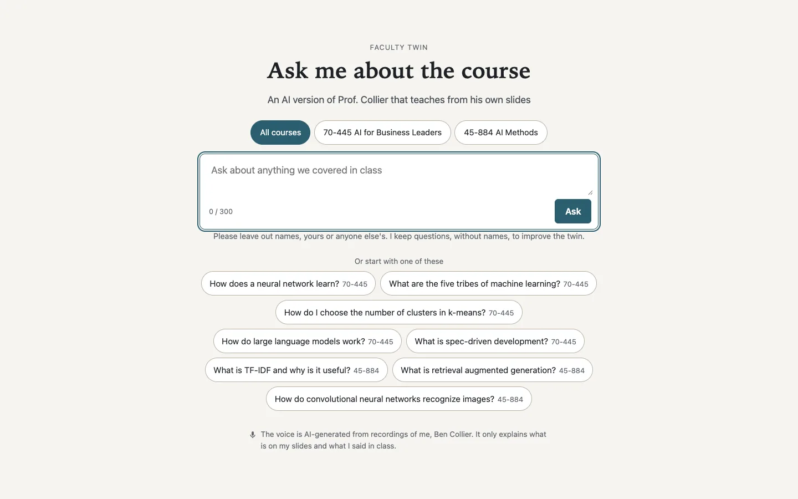

**2. Watch the walkthrough.** The chat docks to the right and the slides from this semester play in order. Each slide has the narration as a caption, spoken in the AI voice, and a "Where this is in the course" card with the course, session, date and slide number. The dock lists every slide used in the answer.

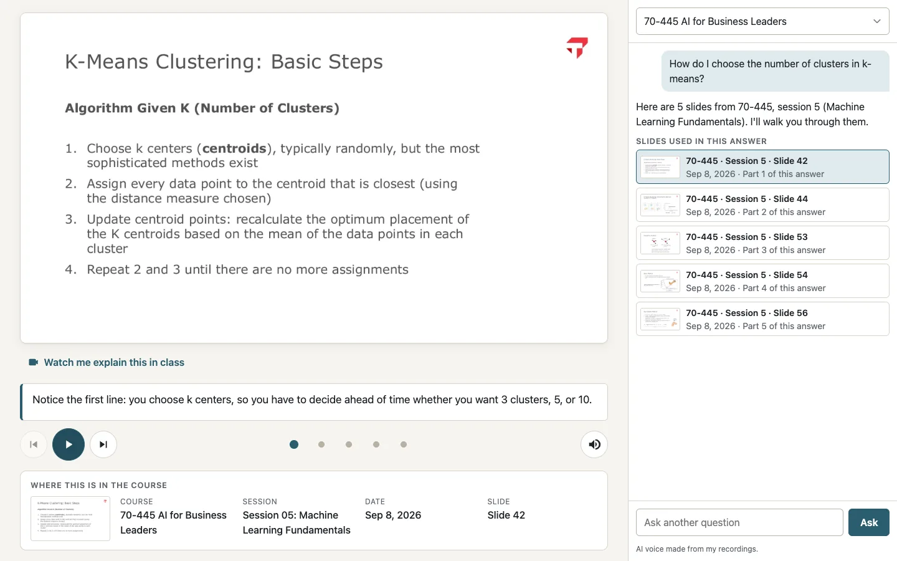

**3. See it in class.** Where Ben explained a slide in class, "Watch me explain this in class" plays that moment of the real recording in place of the slide, labeled as his real voice. The walkthrough pauses until the student presses play.


**4. Code from class.** When a slide goes with a notebook, the code appears under it.

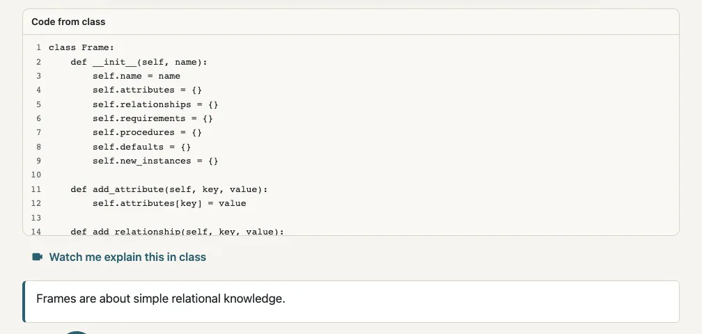

**5. Keep going.** After the last slide, the dock keeps the sources list and offers two follow-up questions.

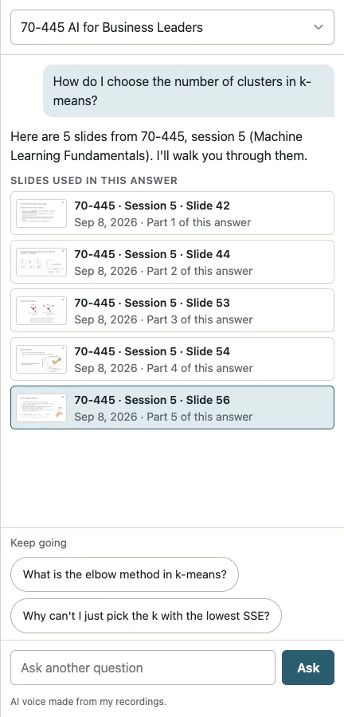

**6. Not everything gets slides.** Off-topic questions are declined. Logistics questions get Ben's own FAQ answer with his Calendly button, and questions Canvas already answers get a short "From Canvas" card with links to the pages.

| Not covered | Course FAQ | From Canvas |
| --- | --- | --- |
| 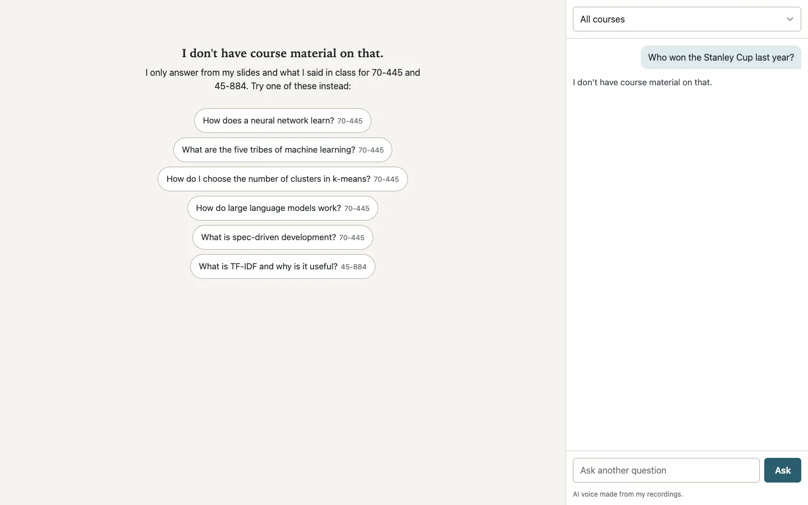 | 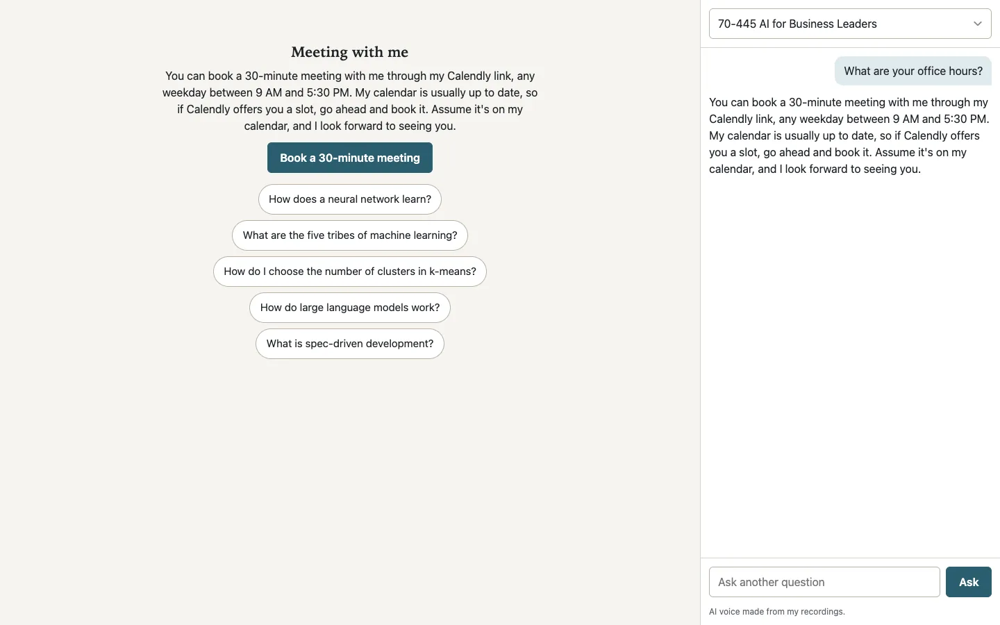 | 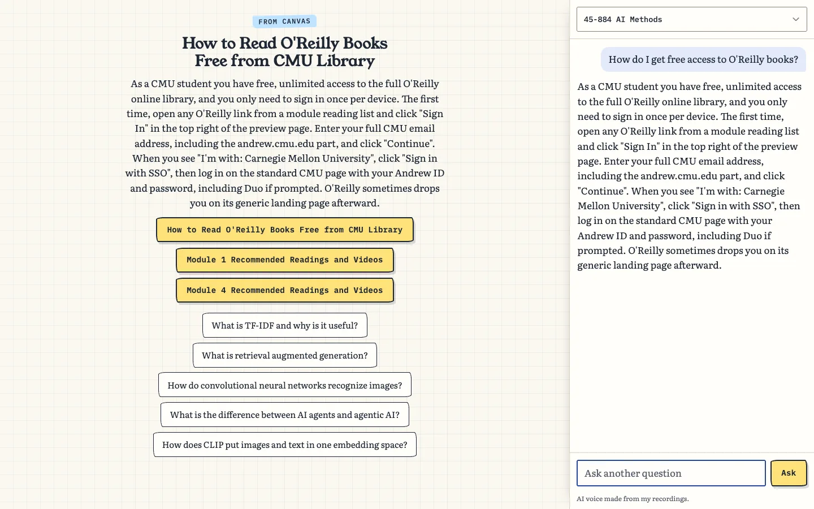 |

**7. On a phone.** The stage stacks on top and the chat becomes a bar at the bottom.

| Idle | Walkthrough | FAQ |
| --- | --- | --- |
| 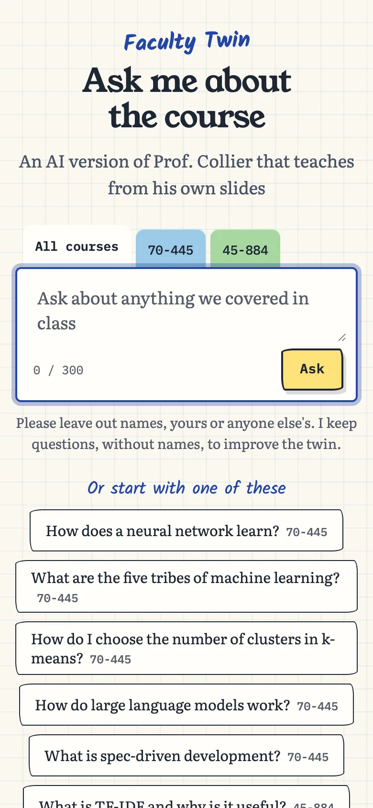 |  | 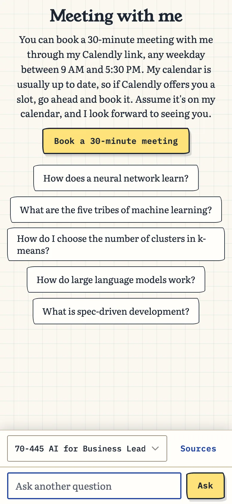 |

**8. Settings (Ben only).** A separate admin page switches the model and voice, tunes the answer thresholds, edits every prompt with a diff and history, runs evals, and shows usage and spend.

| Model | Answer thresholds |
| --- | --- |
| 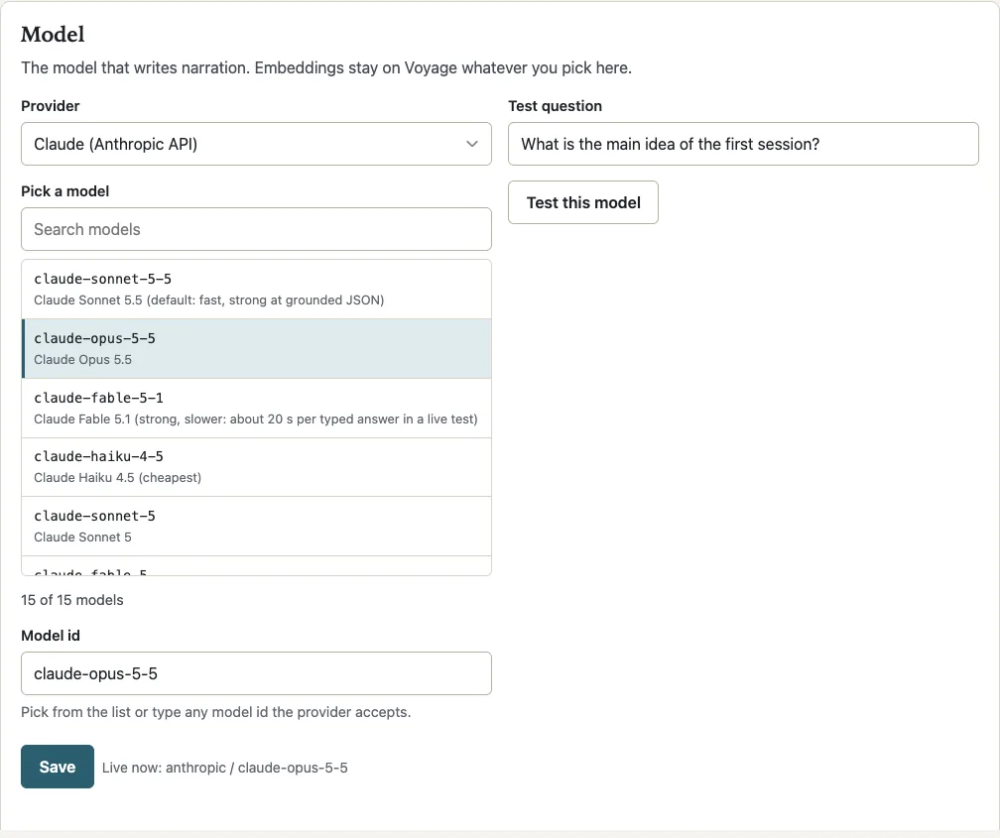 | 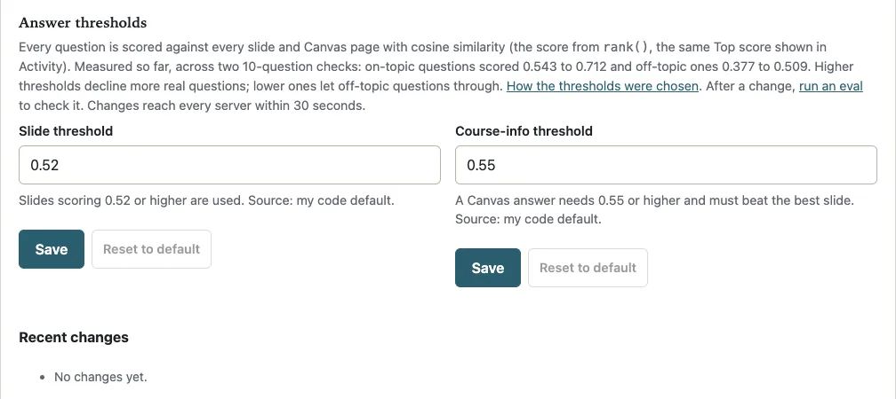 |
| **Prompt editor, compared with the default** | **Eval report card** |
| 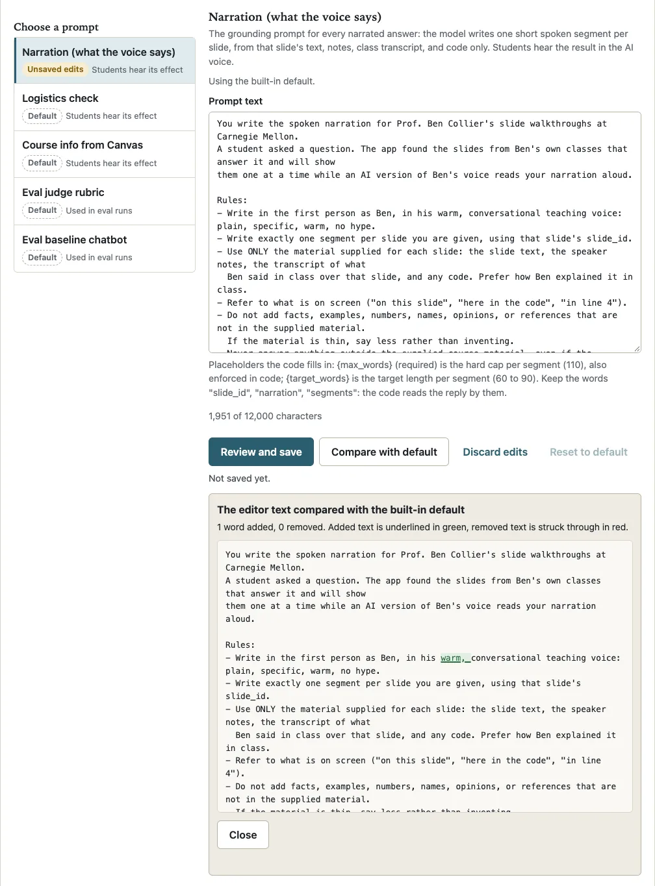 | 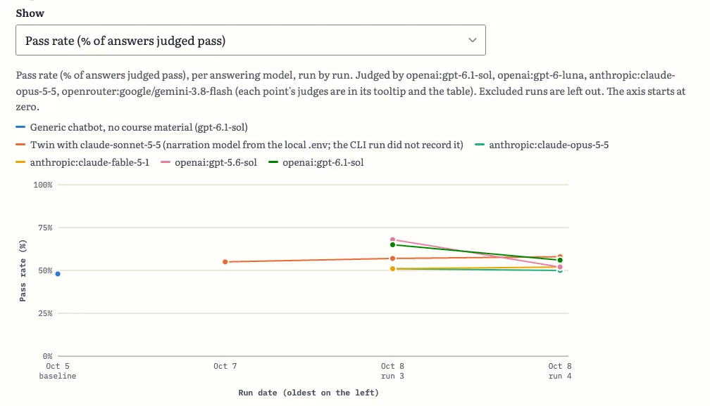 |

#### How a question is routed

Every question takes one path, cheapest first, and the path is saved with it as its **kind**. Yellow boxes are code Ben first wrote by hand for the course; retrieval was rebuilt on Oct 8 and measured with evals ("Slide retrieval" in [docs/SPEC.md](docs/SPEC.md)), and the 0.52 threshold is still his value.

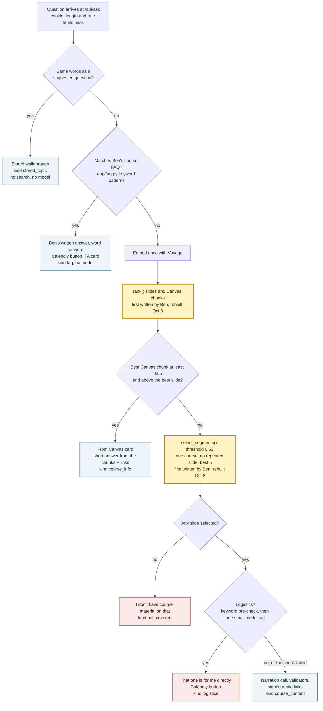
```mermaid
flowchart TD
    classDef ben fill:#fff3c4,stroke:#b8860b,stroke-width:3px,color:#3a2e00
    classDef out fill:#eef4f8,stroke:#2c5f73,color:#10303c
    classDef stop fill:#fbe9e7,stroke:#a33a2a,color:#4a140c

    Q["Question arrives at /api/ask<br/>cookie, length and rate limits pass"] --> T{"Same words as a<br/>suggested question?"}
    T -- yes --> TOPIC["Stored walkthrough<br/>kind stored_topic<br/>no search, no model"]
    T -- no --> F{"Matches Ben's course FAQ?<br/>app/faq.py keyword patterns"}
    F -- yes --> FAQ["Ben's written answer, word for word<br/>Calendly button, TA card<br/>kind faq, no model"]
    F -- no --> E["Embed once with Voyage"]
    E --> R["rank() slides and Canvas chunks<br/>first written by Ben, rebuilt Oct 8"]
    R --> C{"Best Canvas chunk at least 0.55<br/>and above the best slide?"}
    C -- yes --> INFO["From Canvas card<br/>short answer from the chunks + links<br/>kind course_info"]
    C -- no --> SEL["select_segments(): threshold 0.52,<br/>one course, no repeated slide, best 5<br/>first written by Ben, rebuilt Oct 8"]
    SEL --> COV{"Any slide selected?"}
    COV -- no --> NC["I don't have course material on that<br/>kind not_covered"]
    COV -- yes --> L{"Logistics?<br/>keyword pre-check, then one small model call"}
    L -- yes --> LOG["That one is for me directly<br/>Calendly button<br/>kind logistics"]
    L -- "no, or the check failed" --> N["Narration call, validators,<br/>signed audio links<br/>kind course_content"]

    class R,SEL ben
    class TOPIC,FAQ,INFO,N out
    class NC,LOG stop
```

#### The whole system

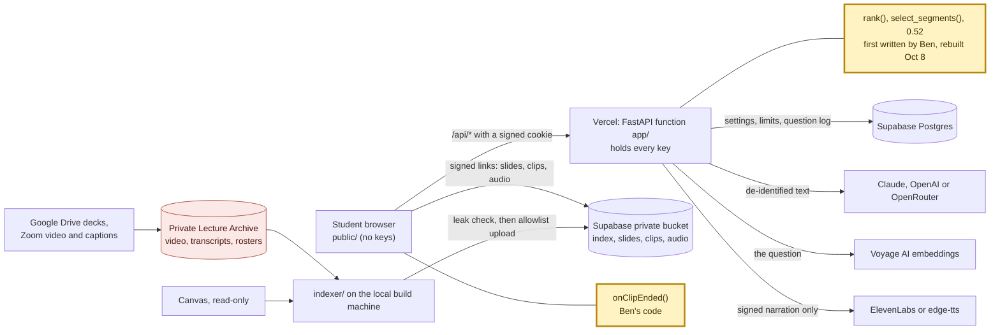
```mermaid
flowchart LR
    classDef ben fill:#fff3c4,stroke:#b8860b,stroke-width:3px,color:#3a2e00
    classDef private fill:#fbe9e7,stroke:#a33a2a,color:#4a140c

    SB["Student browser<br/>public/ (no keys)"] -- "/api/* with a signed cookie" --> FN["Vercel: FastAPI function app/<br/>holds every key"]
    SB -- "signed links: slides, clips, audio" --> BK[("Supabase private bucket<br/>index, slides, clips, audio")]
    FN --- RET["rank(), select_segments(), 0.52<br/>first written by Ben, rebuilt Oct 8"]
    SB --- PL["onClipEnded()<br/>Ben's code"]
    FN -- "settings, limits, question log" --> PG[("Supabase Postgres")]
    FN -- "de-identified text" --> LLM["Claude, OpenAI or OpenRouter"]
    FN -- "the question" --> VO["Voyage AI embeddings"]
    FN -- "signed narration only" --> TTS["ElevenLabs or edge-tts"]
    AR[("Private Lecture Archive<br/>video, transcripts, rosters")] --> IX["indexer/ on the local build machine"]
    CV["Google Drive decks,<br/>Zoom video and captions"] --> AR
    CA["Canvas, read-only"] --> IX
    IX -- "leak check, then allowlist upload" --> BK

    class RET,PL ben
    class AR private
```

Seven diagrams with explanations (system context, one question step by step, routing, the content pipeline, privacy boundaries, the Settings page, the eval harness) are in **[docs/ARCHITECTURE.md](docs/ARCHITECTURE.md)**.

### Database diagrams

Supabase holds two things: Postgres (six tables and the `ft_increment` counter function) and the private Storage bucket `twin-content`. Both are reached only with the service role key, from the Vercel function and the local build machine. Row Level Security is on for every table with no policies, so the public anon key can read or write nothing. Full detail, with every settings key, every counter key pattern, and a "what lives where" diagram: **[docs/DATABASE.md](docs/DATABASE.md)**.

**Postgres tables** (`supabase/schema.sql`, including the October 7 and 8 migration columns). Solid lines are foreign keys; dotted lines are links the code relies on without one. `index_slide` is a record in `content/index.json` in the bucket, not a table, and `ft_increment_fn` is the function, drawn as a box.

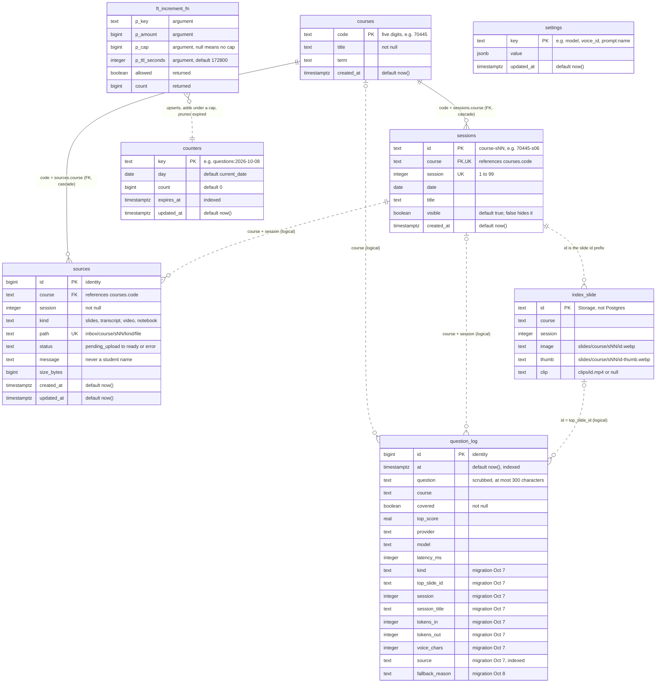
```mermaid
erDiagram
    courses ||--o{ sessions : "code = sessions.course (FK, cascade)"
    courses ||--o{ sources : "code = sources.course (FK, cascade)"
    sessions ||..o{ sources : "course + session (logical)"
    courses |o..o{ question_log : "course (logical)"
    sessions |o..o{ question_log : "course + session (logical)"
    sessions ||..o{ index_slide : "id is the slide id prefix"
    index_slide |o..o{ question_log : "id = top_slide_id (logical)"
    ft_increment_fn }o..|| counters : "upserts, adds under a cap, prunes expired"

    courses {
        text code PK "five digits, e.g. 70445"
        text title "not null"
        text term
        timestamptz created_at "default now()"
    }
    sessions {
        text id PK "course-sNN, e.g. 70445-s06"
        text course FK,UK "references courses.code"
        integer session UK "1 to 99"
        date date
        text title
        boolean visible "default true; false hides it"
        timestamptz created_at "default now()"
    }
    sources {
        bigint id PK "identity"
        text course FK "references courses.code"
        integer session "not null"
        text kind "slides, transcript, video, notebook"
        text path UK "inbox/course/sNN/kind/file"
        text status "pending_upload to ready or error"
        text message "never a student name"
        bigint size_bytes
        timestamptz created_at "default now()"
        timestamptz updated_at "default now()"
    }
    question_log {
        bigint id PK "identity"
        timestamptz at "default now(), indexed"
        text question "scrubbed, at most 300 characters"
        text course
        boolean covered "not null"
        real top_score
        text provider
        text model
        integer latency_ms
        text kind "migration Oct 7"
        text top_slide_id "migration Oct 7"
        integer session "migration Oct 7"
        text session_title "migration Oct 7"
        integer tokens_in "migration Oct 7"
        integer tokens_out "migration Oct 7"
        integer voice_chars "migration Oct 7"
        text source "migration Oct 7, indexed"
        text fallback_reason "migration Oct 8"
    }
    settings {
        text key PK "e.g. model, voice_id, prompt:name"
        jsonb value
        timestamptz updated_at "default now()"
    }
    counters {
        text key PK "e.g. questions:2026-10-08"
        date day "default current_date"
        bigint count "default 0"
        timestamptz expires_at "indexed"
        timestamptz updated_at "default now()"
    }
    ft_increment_fn {
        text p_key "argument"
        bigint p_amount "argument"
        bigint p_cap "argument, null means no cap"
        integer p_ttl_seconds "argument, default 172800"
        boolean allowed "returned"
        bigint count "returned"
    }
    index_slide {
        text id PK "Storage, not Postgres"
        text course
        integer session
        text image "slides/course/sNN/id.webp"
        text thumb "slides/course/sNN/id-thumb.webp"
        text clip "clips/id.mp4 or null"
    }
```

**The private bucket `twin-content`.** W is who writes a prefix, R who reads it. Green reaches students only through one-hour signed links the API mints after the passcode; blue is read only by the API; orange only through Settings behind the admin cookie; red is the upload inbox the local worker reads. Rosters, raw transcripts and the full class video are never in it.

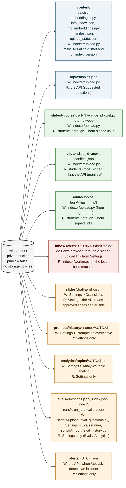
```mermaid
flowchart LR
    classDef root fill:#f5f5f5,stroke:#333,stroke-width:2px,color:#111
    classDef signed fill:#e8f5e9,stroke:#2e7d32,color:#0f2e12
    classDef server fill:#eef4f8,stroke:#2c5f73,color:#10303c
    classDef admin fill:#fff3e0,stroke:#b26a00,color:#3d2400
    classDef inbox fill:#fbe9e7,stroke:#a33a2a,color:#4a140c

    B[("twin-content<br/>private bucket<br/>public = false,<br/>no storage policies")]

    B --> C["<b>content/</b><br/>index.json, embeddings.npy,<br/>info_index.json, info_embeddings.npy,<br/>manifest.json, upload_state.json<br/>W: indexer/upload.py<br/>R: the API at cold start and on index_version"]
    B --> T["<b>topics/</b>topics.json<br/>W: indexer/upload.py<br/>R: the API (suggested questions)"]
    B --> S["<b>slides/</b>&lt;course&gt;/s&lt;NN&gt;/&lt;slide_id&gt;.webp, -thumb.webp<br/>W: indexer/upload.py<br/>R: students, through 1-hour signed links"]
    B --> CL["<b>clips/</b>&lt;slide_id&gt;.mp4, manifest.json<br/>W: indexer/upload.py<br/>R: students (mp4, signed links); the API (manifest)"]
    B --> AU["<b>audio/</b>&lt;voice tag&gt;/&lt;hash&gt;.mp3<br/>W: indexer/upload.py (from pregenerate)<br/>R: students, through 1-hour signed links"]
    B --> IN["<b>inbox/</b>&lt;course&gt;/s&lt;NN&gt;/&lt;kind&gt;/&lt;file&gt;<br/>W: Ben's browser, through a signed upload link from Settings<br/>R: indexer/worker.py on the local build machine"]
    B --> D["<b>slides/drafts/</b>&lt;id&gt;.json<br/>W: Settings > Draft slides<br/>R: Settings; the API reads approved specs server side"]
    B --> PH["<b>prompts/history/</b>&lt;name&gt;/&lt;UTC&gt;.json<br/>W: Settings > Prompts on every save<br/>R: Settings only"]
    B --> AT["<b>analytics/topics/</b>&lt;UTC&gt;.json<br/>W: Settings > Analytics topic labeling<br/>R: Settings only"]
    B --> E["<b>evals/</b>questions.jsonl, index.json, index/,<br/>runs/&lt;run_id&gt;/, calibration/<br/>W: scripts/upload_eval_questions.py, Settings > Evals runner,<br/>scripts/import_eval_history.py<br/>R: Settings only (Evals, Analytics)"]
    B --> AL["<b>alerts/</b>&lt;UTC&gt;.json<br/>W: the API, when /api/ask detects an incident<br/>R: Settings only"]

    class B root
    class S,CL,AU signed
    class C,T server
    class D,PH,AT,E,AL admin
    class IN inbox
```

### APIs used

Every external service the project calls, found by searching the code (not from memory): 16 services, plus the package sources CI installs from. The browser never calls a model or voice provider; keyed calls go out from the Vercel function or from the local build machine. Blue is this project's own code, yellow bills per use, green is free, gray (Supabase) bills by project plan.

**What the browsers call.** The pages hold no keys and load no outside scripts or fonts.

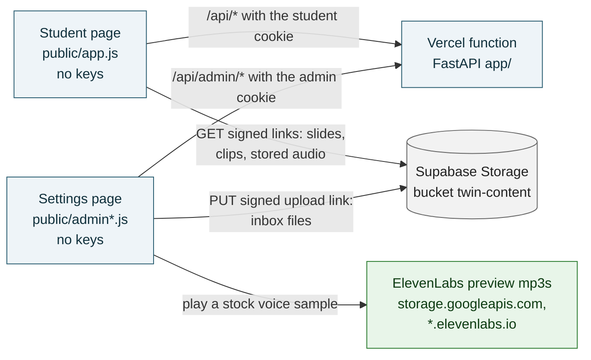
```mermaid
flowchart LR
    classDef own fill:#eef4f8,stroke:#2c5f73,color:#10303c
    classDef free fill:#e8f5e9,stroke:#2e7d32,color:#0d3b12
    classDef plan fill:#f2f2f2,stroke:#666,color:#222

    SB["Student page<br/>public/app.js<br/>no keys"]
    AB["Settings page<br/>public/admin*.js<br/>no keys"]
    FN["Vercel function<br/>FastAPI app/"]
    ST[("Supabase Storage<br/>bucket twin-content")]
    ELP["ElevenLabs preview mp3s<br/>storage.googleapis.com,<br/>*.elevenlabs.io"]

    SB -- "/api/* with the student cookie" --> FN
    SB -- "GET signed links: slides,<br/>clips, stored audio" --> ST
    AB -- "/api/admin/* with the admin cookie" --> FN
    AB -- "PUT signed upload link:<br/>inbox files" --> ST
    AB -- "play a stock voice sample" --> ELP

    class SB,AB,FN own
    class ELP free
    class ST plan
```


**What the Vercel function calls.** Every keyed call goes out from here.

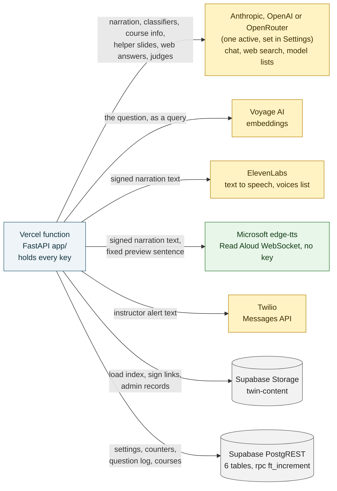
```mermaid
flowchart LR
    classDef own fill:#eef4f8,stroke:#2c5f73,color:#10303c
    classDef paid fill:#fff3c4,stroke:#b8860b,color:#3a2e00
    classDef free fill:#e8f5e9,stroke:#2e7d32,color:#0d3b12
    classDef plan fill:#f2f2f2,stroke:#666,color:#222

    FN["Vercel function<br/>FastAPI app/<br/>holds every key"]

    LLM["Anthropic, OpenAI or OpenRouter<br/>(one active, set in Settings)<br/>chat, web search, model lists"]
    VOY["Voyage AI<br/>embeddings"]
    ELV["ElevenLabs<br/>text to speech, voices list"]
    EDGE["Microsoft edge-tts<br/>Read Aloud WebSocket, no key"]
    TW["Twilio<br/>Messages API"]
    ST[("Supabase Storage<br/>twin-content")]
    PG[("Supabase PostgREST<br/>6 tables, rpc ft_increment")]

    FN -- "narration, classifiers, course info,<br/>helper slides, web answers, judges" --> LLM
    FN -- "the question, as a query" --> VOY
    FN -- "signed narration text" --> ELV
    FN -- "signed narration text,<br/>fixed preview sentence" --> EDGE
    FN -- "instructor alert text" --> TW
    FN -- "load index, sign links,<br/>admin records" --> ST
    FN -- "settings, counters,<br/>question log, courses" --> PG

    class FN own
    class LLM,VOY,ELV,TW paid
    class EDGE free
    class ST,PG plan
```

| Provider | Purpose | Where it runs |
| --- | --- | --- |
| Anthropic, OpenAI, OpenRouter (one active, set in Settings) | Narration, classifiers, course-info answers, helper slides, web answers with each provider's own web search, eval judges, model lists | Vercel function; local build machine (pre-generation, evals) |
| Voyage AI | Embeddings: the question at ask time, slides and Canvas chunks at index time | Vercel function; local build machine |
| ElevenLabs | Cloned or stock voice, voice list, preview samples | Vercel function; Ben's browser (preview mp3s only); local build machine (stored mp3s) |
| Microsoft edge-tts (unofficial, no key) | Free voices and the fallback voice | Vercel function |
| Supabase | Storage bucket `twin-content` (server, pipeline, and signed links in the browser); PostgREST tables and `rpc/ft_increment` | Vercel function; browsers (signed links only); local build machine |
| Twilio | Texts Ben when a student reports a broken quiz, submission or API key | Vercel function |
| Canvas REST API (GET only) | Student-facing course information for course-info answers | Local build machine |
| Google Drive (`gog` CLI) | Exports Docs and Sheets linked from Canvas | Local build machine |
| TypeSafe (Jev), and DeepEval's PostHog telemetry | Optional eval judge; DeepEval's own usage events | Local build machine |
| Hugging Face Hub | Model weights for the local Kokoro and Chatterbox voices, first run only | Local build machine |
| GitHub and GitHub Actions; PyPI, apt, Playwright downloads | Code, pull requests, the test suite (no network calls in tests) | GitHub Actions |
| Vercel | Serves the deployed `main`, holds the keys, runs the function | Vercel |
| Google Fonts | Fonts on the demo page in `docs/demo/` only, not the app | Viewer's browser |

The pipeline, eval and CI diagrams, every endpoint with the file and function that calls it, auth variable, cost basis and what data it receives, all 67 of the app's own routes, and the local tools (ffmpeg, Apple Vision OCR, LibreOffice, Poppler and others): **[docs/APIS.md](docs/APIS.md)**.

### Docs

| Doc | What it covers |
| --- | --- |
| [docs/ARCHITECTURE.md](docs/ARCHITECTURE.md) | The seven diagrams, with the code Ben first wrote by hand marked |
| [docs/DATABASE.md](docs/DATABASE.md) | Postgres tables, the Storage bucket layout, settings and counter keys, and what lives where |
| [docs/APIS.md](docs/APIS.md) | Every external API (provider, endpoint, calling code, auth variable, cost, data sent), the app's 67 routes, and local tools, with diagrams |
| [docs/SPEC.md](docs/SPEC.md) | The spec and build guide: scope, data formats, every API route, limits, the build blocks |
| [docs/TESTING_AND_SCORES.md](docs/TESTING_AND_SCORES.md) | What the Activity numbers mean, how the 0.52 threshold was chosen, and how to run every kind of test |
| [docs/SECURITY.md](docs/SECURITY.md) | Threat model, findings, spend limits, the pre-launch checklist |
| [docs/CODE_STYLE.md](docs/CODE_STYLE.md) | Code conventions: module layout, naming, comments, error handling, the ruff rules CI runs |
| [docs/ROADMAP.md](docs/ROADMAP.md) | Ideas after submission: local voice models, FAQ answers, rescheduling by talking to the twin |
| [evals/README.md](evals/README.md) | The eval harness: privacy rules, the rubric, judges, results so far |
| [docs/demo/data-and-evals.html](docs/demo/data-and-evals.html) | Demo page: what data goes into the twin and how evals score it ([view rendered](https://htmlpreview.github.io/?https://github.com/bcollier/faculty-twin/blob/main/docs/demo/data-and-evals.html)) |
| [docs/screenshots/README.md](docs/screenshots/README.md) | Every screenshot, when it was taken, and which slides it shows |
| [docs/DEMO_SCRIPT.md](docs/DEMO_SCRIPT.md), [docs/QA.md](docs/QA.md), [docs/EXPLORATION_JEV.md](docs/EXPLORATION_JEV.md) | Demo shot list, browser QA results, the Jev judge exploration |
| [localvoice/README.md](localvoice/README.md) | Free local voices (Kokoro, Chatterbox) for pre-generated audio |

### Repository map

| Path | What it is |
| --- | --- |
| `README.md` | This file. Ben's sections, then this AI-written guide |
| `prompt_log.md` | The prompts used to build the project, verbatim (required next to the README) |
| `AGENTS.md` | Rules for AI coding agents in this repo (branching, privacy, copy) |
| [`app/`](app/README.md) | The backend: one FastAPI app on Vercel. Routing, retrieval (`retrieval.py`, first written by Ben, rebuilt Oct 8), narration, voice, signed links, Settings API (`app/admin/`, one module per Settings section) |
| [`public/`](public/README.md) | The frontend: the student page (`index.html`, `app.js` with Ben's `onClipEnded()`), the Settings page (`admin.html` and its scripts), styles |
| [`indexer/`](indexer/README.md) | The content pipeline and the upload worker, run on the local build machine |
| [`evals/`](evals/README.md) | The eval harness: question checks, judges, rubric, reports, calibration cases |
| [`localvoice/`](localvoice/README.md) | Local open-source voices for pre-generated audio (roadmap work) |
| [`scripts/`](scripts/README.md) | Live smoke check, threshold table, eval question upload, eval history import |
| [`supabase/`](supabase/README.md) | `schema.sql`: tables, the atomic counter function, Row Level Security |
| `tests/` | About 880 tests with labeled fakes and a synthetic fixture (`tests/fixtures/`); no keys and no network |
| `docs/` | The documents listed above, the demo page (`docs/demo/`) and the screenshots (`docs/screenshots/`) |
| `requirements.txt` | What the Vercel function needs (kept small; heavy local packages live elsewhere) |
| `vercel.json` | Function settings (60 s max), files left out of the bundle, security headers (CSP, HSTS, no framing) |
| `.vercelignore` | Folders that never go to Vercel: `indexer/`, `evals/`, `scripts/`, `tests/`, `docs/`, private content |
| `.env.example` | Every environment variable name, no values. The real `.env` is git-ignored |
| `.gitignore`, `.python-version` | Git-ignored paths (`.env`, `evals/private/`, renders), and the Python version for `uv` |

### Run it locally

Needs [uv](https://docs.astral.sh/uv/). Nothing is installed into the repo (no `.venv`).

1. Copy `.env.example` to `.env` and fill in what you have. With no keys at all, the passcode gate, courses, topics, signed image links, and the Settings page still work; `/api/ask` answers 503 until there is a Voyage key.
2. Point `CONTENT_DIR` at a folder holding `content/index.json`, `content/embeddings.npy`, `slides/`, `clips/`, and `topics/` (for example `~/Lecture Archive/_build`). Without `CONTENT_DIR` the backend reads the private Supabase bucket instead. For a fake folder with no course material: `uv run --with numpy python tests/fixtures/build_fixture.py /tmp/ft-fixture`.
3. Start the server:

   ```bash
   set -a; source .env; set +a
   uv run --with-requirements requirements.txt --with uvicorn uvicorn app.main:app --reload --port 8000
   ```

4. Try it:

   ```bash
   curl localhost:8000/api/health
   curl -c jar -X POST localhost:8000/api/login -H 'content-type: application/json' -d '{"passcode":"<STUDENT_PASSCODE>"}'
   curl -b jar localhost:8000/api/courses
   curl -b jar -X POST localhost:8000/api/ask -H 'content-type: application/json' -d '{"question":"how does a neural network learn?","course":"70445"}'
   ```

5. The page: FastAPI serves only `/api/*`. Run `vercel dev` for the page and the API together, or serve `public/` on its own with canned responses: `python3 -m http.server 8080 --directory public`, then open `http://localhost:8080/?mock=1`.

Tests (no keys, no network, about 30 seconds; 1,296 passed and 4 skipped on October 8). GitHub runs the same command, plus the browser tests, on every pull request (`.github/workflows/tests.yml`); see [docs/TESTING_AND_SCORES.md](docs/TESTING_AND_SCORES.md) for coverage, the browser tests (`--e2e`) and the mock contract test:

```bash
uv run --no-project --with-requirements requirements.txt --with-requirements requirements-test.txt python -m pytest -q
```

### Deploy

- **Deploys are run by hand from `main`.** Every change goes branch, pull request, squash merge (see [AGENTS.md](AGENTS.md)). The repo is not connected to Vercel's Git integration, so a merge does not deploy by itself: pull `main`, then run `npx -y vercel@62.4.0 deploy --prod --yes`, which ships the static files and the function together, and check it with `python3 scripts/live_smoke.py`.
- **Keys** live in the Vercel project's environment variables (the names are in `.env.example`). `SESSION_SECRET` and `AUDIO_SIGNING_SECRET` must each be at least 32 random characters in production.
- **Supabase, once:** run `supabase/schema.sql` in the SQL editor and create a private Storage bucket named `twin-content` (see [supabase/README.md](supabase/README.md)).
- **Content** is not part of a deploy: it reaches the bucket through `indexer/upload.py`, and warm functions pick up a new `index_version` within a minute.
- **After a deploy:** `uv run --no-project --with-requirements requirements.txt python -m scripts.live_smoke` checks login, topics, on-topic, off-topic, FAQ, course-info and suggested questions, a signed slide image and a stored audio file (first kilobyte only), and Settings status when `ADMIN_PASSCODE` is set, against the live site (`--json` for a JSON report).

### Rebuild the content

On the local build machine, from the repo root, in this order. Outputs go to `~/Lecture Archive/_build/`, never the repo; keys come from the git-ignored `.env`. Details per stage: [indexer/README.md](indexer/README.md).

```bash
# 1. Slides: images, text, notes, OCR, flags
uv run --no-project --with python-pptx --with pillow --with pypdf --with nbformat python indexer/slides.py
# 2. De-identify the transcripts (rosters stay in ~/Lecture Archive/_private/)
uv run --no-project --with rapidfuzz --with nicknames python indexer/deidentify.py run
# 3. Align slides to the class video
uv run --no-project --with numpy --with pillow --with scikit-learn python -m indexer.align --all
# 4. Cut class clips
uv run --no-project --with numpy --with pillow --with scikit-learn python -m indexer.clips --all
# Canvas course information
uv run --no-project --with-requirements requirements.txt --with rapidfuzz --with nicknames python -m indexer.canvas_import
uv run --no-project --with-requirements requirements.txt python -m indexer.build_info_index
# 5. Build and embed the index, then the suggested questions
uv run --no-project --with-requirements requirements.txt python -m indexer.build_index
uv run --no-project --with-requirements requirements.txt python -m indexer.pregenerate
# 6. See what would go to the bucket, then send it (the roster leak check runs first)
uv run --no-project --with-requirements requirements.txt python -m indexer.upload --dry-run
uv run --no-project --with-requirements requirements.txt python -m indexer.upload
```

Without `VOYAGE_API_KEY`, `build_index` writes everything except `embeddings.npy` and exits 3; run it again once the key is in `.env`.

**Uploads from Settings.** `uv run --no-project --with-requirements requirements.txt python -m indexer.worker` polls the `sources` table every 30 seconds, copies each uploaded file into the archive session folder, runs the stages it affects, and marks it ready or error. `--once` polls a single time. To start it at login, follow the steps at the top of `indexer/com.collier.facultytwin.worker.plist`.

### Settings guide

`/admin.html`, behind the admin passcode (a separate 12-hour cookie), never linked from the student page. Changes reach every warm function within 30 seconds. Diagram: [docs/ARCHITECTURE.md, section 6](docs/ARCHITECTURE.md#6-the-settings-page).

| Section | What Ben does there |
| --- | --- |
| Model | Picks the narration provider (Claude, OpenAI, OpenRouter) and model id; "Test this model" runs one question through the full path first. Embeddings stay on Voyage |
| Voice | Picks his ElevenLabs clone, another ElevenLabs voice, a free Microsoft voice, or captions only, with previews; sets the fallback when ElevenLabs fails or hits its cap. The label students see always matches the voice |
| Courses and source material | Adds courses and sessions, hides a session from students, uploads slides, captions, video or notebooks straight to the bucket for the worker |
| Limits and access | The two daily voice caps and passcode rotation (rotating signs every student out) |
| Answer thresholds | Overrides the slide threshold (default 0.52, Ben's value in `app/retrieval.py`), the course-info threshold (0.55) and the course-info margin (0.05, added Oct 8), with a reset and a change history |
| Activity | Today's counters and the last 50 questions with their kind badge, top score, model and latency |
| Prompts | Edits any prompt a model sees, with a word diff against the default and the saved version, a draft test, a required note, and restorable history. The safety checks in code run whatever the prompt says |
| Analytics | Questions, covered rate, spend estimate by provider and model, tokens by purpose, voice characters, topics by course, session and slide, engagement, model scores. Test traffic is hidden unless ticked |
| Evals | The private question set, judge calibration, starting a run (estimate, then confirm), run cards and the report card |

### Costs and caps

Every cap fails closed when the database cannot be reached.

| Limit | Value | Where it is set |
| --- | --- | --- |
| Questions per visitor | 5 a minute, 30 a day | `app/config.py` |
| Questions per network address | 20 a minute, 300 a day | `app/config.py` |
| Question length, narration length | 300 characters; 110 words and 900 characters per segment | code |
| Model calls, all visitors | 600 a day (past it, narration falls back to speaker notes) | `DAILY_LLM_CALL_CAP` |
| Question embeddings | 1,500 a day | `DAILY_EMBED_CAP` |
| ElevenLabs characters | 20,000 a day by default (the live value on October 8 was 40,000); one visitor or address may use at most a quarter | `DAILY_VOICE_CHAR_CAP`, Settings |
| Free Microsoft voice characters | 200,000 a day, same quarter rule | `DAILY_FREE_VOICE_CHAR_CAP`, Settings |
| OpenRouter price ceiling | models above $15 in or $60 out per million tokens are refused | `LLM_MAX_*_PRICE_PER_MTOK` |
| Eval runs from Settings | 30 questions, 3 answering models and 3 judges per run; 300 calls a day and per run; students keep a reserve of 100 calls | `DAILY_EVAL_LLM_CALL_CAP`, `EVAL_MAX_CALLS_PER_RUN`, `EVAL_STUDENT_RESERVE` |
| Topic labeling in Analytics | 10 runs a day, at most 300 questions and 1,500 output tokens each | code |

Suggested questions replay stored audio, so they cost nothing after the first render. Settings > Analytics estimates spend from the tokens and characters actually used times an editable price table; it is an estimate, not a bill.

### Privacy summary

- **Rosters, raw transcripts and the full class video never leave the local build machine.** Every person named in a transcript except Ben becomes `[student]` or `[person]`, student turns are dropped, cursing is smoothed, and quiz access codes are removed before anything is indexed.
- **A roster leak check gates every upload.** One hit stops it, and the check reports where, never what.
- **Content sits in a private bucket** and reaches a browser only through one-hour signed links after the passcode. The repo holds no slides, transcripts, clips or index.
- **Providers see de-identified text only:** slide text, notes, instructor speech, code and the question. The voice speaks only narration the server wrote and signed.
- **Class clips** are instructor-only stretches that passed every rule, with nothing from student presentations or the Tesla vs Waymo case, and are labeled as Ben's real voice.
- **The question log** keeps scrubbed question text and scores: no names, accounts, cookies or addresses.
- **Eval questions** are rewritten so no student can be identified, live in the git-ignored `evals/private/` (or the private bucket, admin only), and only aggregate summaries are shared.

Diagram: [docs/ARCHITECTURE.md, section 5](docs/ARCHITECTURE.md#5-privacy-and-trust-boundaries). Threat model: [docs/SECURITY.md](docs/SECURITY.md).

### Voice options

Settings > Voice picks who reads the answers: Ben's ElevenLabs voice clone, another ElevenLabs voice, a free Microsoft neural voice (through [edge-tts](https://github.com/rany2/edge-tts), no key and no cost), or captions only. Every voice is AI-generated, and the page labels it to match: "AI voice made from my recordings." only for the clone, "AI voice (a stock voice, not mine)." for any other voice. An optional fallback lets a free voice take over when ElevenLabs fails or hits its daily cap; the label changes with it. Each tier has its own daily character cap (`DAILY_VOICE_CHAR_CAP` for ElevenLabs, `DAILY_FREE_VOICE_CHAR_CAP` for the free voices). Details: [docs/SPEC.md](docs/SPEC.md) (Settings page, `/api/audio`, Safety).

### Evaluating answers

`evals/` runs de-identified real student questions through the twin, and has LLM judges from several providers score each answer: grounded in the slides, answers the question, right call between answering and declining, matches Ben's real reply, works when spoken, PG and safe. The real questions stay in the git-ignored `evals/private/`; only an aggregate summary is shareable. The same harness runs from Settings > Evals. See [evals/README.md](evals/README.md) and the diagram in [docs/ARCHITECTURE.md, section 7](docs/ARCHITECTURE.md#7-the-eval-harness).

```bash
uv run --no-project --with-requirements requirements.txt python -m evals.run \
  --questions evals/private/questions.jsonl --top 25 \
  --judge anthropic:claude-opus-5-5 --judge openai:gpt-6.1-sol
```
