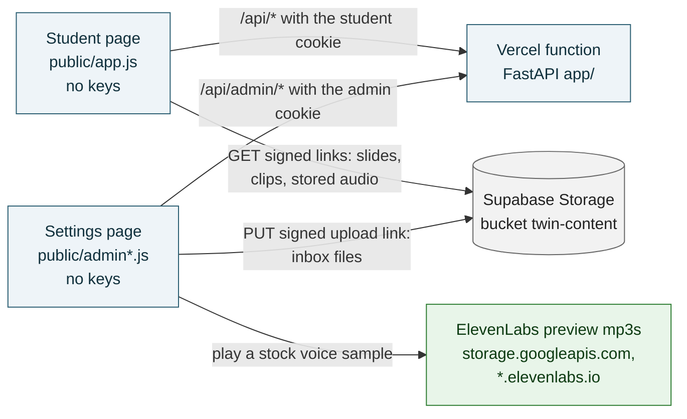
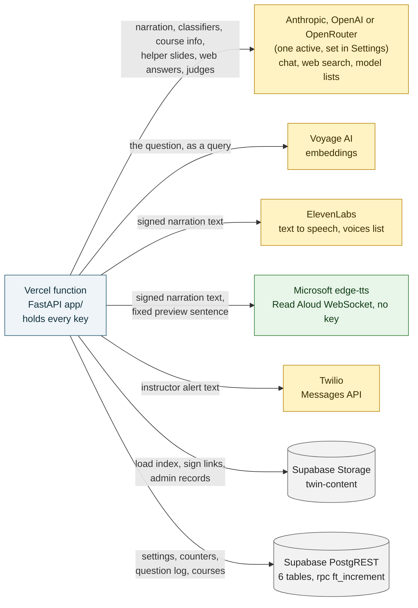
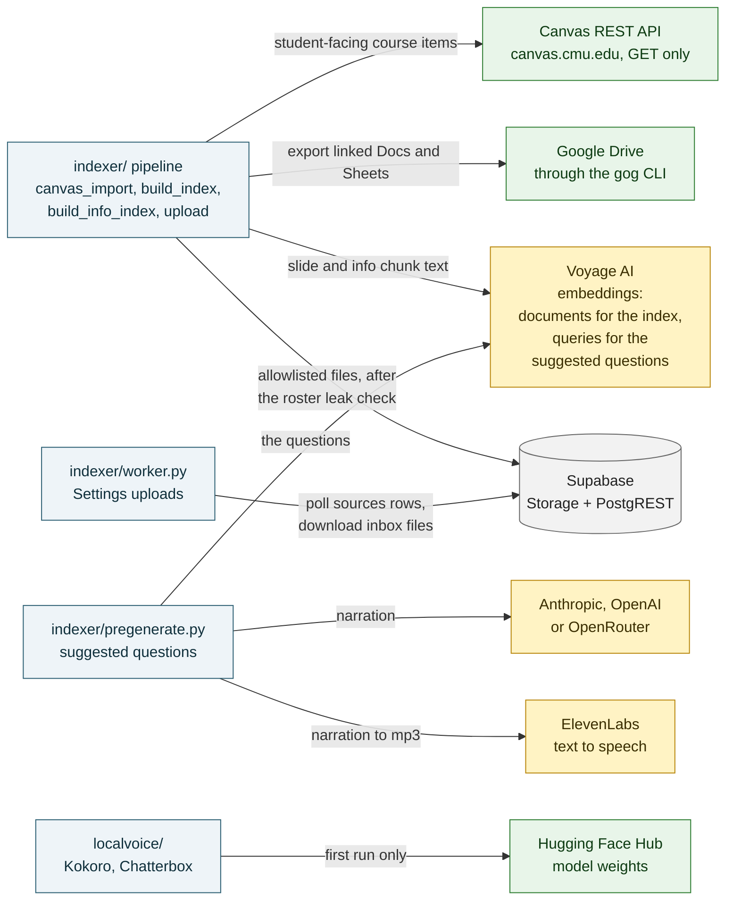
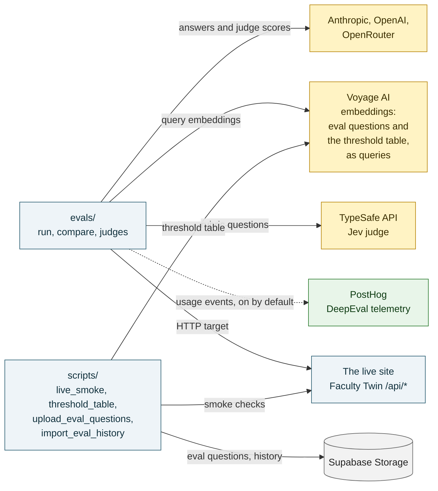
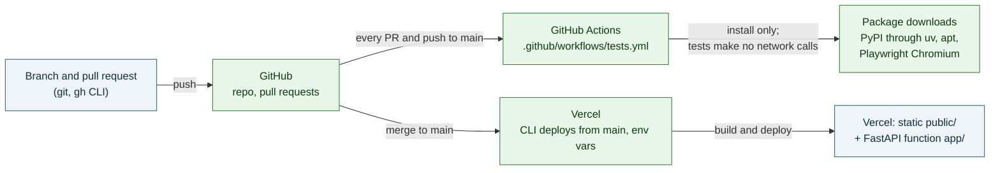
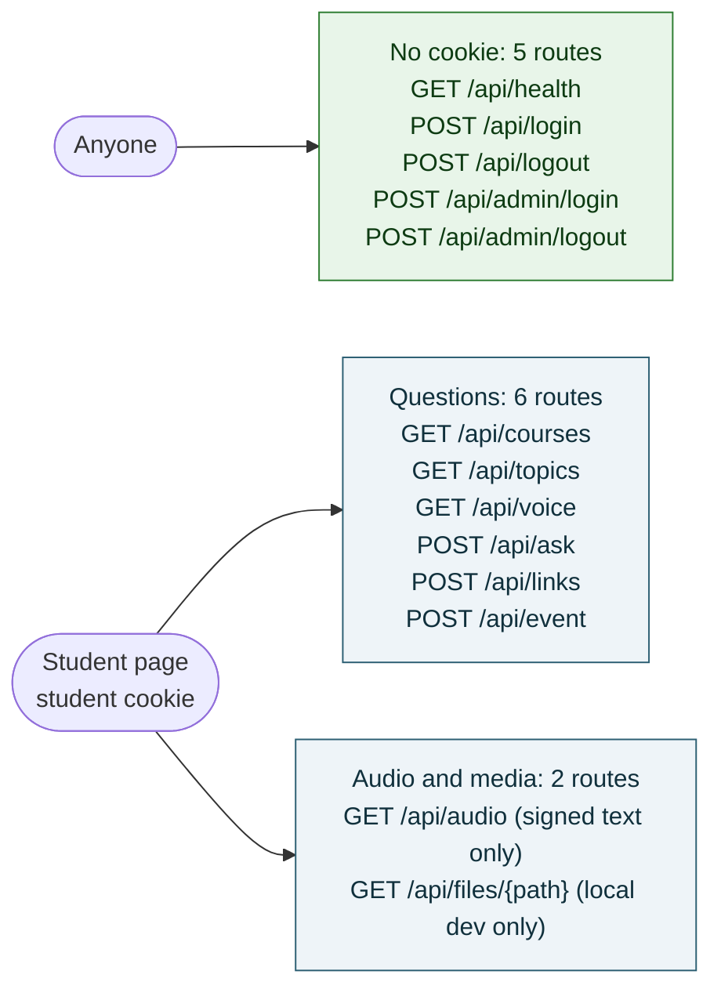
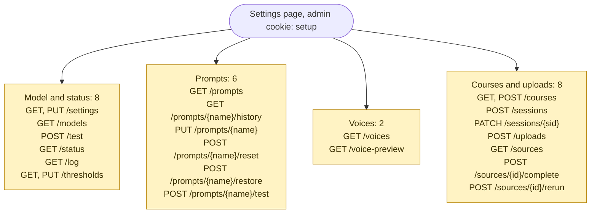
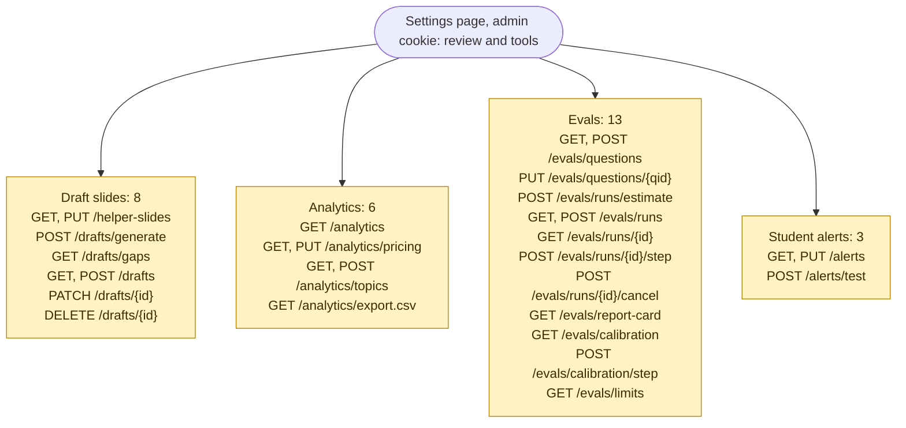

# Every API Faculty Twin uses

*Written by Claude Code (Claude Opus 5.5) from the code on `main`, October 8, 2026. Built by searching every outbound call and SDK use in `app/`, `indexer/`, `scripts/`, `evals/`, `localvoice/`, `public/`, `vercel.json`, `.github/workflows/` and `supabase/`, not from memory. Every row names the file and function that makes the call. Where this page and [SPEC.md](SPEC.md) disagree, the spec wins.*

Three kinds of API show up in this project:

1. **External services** reached over the network: model providers, embeddings, voices, storage, texting, Canvas, and the platforms that build and host the app.
2. **The app's own HTTP API**: the 67 FastAPI routes under `/api/` that the student page and the Settings page call.
3. **Local libraries and tools** the content pipeline calls on the local build machine (ffmpeg, Apple Vision, LibreOffice and others). They are not network services, but they are part of the code path.

Contents:

1. [External services diagrams](#1-external-services-diagrams)
2. [The app's own routes diagram](#2-the-apps-own-routes-diagram)
3. [External APIs table](#3-external-apis-table)
4. [The app's routes table](#4-the-apps-routes-table)
5. [Local libraries and tools](#5-local-libraries-and-tools)
6. [What each service receives, and which are optional](#6-what-each-service-receives-and-which-are-optional)

## 1. External services diagrams

The browser never calls a model or voice provider. Every keyed call goes out from the Vercel function or from the local build machine. The diagrams are split by where the call is made, so each one stays readable.

Colors in every diagram: blue is this project's own code, yellow services bill per use, green ones cost nothing. Supabase (gray) bills by project plan, not per call.

### 1a. What the browsers call

The page loads no outside scripts or fonts (`vercel.json` CSP: `script-src 'self'`, `font-src 'self'`, `connect-src 'self' https://*.supabase.co`).

### 1b. What the Vercel function calls

### 1c. The content pipeline on the local build machine

### 1d. Evals and scripts on the local build machine

### 1e. Code, tests and deploy

The test suite calls no external service: every model, embedding, voice and storage call is a labeled fake, and `tests/conftest.py` fails any test that opens a connection to a non-loopback host. CI needs no secrets (`permissions: contents: read`).

## 2. The app's own routes diagram

67 routes, grouped by who may call them. "Student cookie" is the signed `ft_session` cookie set by `POST /api/login`; "admin cookie" is `ft_admin`, set by `POST /api/admin/login`. Admin writes are also refused cross-site by the Origin check.

### 2a. Anyone and students

### 2b. The Settings page, setup (admin cookie)

### 2c. The Settings page, review and tools (admin cookie)

Every path in 2b and 2c starts with `/api/admin`.

## 3. External APIs table

16 external services (plus the package sources CI installs from), in 32 rows: one per endpoint or way of calling it. "Student request" means the call happens while a student waits on `POST /api/ask` or `GET /api/audio`. "Settings" means Ben's admin page. Auth names the environment variable only; values live in Vercel and the local `.env`, never in the repo.

### Model providers

| Provider | Endpoint or SDK method | Used for | Called by | When | Auth | Runs where | Cost basis | Data sent |
| --- | --- | --- | --- | --- | --- | --- | --- | --- |
| Anthropic | `POST https://api.anthropic.com/v1/messages` (version header `2023-06-01`, refusal fallback beta header on models that support it) | Narration, the logistics, incident and web-scope classifiers, course-info answers, helper slides, topic labels, Settings test runs, eval answers and judges | `app/llm.py:complete_json` (request from `build_anthropic`), called from `app/narration.py:narrate`, `app/logistics.py:classify`, `app/alerts.py:classify`, `app/web_answer.py:classify`, `app/course_info.py:answer`, `app/helper_slide.py:ask_model`, `app/analytics.py:label_topics`, `app/admin_evals.py:_judge_one`; directly by `evals/judges.py:Judge._send` | Student request; Settings (test, prompt test, draft slides, topic labels, evals); evals on the local build machine; `indexer/pregenerate.py:_generate` | `ANTHROPIC_API_KEY` (`x-api-key`) | Vercel function; local build machine | Per token (Sonnet 5.5 default: $2 in, $10 out per million, `app/pricing.py`) | The question text, de-identified slide text, notes and transcript excerpts, de-identified Canvas chunks; for judges, rewritten eval questions and the answers |
| Anthropic | Same endpoint with the server tool `web_search_20250305` (`max_uses` 3) | Beyond-the-slides web answers | `app/web_answer.py:search` (`anthropic_request`, `_post`) | Student request (course-adjacent question no slide covers); Settings evals; `evals/compare.py:eval_search` | `ANTHROPIC_API_KEY` | Vercel function; local build machine | Tokens plus $10 per 1,000 searches | The question text; the provider's search sees the search terms it writes |
| Anthropic | `GET https://api.anthropic.com/v1/models?limit=100` | Settings model picker, merged with the curated list | `app/llm.py:list_models`, called by `app/admin/settings.py:models` | Settings | `ANTHROPIC_API_KEY` | Vercel function | Free | Nothing |
| OpenAI | `POST https://api.openai.com/v1/chat/completions` (`response_format: json_object`) | Same jobs as Anthropic when OpenAI is the active provider; GPT judges | `app/llm.py:complete_json` (`build_openai`) and the same callers; `evals/judges.py:Judge._send` | Student request; Settings; evals | `OPENAI_API_KEY` (Bearer) | Vercel function; local build machine | Per token | Same as Anthropic |
| OpenAI | `POST https://api.openai.com/v1/responses` with tool `web_search` (`search_context_size: low`) | Web answers when OpenAI is active | `app/web_answer.py:search` (`openai_request`) | Student request; Settings evals; `evals/compare.py` | `OPENAI_API_KEY` | Vercel function; local build machine | Tokens plus $10 per 1,000 searches | The question text |
| OpenAI | `GET https://api.openai.com/v1/models` | Settings model picker | `app/llm.py:list_models` from `app/admin/settings.py:models` | Settings | `OPENAI_API_KEY` | Vercel function | Free | Nothing |
| OpenRouter | `POST https://openrouter.ai/api/v1/chat/completions` (optional `HTTP-Referer`, `X-Title`) | Same jobs when OpenRouter is active; the Gemini judge (`openrouter:google/gemini-...`); Claude judges when `FT_EVAL_ROUTE_ANTHROPIC=openrouter` | `app/llm.py:complete_json` (`build_openrouter`); `evals/judges.py:Judge._send`, `evals/judges.py:route_of` | Student request; Settings; evals | `OPENROUTER_API_KEY` (Bearer) | Vercel function; local build machine | Per token, the routed model's price | Same as Anthropic |
| OpenRouter | Same endpoint with tool `openrouter:web_search`, engine `exa` (5 results, 2 uses) | Web answers when OpenRouter is active (Exa is called by OpenRouter, not by this code) | `app/web_answer.py:search` (`openrouter_request`) | Student request; Settings evals; `evals/compare.py` | `OPENROUTER_API_KEY` | Vercel function; local build machine | Tokens plus $7 per 1,000 Exa requests | The question text |
| OpenRouter | `GET https://openrouter.ai/api/v1/models` (public, cached 10 minutes) | Settings model picker; the price ceiling check before saving a model or starting an eval; live prices for the Analytics spend estimate and eval estimates | `app/llm.py:list_models`, from `app/admin/settings.py:models`, `app/admin/price_guard.py:check_model_price`, `app/analytics.py:_openrouter_live`, `app/admin_evals.py:_price_listing`, `evals/compare.py:_live_prices` | Settings; evals | None | Vercel function; local build machine | Free | Nothing |
| TypeSafe | `typesafe-sdk` through DeepEval's `JevEval` metric, default base `https://api.typesafe.ai` | The Jev judge: calibrated yes/no and 1 to 5 answers to the rubric | `evals/jev_judge.py:JevJudge.judge` | Evals on the local build machine only (`--judge jev`), never on Vercel | `TYPESAFE_API_KEY` | Local build machine | TypeSafe account (not in the price table) | Rewritten eval question, the answer, the reference answer and the retrieved slide text |

### Embeddings and voice

| Provider | Endpoint or SDK method | Used for | Called by | When | Auth | Runs where | Cost basis | Data sent |
| --- | --- | --- | --- | --- | --- | --- | --- | --- |
| Voyage AI | `POST https://api.voyageai.com/v1/embeddings`, `input_type: query` | Embeds the question once; the vector scores slides and Canvas info chunks | `app/embed.py:embed_question`, from `app/main.py:answer` | Student request; Settings test and evals (`app/admin_evals.py:run_step`); `evals/targets.py:InProcessTarget`; `indexer/pregenerate.py`; `scripts/threshold_table.py:voyage_embed_many` | `VOYAGE_API_KEY` (Bearer), model `VOYAGE_MODEL` | Vercel function; local build machine | $0.06 per million tokens; daily cap `DAILY_EMBED_CAP` | The question text |
| Voyage AI | Same endpoint, `input_type: document`, batched | Builds the slide index and the Canvas info index | `indexer/build_index.py:voyage_embed`, `indexer/build_index.py:embed_records`, reused by `indexer/build_info_index.py:build` | Indexer on the local build machine | `VOYAGE_API_KEY` | Local build machine | Same; a content-hash cache means a rebuild only pays for changed chunks | De-identified slide text, notes, transcript excerpts and Canvas chunks |
| ElevenLabs | `POST https://api.elevenlabs.io/v1/text-to-speech/{voice_id}/stream?output_format=mp3_44100_128` | The cloned or stock voice for narration | `app/speech.py:open_stream`, `app/speech.py:stream_bytes`, from `app/main.py:audio`; `indexer/pregenerate.py:speak` for stored mp3s | Student request (`GET /api/audio`); pre-generation | `ELEVENLABS_API_KEY` (`xi-api-key`), voice `ELEVENLABS_VOICE_ID` or the Settings voice | Vercel function; local build machine | $0.08 per 1,000 characters (plan allowance first); daily cap `DAILY_VOICE_CHAR_CAP` | Narration text the backend signed, nothing else |
| ElevenLabs | `GET https://api.elevenlabs.io/v2/voices?page_size=100` (cached an hour) | Lists clone and stock voices in Settings; checks a voice before saving; decides the honest clone or stock label | `app/speech.py:list_voices`, `app/speech.py:find_voice`, from `app/admin/voice_picker.py:list_voice_options`, `app/admin/settings.py:_voice_values`, `app/voices.py:eleven_kind` | Settings; `GET /api/voice` and `/api/ask` when the label is not saved | `ELEVENLABS_API_KEY` | Vercel function | Free | Nothing |
| ElevenLabs | Each voice's `preview_url` mp3 (hosts `storage.googleapis.com`, `*.elevenlabs.io`, allowed in the `media-src` CSP) | Plays a stock voice sample in Settings | `public/admin.js:togglePreview` | Settings | None (public file) | Ben's browser | Free | Nothing |
| Microsoft edge-tts | `edge_tts.Communicate(...).stream()`: WebSocket `wss://speech.platform.bing.com/consumer/speech/synthesize/readaloud/edge/v1` (unofficial, the endpoint behind Edge's Read Aloud) | Free voices for narration, the fallback voice, web answers when Settings allows, and the Settings preview | `app/edge_voice.py:_communicate`, `_audio_chunks`, `open_stream`, `preview`, from `app/main.py:audio` and `app/admin/voice_picker.py:voice_preview` | Student request (`GET /api/audio`); Settings | None (the package's built-in client token) | Vercel function | Free; capped by `DAILY_FREE_VOICE_CHAR_CAP`, at most 6 requests at once per instance | Narration text the backend signed, or the fixed preview sentence |
| Microsoft edge-tts | `edge_tts.list_voices()`: `GET https://speech.platform.bing.com/consumer/speech/synthesize/readaloud/voices/list` | Checks a free voice name exists before it is saved | `app/edge_voice.py:available_voices`, from `app/admin/settings.py:_check_free_voice` and `app/admin/voice_picker.py:voice_preview` | Settings | None | Vercel function | Free | Nothing |

### Storage, texting and course sources

| Provider | Endpoint or SDK method | Used for | Called by | When | Auth | Runs where | Cost basis | Data sent |
| --- | --- | --- | --- | --- | --- | --- | --- | --- |
| Supabase Storage (server) | `GET`/`HEAD`/`POST /storage/v1/object/twin-content/{path}`, `POST /storage/v1/object/list/twin-content`, `DELETE /storage/v1/object/twin-content`, `POST /storage/v1/object/sign/twin-content` (batch signing), `POST /storage/v1/object/upload/sign/twin-content/{path}` | Loads the index, embeddings, topics and clip manifest; signs one-hour links; stores prompt history, eval data, alerts, topic runs and draft slides; mints the Settings upload link | `app/supa.py` (`download`, `download_optional`, `upload`, `list_objects`, `delete_objects`, `object_exists`, `sign_urls`, `create_upload_url`), from `app/storage.py:load_supabase`, `app/storage.py:media_urls`, `app/prompts.py`, `app/eval_store.py`, `app/alerts.py`, `app/analytics.py`, `app/helper_slide.py`, `app/admin/uploads.py:create_upload` | Student request (index load when the version changes, signed links); Settings | `SUPABASE_URL`, `SUPABASE_SERVICE_ROLE_KEY` (apikey and Bearer), bucket `SUPABASE_BUCKET` | Vercel function | Supabase project plan (storage and egress) | Course content built by the indexer, admin records, the scrubbed alert record |
| Supabase Storage (pipeline) | Same object, list and delete endpoints, with `x-upsert` and a sha256 in `x-metadata` | Uploads the allowlisted build after the roster leak check; deletes stale objects; the worker downloads inbox files; scripts upload eval questions and history | `indexer/common.py:Supabase` (`upload`, `download`, `download_to`, `delete`), from `indexer/upload.py:run`, `indexer/worker.py`; `app/eval_store.py:SupabaseBucket`, from `scripts/upload_eval_questions.py` and `scripts/import_eval_history.py` | Indexer, worker and scripts | `SUPABASE_URL`, `SUPABASE_SERVICE_ROLE_KEY` | Local build machine | Same | Slide images, clips, de-identified index, stored audio, checked eval questions |
| Supabase Storage (browser) | Signed URLs: `GET /storage/v1/object/sign/twin-content/...?token=` and `PUT /storage/v1/object/upload/sign/twin-content/inbox/...?token=` | Students load slide images, clips and stored mp3s; Ben uploads a deck, transcript, video or notebook straight to the inbox | `public/app.js` (image, clip and audio `src`), `public/admin.js:putWithProgress` | Student page; Settings | The link's own token (one hour for downloads); the browser never holds a key | Browsers | Supabase egress | Ben's uploaded file (Settings only) |
| Supabase PostgREST | `GET`/`POST`/`PATCH /rest/v1/{table}` on `settings`, `counters`, `question_log`, `courses`, `sessions`, `sources` | Settings values, rate-limit and usage counters, the question log, the course catalog, the upload queue | `app/supa.py` (`select`, `insert`, `update`), from `app/settings_store.py`, `app/limits.py`, `app/playlist.py:hidden_sessions`, `app/admin/`; `indexer/common.py:Supabase` (`select`, `update`, `upsert`) from `indexer/worker.py` | Every request; Settings; worker | `SUPABASE_URL`, `SUPABASE_SERVICE_ROLE_KEY` | Vercel function; local build machine | Project plan | Question text and scores (no name, account or address), hashed counter keys, settings |
| Supabase RPC | `POST /rest/v1/rpc/ft_increment` | Atomic counters for every rate limit and daily cap | `app/supa.py:rpc`, from `app/limits.py:increment` (and `app/usage.py` through it) | Every student request; Settings | Same | Vercel function | Project plan | Counter key (an HMAC of the cookie id, or a salted daily hash of the address) and an amount |
| Twilio | `POST https://api.twilio.com/2010-04-01/Accounts/{sid}/Messages.json` | Texts Ben when a student reports a broken quiz, submission or API key | `app/alerts.py:send_sms`, from `app/alerts.py:raise_alert` and `app/alerts.py:send_test` | Student request (only real student traffic, capped); Settings test text | `TWILIO_ACCOUNT_SID`, `TWILIO_AUTH_TOKEN` (basic auth), `TWILIO_FROM`, `ALERT_TO_PHONE` | Vercel function | $0.0083 per segment plus about $0.005 carrier fee; `ALERT_DAILY_CAP` | Course, problem type, Canvas item and link, and at most about 120 characters of the scrubbed question |
| Canvas (CMU) | `GET https://canvas.cmu.edu/api/v1/users/self`, `/courses/{id}` (syllabus), `/courses/{id}/pages` and `/courses/{id}/pages/{slug}`, `/courses/{id}/assignments`, `/courses/{id}/quizzes/{id}`, `/courses/{id}/files/{id}`, `/courses/{id}/modules` and `/modules/{id}/items`, `/courses/{id}/discussion_topics?only_announcements=true` | Imports student-facing course information for course-info answers | `indexer/canvas_import.py:CanvasClient.get`, from `indexer/canvas_import.py:Importer` | Indexer on the local build machine | Token file `<archive>/_private/canvas_token` (Bearer); `CanvasClient` sends GET only and refuses submissions, grades, enrollments and users | Local build machine | Free | Nothing but the request; at most 3 requests a second |
| Canvas file store | A file's download URL, following the redirect to Instructure's file storage (https only, no token sent) | Downloads PDFs and Word files Ben posted, to extract text | `indexer/canvas_import.py:CanvasClient.download` | Indexer | The URL's own verifier | Local build machine | Free | Nothing |
| Google Drive | `gog -a <account> drive download <file_id> --format txt\|csv` (the `gog` CLI and its own Google sign-in) | Exports Google Docs and Sheets linked from Canvas as text | `indexer/canvas_import.py:gog_export` | Indexer (skipped with `--no-gdrive`) | `gog`'s stored login for Ben's Google accounts | Local build machine | Free | The file id only |

### Model weights, telemetry and platforms

| Provider | Endpoint or SDK method | Used for | Called by | When | Auth | Runs where | Cost basis | Data sent |
| --- | --- | --- | --- | --- | --- | --- | --- | --- |
| Hugging Face Hub | `KPipeline(lang_code="a")` and `ChatterboxTTS.from_pretrained(...)` download model weights | Local Kokoro and Chatterbox voices (roadmap work) | `localvoice/engines.py` (`KokoroEngine`, `ChatterboxEngine`) | First run of `localvoice/` only; then cached | None | Local build machine | Free | Nothing |
| PostHog (via DeepEval) | DeepEval's telemetry client, host `https://us.i.posthog.com` | DeepEval's own anonymous usage events, on by default | Imported by `evals/jev_judge.py` (DeepEval), not called by our code | Jev judge runs | None | Local build machine | Free | DeepEval usage events; `DEEPEVAL_TELEMETRY_OPT_OUT=1` turns it off and is not set in this repo |
| GitHub | Git over HTTPS, pull requests (the `gh` CLI), GitHub Actions | Code, reviews, CI | `.github/workflows/tests.yml` (jobs `pytest`, `frontend-syntax`, `e2e`; actions `actions/checkout@v4`, `astral-sh/setup-uv@v6`, `actions/setup-node@v4`, `actions/cache@v4`) | Every pull request and push to `main` | The workflow's own token, `contents: read`; no secrets | GitHub Actions | Account plan | Code only |
| CI package sources | PyPI (through `uv`), Ubuntu apt (`wamerican`), Playwright's Chromium download | Installs the test environment | `.github/workflows/tests.yml` | Every CI run | None | GitHub Actions | Free | Nothing |
| Vercel | Deploys with the Vercel CLI (`vercel deploy --prod`) from an up-to-date `main` checkout, project environment variables, function runtime (`vercel.json`: 60 s max, CSP and security headers) | Hosts `public/` and the FastAPI function | `vercel.json`; `app/config.py:is_production` reads Vercel's own variables | Each production deploy, run after a merge | Vercel project; keys stored as env vars | Vercel | Account plan | The built app and its env vars |
| Google Fonts | `https://fonts.googleapis.com/css2` stylesheet | Fonts on the demo page `docs/demo/data-and-evals.html` only; the app itself loads no outside fonts or scripts (`font-src 'self'`, `script-src 'self'`) | `docs/demo/data-and-evals.html` | Viewing the demo page | None | Viewer's browser | Free | The usual font request |

Not APIs: Calendly and Canvas links in FAQ and course-info answers (`app/faq.py`, `app/course_info.py:links`) are plain links a student can click; the server never calls them. Zoom has no API call in this repo: the indexer reads Zoom VTT caption files and video that are already in the private archive. Whisper is not run by this code either: `indexer/deidentify.py:load_whisper` only reads `whisper/audio.vtt` files made earlier.

## 4. The app's routes table

Taken from the routers in `app/main.py`, `app/admin/`, `app/thresholds.py`, `app/analytics.py`, `app/helper_slide.py`, `app/admin_evals.py` and `app/admin_alerts.py`. "Calls out to" lists the external services a route can reach.

### Health and sign-in (no cookie)

| Method | Path | Auth | Purpose | Calls out to | Code |
| --- | --- | --- | --- | --- | --- |
| GET | `/api/health` | none | Warm-up and status check | nothing | `app/main.py:health` |
| POST | `/api/login` | none (10 per 15 minutes) | Student passcode in, student cookie out | Supabase (rate counter) | `app/main.py:login` |
| POST | `/api/logout` | none | Clears the student cookie | nothing | `app/main.py:logout` |
| POST | `/api/admin/login` | none (5 per 15 minutes, fails closed) | Admin passcode in, admin cookie out | Supabase (rate counter) | `app/admin/login.py:admin_login` |
| POST | `/api/admin/logout` | none | Clears the admin cookie | nothing | `app/admin/login.py:admin_logout` |

### Student

| Method | Path | Auth | Purpose | Calls out to | Code |
| --- | --- | --- | --- | --- | --- |
| GET | `/api/courses` | student cookie | Courses and sessions students can pick | Supabase (`sessions`) | `app/main.py:courses` |
| GET | `/api/topics` | student cookie | Suggested questions | nothing (loaded index) | `app/main.py:topics` |
| GET | `/api/voice` | student cookie | What students are told about the voice | ElevenLabs voices list (only if the label is not saved) | `app/main.py:voice_info` |
| POST | `/api/ask` | student cookie | Question in, playlist or answer card out | Voyage, the active model provider (and its web search), ElevenLabs voices list, Twilio (alerts), Supabase | `app/main.py:ask` |
| POST | `/api/links` | student cookie (10 a minute) | Fresh signed slide and clip links after an hour | Supabase (signing) | `app/main.py:links` |
| POST | `/api/event` | student cookie (60 a minute, 2,000 a day) | One allowlisted page event for Analytics | Supabase (counter) | `app/main.py:event` |

### Audio and media

| Method | Path | Auth | Purpose | Calls out to | Code |
| --- | --- | --- | --- | --- | --- |
| GET | `/api/audio` | student cookie plus the HMAC signature | Streams speech for a signed narration segment | ElevenLabs text to speech or edge-tts; Supabase (voice caps) | `app/main.py:audio` |
| GET | `/api/files/{path}` | student cookie plus a signed link | Local development only (`CONTENT_DIR` set): slide images and clips | nothing | `app/main.py:dev_file` |

### Settings: model, status, prompts, voices (admin cookie)

| Method | Path | Auth | Purpose | Calls out to | Code |
| --- | --- | --- | --- | --- | --- |
| GET | `/api/admin/settings` | admin cookie | The current settings view | Supabase; ElevenLabs voices list (label) | `app/admin/settings.py:get_settings` |
| PUT | `/api/admin/settings` | admin cookie | Saves provider, model, voice, caps, web answers | Supabase; OpenRouter models (price check); ElevenLabs voices list; edge-tts voice list | `app/admin/settings.py:put_settings` |
| GET | `/api/admin/models` | admin cookie | Model picker for one provider | Anthropic, OpenAI or OpenRouter models list | `app/admin/settings.py:models` |
| POST | `/api/admin/test` | admin cookie | One sample question through an unsaved model | Same as `/api/ask` minus Twilio (dry run) | `app/admin/settings.py:test_model` |
| GET | `/api/admin/status` | admin cookie | Which keys are set (booleans), content loaded, today's counters | Supabase | `app/admin/status_activity.py:status` |
| GET | `/api/admin/log` | admin cookie | Recent question log rows | Supabase (`question_log`) | `app/admin/status_activity.py:question_log` |
| GET | `/api/admin/thresholds` | admin cookie | The not-covered and info thresholds | Supabase | `app/thresholds.py:get_thresholds` |
| PUT | `/api/admin/thresholds` | admin cookie | Saves threshold overrides | Supabase | `app/thresholds.py:put_thresholds` |
| GET | `/api/admin/prompts` | admin cookie | Every model-facing prompt with its default | Supabase | `app/admin/prompt_editor.py:list_prompts` |
| GET | `/api/admin/prompts/{name}/history` | admin cookie | Saved versions of one prompt | Supabase Storage | `app/admin/prompt_editor.py:prompt_history` |
| PUT | `/api/admin/prompts/{name}` | admin cookie | Saves a checked new version | Supabase | `app/admin/prompt_editor.py:save_prompt` |
| POST | `/api/admin/prompts/{name}/reset` | admin cookie | Back to the default text | Supabase | `app/admin/prompt_editor.py:reset_prompt` |
| POST | `/api/admin/prompts/{name}/restore` | admin cookie | Restores a saved version | Supabase | `app/admin/prompt_editor.py:restore_prompt` |
| POST | `/api/admin/prompts/{name}/test` | admin cookie | One question with the draft prompt, nothing saved | Same as `/api/admin/test` | `app/admin/prompt_editor.py:test_prompt` |
| GET | `/api/admin/voices` | admin cookie | Clone, ElevenLabs stock and free Microsoft voices | ElevenLabs voices list | `app/admin/voice_picker.py:list_voice_options` |
| GET | `/api/admin/voice-preview` | admin cookie | One fixed sentence in a free voice, cached | edge-tts | `app/admin/voice_picker.py:voice_preview` |

### Settings: courses and uploads (admin cookie)

| Method | Path | Auth | Purpose | Calls out to | Code |
| --- | --- | --- | --- | --- | --- |
| GET | `/api/admin/courses` | admin cookie | Courses, sessions, and what exists for each | Supabase (tables, object checks) | `app/admin/courses.py:list_courses` |
| POST | `/api/admin/courses` | admin cookie | Adds a course | Supabase | `app/admin/courses.py:add_course` |
| POST | `/api/admin/sessions` | admin cookie | Adds a session | Supabase | `app/admin/courses.py:add_session` |
| PATCH | `/api/admin/sessions/{sid}` | admin cookie | Edits a session (title, date, shown to students or not) | Supabase | `app/admin/courses.py:patch_session` |
| POST | `/api/admin/uploads` | admin cookie | Records a `sources` row and returns a signed upload link | Supabase (table, upload signing) | `app/admin/uploads.py:create_upload` |
| GET | `/api/admin/sources` | admin cookie | Upload queue and status | Supabase | `app/admin/uploads.py:list_sources` |
| POST | `/api/admin/sources/{source_id}/complete` | admin cookie | Marks an upload ready for the worker | Supabase | `app/admin/uploads.py:complete_source` |
| POST | `/api/admin/sources/{source_id}/rerun` | admin cookie | Queues an upload again | Supabase | `app/admin/uploads.py:rerun_source` |

### Settings: draft slides (admin cookie)

| Method | Path | Auth | Purpose | Calls out to | Code |
| --- | --- | --- | --- | --- | --- |
| GET | `/api/admin/helper-slides` | admin cookie | Helper slide switch and cap | Supabase | `app/helper_slide.py:get_helper_settings` |
| PUT | `/api/admin/helper-slides` | admin cookie | Saves them | Supabase | `app/helper_slide.py:put_helper_settings` |
| POST | `/api/admin/drafts/generate` | admin cookie | One model call drafts a slide; nothing saved | Active model provider | `app/helper_slide.py:generate_draft` |
| GET | `/api/admin/drafts/gaps` | admin cookie | Recent declined questions, scrubbed, as ideas | Supabase (`question_log`) | `app/helper_slide.py:draft_gaps` |
| GET | `/api/admin/drafts` | admin cookie | Saved drafts | Supabase Storage | `app/helper_slide.py:get_drafts` |
| POST | `/api/admin/drafts` | admin cookie | Saves a draft | Supabase Storage | `app/helper_slide.py:post_draft` |
| PATCH | `/api/admin/drafts/{draft_id}` | admin cookie | Edits a draft | Supabase Storage | `app/helper_slide.py:patch_draft` |
| DELETE | `/api/admin/drafts/{draft_id}` | admin cookie | Deletes a draft | Supabase Storage | `app/helper_slide.py:remove_draft` |

### Settings: analytics (admin cookie)

| Method | Path | Auth | Purpose | Calls out to | Code |
| --- | --- | --- | --- | --- | --- |
| GET | `/api/admin/analytics` | admin cookie | Usage, spend estimate, eval performance | Supabase; OpenRouter models (live prices) | `app/analytics.py:analytics` |
| GET | `/api/admin/analytics/pricing` | admin cookie | The price table | Supabase | `app/analytics.py:get_pricing` |
| PUT | `/api/admin/analytics/pricing` | admin cookie | Saves the price table | Supabase | `app/analytics.py:put_pricing` |
| GET | `/api/admin/analytics/topics` | admin cookie | Earlier topic-label runs | Supabase Storage | `app/analytics.py:topic_runs` |
| POST | `/api/admin/analytics/topics` | admin cookie (10 runs a day) | Labels scrubbed questions by topic with one model call | Active model provider; Supabase | `app/analytics.py:run_topic_labels` |
| GET | `/api/admin/analytics/export.csv` | admin cookie | Question log as CSV | Supabase | `app/analytics.py:export_csv` |

### Settings: evals (admin cookie)

| Method | Path | Auth | Purpose | Calls out to | Code |
| --- | --- | --- | --- | --- | --- |
| GET | `/api/admin/evals/questions` | admin cookie | The checked eval questions | Supabase Storage | `app/admin_evals.py:get_questions` |
| POST | `/api/admin/evals/questions` | admin cookie | Adds a question after the privacy checks | Supabase Storage | `app/admin_evals.py:add_question` |
| PUT | `/api/admin/evals/questions/{qid}` | admin cookie | Edits a question, same checks | Supabase Storage | `app/admin_evals.py:edit_question` |
| POST | `/api/admin/evals/runs/estimate` | admin cookie | Calls and rough cost for a run; calls no model | Supabase; OpenRouter models (prices) | `app/admin_evals.py:estimate_run` |
| POST | `/api/admin/evals/runs` | admin cookie | Starts a run (one at a time) | Supabase; OpenRouter models (price check) | `app/admin_evals.py:create_run` |
| POST | `/api/admin/evals/runs/{run_id}/step` | admin cookie | Answers and judges the next question | Voyage; model providers (answers and judges, web search); Supabase | `app/admin_evals.py:step` |
| POST | `/api/admin/evals/runs/{run_id}/cancel` | admin cookie | Stops a run | Supabase Storage | `app/admin_evals.py:cancel` |
| GET | `/api/admin/evals/runs` | admin cookie | Run list | Supabase Storage | `app/admin_evals.py:list_runs` |
| GET | `/api/admin/evals/runs/{run_id}` | admin cookie | One run's results | Supabase Storage | `app/admin_evals.py:get_run` |
| GET | `/api/admin/evals/report-card` | admin cookie | Scores across runs | Supabase Storage | `app/admin_evals.py:get_report_card` |
| GET | `/api/admin/evals/calibration` | admin cookie | Judge calibration results | Supabase Storage | `app/admin_evals.py:get_calibration` |
| POST | `/api/admin/evals/calibration/step` | admin cookie | Scores the next synthetic case with one judge | One model provider; Supabase Storage | `app/admin_evals.py:calibration_step` |
| GET | `/api/admin/evals/limits` | admin cookie | Caps shown before Start | Supabase | `app/admin_evals.py:eval_limits` |

### Settings: student alerts (admin cookie)

| Method | Path | Auth | Purpose | Calls out to | Code |
| --- | --- | --- | --- | --- | --- |
| GET | `/api/admin/alerts` | admin cookie | Alert switch, Twilio setup (set or not set), recent alerts | Supabase | `app/admin_alerts.py:get_alerts` |
| PUT | `/api/admin/alerts` | admin cookie | Saves the switch and cap | Supabase | `app/admin_alerts.py:put_alerts` |
| POST | `/api/admin/alerts/test` | admin cookie (5 a day) | Sends the fixed test text | Twilio; Supabase | `app/admin_alerts.py:send_test` |

Two local tools also call these routes from outside a browser: `scripts/live_smoke.py:run` (login, topics, ask, signed media, `/api/admin/status`) and `evals/targets.py:HttpTarget` (login and ask against the live site, with `FT_EVAL_PASSCODE` or `STUDENT_PASSCODE`).

## 5. Local libraries and tools

No network unless the row says so. All run on the local build machine; none ships to Vercel (`.vercelignore` and `vercel.json` `excludeFiles` keep `indexer/`, `evals/`, `scripts/` and `localvoice/` out of the bundle).

| Tool or library | What it does here | Called by |
| --- | --- | --- |
| Apple Vision framework (Swift, `VNRecognizeTextRequest`), compiled with `swiftc` | OCR of text inside slide images, so it can be tested and scrubbed | `indexer/ocr_vision.swift`, built and run by `indexer/slides.py` (OCR step) |
| `pdftoppm`, `pdftotext`, `pdfinfo` (Poppler) | Slide images, slide text, page counts; text from Canvas PDFs | `indexer/slides.py`, `indexer/canvas_import.py` (text extraction) |
| LibreOffice (`soffice --headless`) | PPTX to PDF; Word files from Canvas to text | `indexer/slides.py` (export), `indexer/canvas_import.py` |
| Microsoft PowerPoint and Keynote, through `osascript` (AppleScript) | Fallbacks when LibreOffice cannot export a deck | `indexer/slides.py` |
| `ffmpeg`, `ffprobe` | Video frames for slide alignment, class clips, durations, audio conversion | `indexer/align.py`, `indexer/clips.py`, `indexer/deidentify.py`, `localvoice/audio.py`, `localvoice/sample.py`, `localvoice/ab.py` |
| `python-pptx`, `pypdf`, `nbformat`, Pillow | Speaker notes and titles, PDF reading, notebook code, images | `indexer/slides.py`, `indexer/align.py` |
| scikit-learn (TF-IDF), SciPy (`ndimage`), NumPy | Slide to video alignment, code map suggestions, embedding math | `indexer/align.py`, `indexer/suggest_code_map.py`, `app/retrieval.py` |
| `rapidfuzz`, `nicknames` | Fuzzy roster matching to strip student names from transcripts | `indexer/deidentify.py` |
| `/usr/share/dict/words` | English word list, so ordinary words are not mistaken for names | `indexer/deidentify.py` |
| Kokoro (`kokoro`), Chatterbox (`chatterbox-tts`), PyTorch | Free local voices for pre-generated audio (roadmap). Downloads weights from Hugging Face on first run | `localvoice/engines.py` |
| DeepEval and `typesafe-sdk` | The Jev judge (network: TypeSafe API, DeepEval telemetry) | `evals/jev_judge.py` |
| `edge-tts` (Python package) | Client for the Microsoft voice service above | `app/edge_voice.py` |
| `httpx` | Every other HTTP call in the table above (no provider SDKs, to keep the Vercel bundle small) | `app/llm.py`, `app/supa.py`, `app/speech.py`, `app/embed.py`, `app/alerts.py`, `indexer/common.py`, and others |
| `uv` | Runs each pipeline stage the worker starts | `indexer/worker.py` |
| `launchd` (`launchctl`) | Starts the upload worker at login | `indexer/com.collier.facultytwin.worker.plist` |
| `gog` | Google Drive export (listed above as a network service) | `indexer/canvas_import.py:gog_export` |

## 6. What each service receives, and which are optional

Rosters, raw transcripts, class video and email text never go to a model, embedding or voice provider. The indexer strips student names and questions from transcripts before indexing (`indexer/deidentify.py`), and the upload runs a roster leak check first (`indexer/upload.py:leak_check`). The question log stores question text and scores only.

| Service | What it receives | Never receives | Optional? |
| --- | --- | --- | --- |
| Anthropic, OpenAI, OpenRouter | The student's question as typed (no name, cookie, account or address), de-identified slide text, notes, transcript excerpts and Canvas chunks; for evals, rewritten questions that passed `evals/dataset.py` | Rosters, raw transcripts, raw email, visitor ids | One provider is needed for narration. Without one, answers fall back to the slide notes. Web search is a Settings switch with a daily cap |
| Exa (through OpenRouter) | Search terms the model writes from the question | Anything else | Only with OpenRouter as the provider and web answers on |
| Voyage AI | The question (live); de-identified chunks (indexer) | Rosters, raw transcripts | Required: `/api/ask` returns 503 without `VOYAGE_API_KEY` |
| ElevenLabs | Narration text the backend signed | Student input, identifiers | Optional: free voice or captions only |
| Microsoft edge-tts | Narration text the backend signed, the fixed preview sentence | Student input, identifiers | Optional; unofficial, can stop working at any time; failures fall back to captions |
| Twilio | Course, problem type, Canvas item and link, up to about 120 characters of the scrubbed question, sent to Ben's phone | Visitor id, address, cookie | Optional: without it, alerts are stored in the bucket and shown in Settings |
| Supabase | Course content, settings, counters (hashed keys), question log, admin records. The upload inbox can hold a file Ben uploads in Settings (a deck, raw transcript or class video) until the worker copies it into the archive; it is never signed for a student | Rosters (the upload allowlist and leak check stop them) | Required in production; local development can use `CONTENT_DIR` instead |
| Canvas | Nothing but GET requests | Any write; submissions, grades and enrollments are refused in code | Optional indexer stage |
| Google Drive (`gog`) | File ids of docs linked from Canvas | Anything else | Optional (`--no-gdrive`) |
| TypeSafe (Jev) | Rewritten eval questions, answers, reference answers, retrieved slide text | Raw email text | Optional judge, command line only |
| PostHog (DeepEval telemetry) | DeepEval's usage events | | Only when the Jev judge runs; set `DEEPEVAL_TELEMETRY_OPT_OUT=1` to turn it off |
| Hugging Face Hub | Download requests | Anything else | Only for `localvoice/` |
| GitHub, Vercel | Code, and for Vercel the environment variables | Private archive, rosters, `.env` | Required to build and host |
