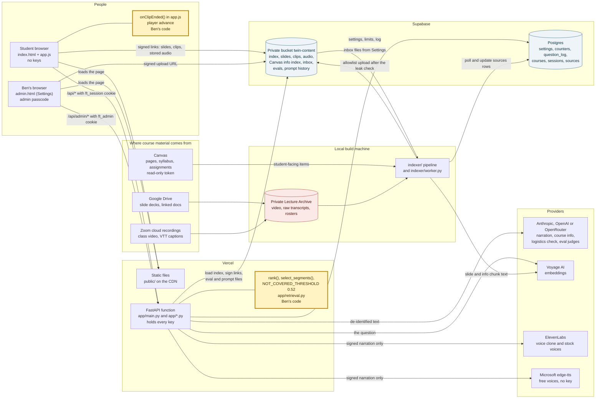
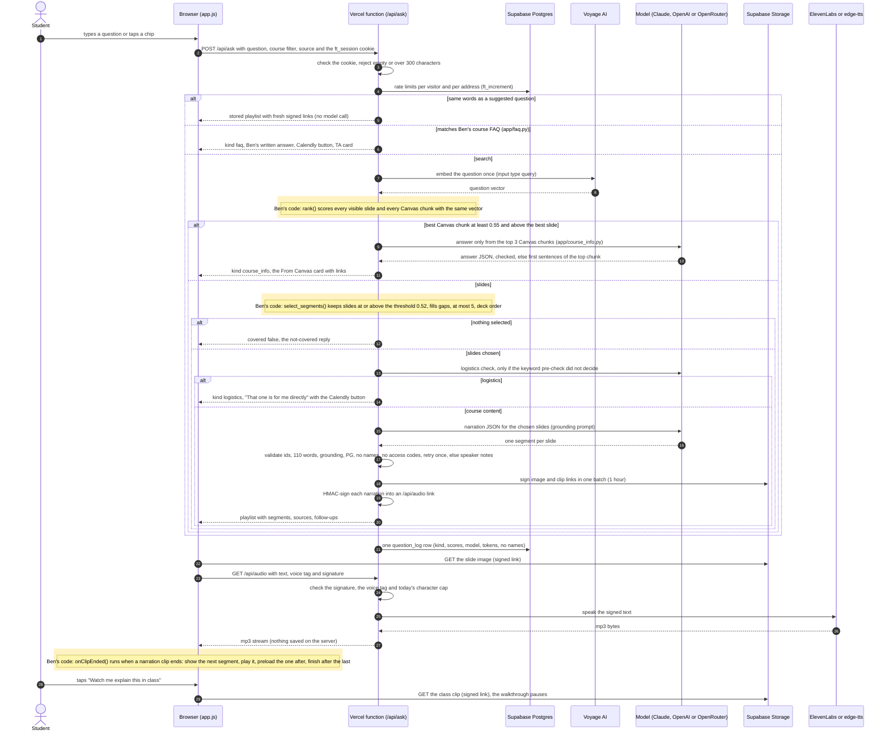
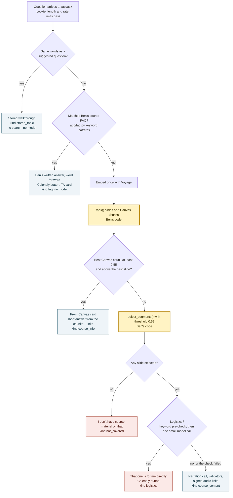
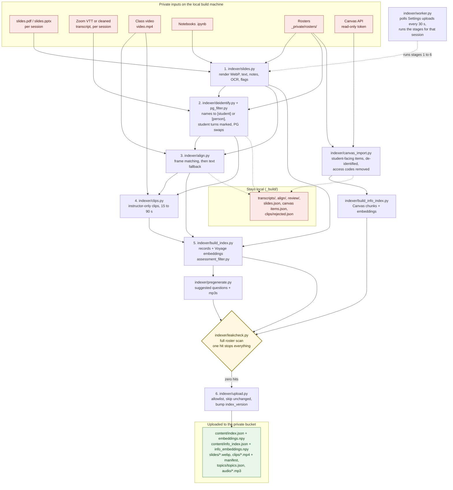
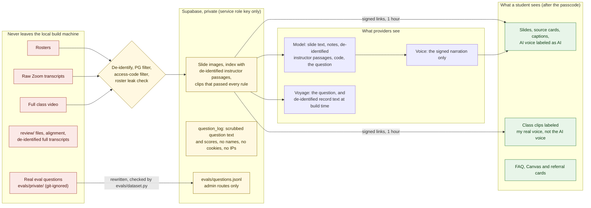
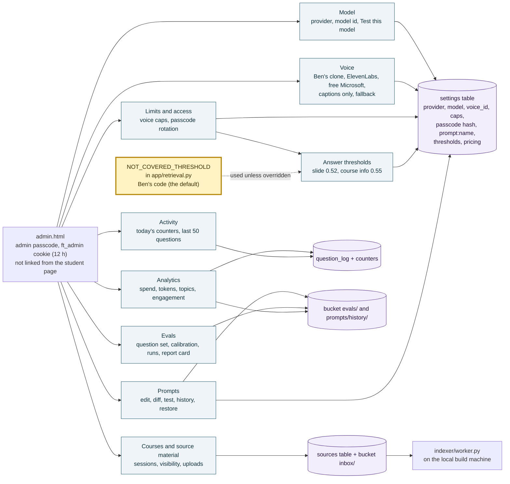
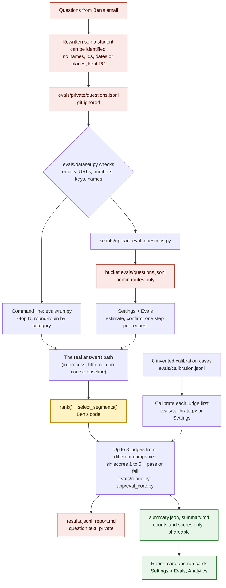

# How Faculty Twin works: architecture diagrams

*Written by Claude Code (Claude Opus 5.5) from the code on `main` and [SPEC.md](SPEC.md), October 8, 2026. Where this page and the spec disagree, the spec wins.*

Seven diagrams, each with a short explanation. They render on GitHub (Mermaid).

**How Ben's hand-written code is marked.** Four pieces of the app are written by Ben by hand (see [AGENTS.md](../AGENTS.md), "Code Ben writes by hand"): `rank()` and `select_segments()` in `app/retrieval.py`, the not-covered threshold `NOT_COVERED_THRESHOLD = 0.52` in the same file, and `onClipEnded()` in `public/app.js`. In flowcharts they are **yellow boxes with a thick gold border** and the words "Ben's code". In the sequence diagram they sit inside **yellow shaded bands** with a "Ben's code" note.

Contents:

1. [System context](#1-system-context)
2. [One question, step by step](#2-one-question-step-by-step)
3. [How a question is routed](#3-how-a-question-is-routed)
4. [The content pipeline](#4-the-content-pipeline)
5. [Privacy and trust boundaries](#5-privacy-and-trust-boundaries)
6. [The Settings page](#6-the-settings-page)
7. [The eval harness](#7-the-eval-harness)

The data diagrams (every Postgres table and column, the Storage bucket's folders with who writes and reads each, the settings and counter keys, and what stays on the local build machine) are in **[DATABASE.md](DATABASE.md)**.

## 1. System context

Faculty Twin is one Vercel project: the static page (`public/`) on Vercel's CDN and one FastAPI function (`app/`) that holds every key. The browser never talks to a model or voice provider; it calls `/api/*` with a signed cookie and fetches slide images, clips and stored audio straight from the private Supabase bucket through links the function signed for an hour. Postgres holds the settings, rate-limit counters, the question log and the course catalog. Everything the function serves was built ahead of time on the local build machine, which holds the private Lecture Archive (class video, raw transcripts, rosters) and runs the `indexer/` pipeline and the upload worker. The two yellow boxes are Ben's hand-written code: retrieval on the server and the player's advance logic in the browser.

## 2. One question, step by step

A question starts in the browser and goes to `/api/ask` with the 7-day `ft_session` cookie. The function checks the cookie, the length and the rate limits, then tries the cheap answers first: a suggested question replays its stored playlist, and Ben's course FAQ answers with his own words, neither calling a model. Otherwise the question is embedded once, and Ben's `rank()` scores both the slides and the Canvas chunks with that one vector; a strong Canvas match becomes a short "From Canvas" answer, and otherwise Ben's `select_segments()` picks the slides against the 0.52 threshold. Chosen slides pass a logistics check and then one narration call, whose JSON is validated in code before anything is signed for the voice. The page shows each slide from a signed link, plays each narration through `/api/audio` (which speaks only text the server signed), and Ben's `onClipEnded()` moves the walkthrough along when each narration ends.

## 3. How a question is routed

Every question takes exactly one path, and the path is saved with it in the question log as its **kind** (the badge in Settings > Activity). The order is cheapest first: stored topics and the FAQ need no embedding and no model. After one embedding, the Canvas course-info index wins only when its best chunk clears its own threshold (0.55 by default) and beats every slide, so a concept question still gets slides. Ben's `select_segments()` decides between slides and "not covered" using the slide threshold (0.52, Ben's value, overridable in Settings > Answer thresholds). The logistics check exists because meeting, absence and grade emails scored just above 0.52 in the October 7 eval; if that check fails for any reason the question is treated as course content, so it can never block a real answer. More detail: [TESTING_AND_SCORES.md](TESTING_AND_SCORES.md#how-a-question-is-answered).

## 4. The content pipeline

Each stage is its own script, run on the local build machine with `uv run`, reading the private archive and writing to `~/Lecture Archive/_build/`; a stage skips work whose inputs have not changed. Slides are rendered and their text, notes and OCR text extracted first; transcripts are then de-identified against the rosters (every person except Ben becomes `[student]` or `[person]`, student turns are dropped, cursing is smoothed), aligned to slides by matching video frames to slide images, and cut into clips only where the rules all pass (instructor only, no masked names, no PG swaps, no student presentations, nothing from the Tesla vs Waymo case). `build_index.py` folds everything into one record per slide and code cell and embeds it with Voyage; `canvas_import.py` and `build_info_index.py` do the same for Canvas course information. The roster leak check is the gate: a single hit stops the upload, and `upload.py` then sends only an allowlist of files and bumps `settings.index_version`, so warm functions reload within a minute. The red boxes never leave the machine. There is no Ben-written code in the pipeline. Commands are in the README under "Rebuild the content".

## 5. Privacy and trust boundaries

Rosters, raw transcripts, the full class video and the review files stay on the local build machine; nothing reads them anywhere else, and they are never committed. What crosses the boundary has been through de-identification, the PG filter, the access-code filter and the roster leak check, and goes only to the private bucket, which the browser reaches through one-hour signed links after the passcode. Model and embedding providers see de-identified slide text, notes, instructor speech, code and the student's question, never a roster; the voice provider sees only narration the server wrote and signed. The question log keeps scrubbed question text and scores with no names, accounts, cookies or addresses (`app/privacy.py`). Students see slides and captions with an AI-voice label that matches the voice actually speaking, and class clips labeled as Ben's real voice. The threat model behind this is in [SECURITY.md](SECURITY.md).

## 6. The Settings page

The Settings page (`public/admin.html`, with `admin.js`, `admin-analytics.js` and `admin-evals.js`) is Ben's control panel, behind a separate admin passcode and a 12-hour cookie. Model, Voice, Limits and access, Answer thresholds and Prompts all write rows in the `settings` table, which every warm function re-reads through a 30-second cache, so a change reaches students within half a minute without a deploy. Courses and source material create `sources` rows and upload files straight from the browser into the bucket's `inbox/`, which the local worker picks up. Prompts and Evals keep their history and results as JSON files in the private bucket; Analytics and Activity read the question log and usage counters. The slide threshold's default is Ben's hand-written `NOT_COVERED_THRESHOLD`; Settings can only override it at run time, and "Reset to default" goes back to his value. See the screenshots in [screenshots/README.md](screenshots/README.md).

Added Oct 8: **Student alerts** (`admin-alerts.js`, `app/admin_alerts.py`). When a student reports a broken quiz, a broken submission, or an API key out of credits, the first step of `answer()` (`app/alerts.py`) works out the course and the Canvas item and texts Ben's cell through Twilio's Messages API, with a scrubbed quote, a 2 hour dedupe, a daily cap, and one alert per visitor per day. Every alert is also stored in the bucket at `alerts/<UTC>.json`, so the Settings panel shows it even when Twilio is not set up. See "Instructor alerts" in [SPEC.md](SPEC.md).

## 7. The eval harness

The eval harness asks how well the twin answers the questions students really send. Questions come from Ben's email, are rewritten so no student can be identified, live only in the git-ignored `evals/private/`, and are checked again by `evals/dataset.py` before any model sees them; a checked copy can be uploaded to the private bucket for Settings > Evals. A run sends each question through the same `answer()` path students use (so Ben's retrieval decides what is covered), then up to three judges from different companies score six dimensions and give a verdict, after each judge has passed the eight invented calibration cases. Only the summary (counts and scores, no question text) is shareable; it feeds the report card in Settings. The command line and Settings share one implementation (`app/eval_core.py`), so their numbers agree. Details: [evals/README.md](../evals/README.md) and [TESTING_AND_SCORES.md](TESTING_AND_SCORES.md#run-evals-from-settings).
