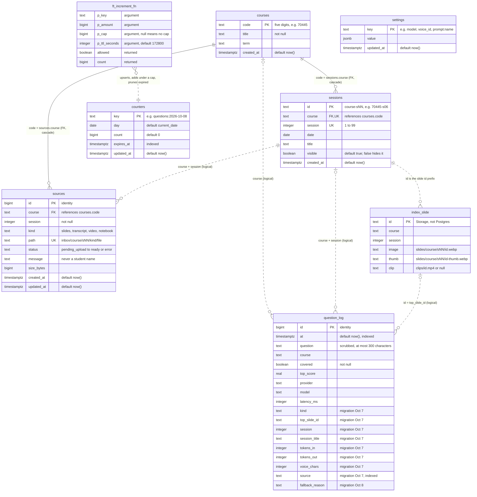
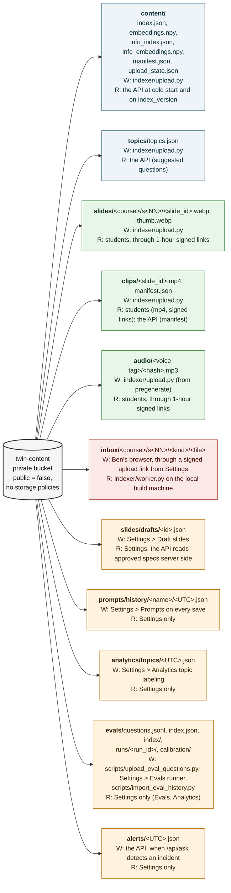
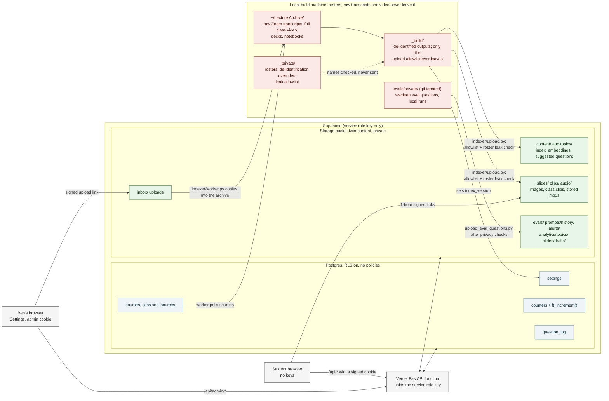

# Faculty Twin data: database diagrams

*Written by Claude Code (Claude Opus 5.5) from `supabase/schema.sql` and the code on `main`, October 8, 2026. Where this page and [SPEC.md](SPEC.md) ("Database tables") disagree, the spec wins. Every column and path below was checked against the code.*

Faculty Twin keeps its data in three places: **Supabase Postgres** (six small tables and one function), the **private Supabase Storage bucket `twin-content`** (course content, uploads, admin records), and the **private archive on the local build machine** (everything with a student name or a raw recording in it). Only the backend (`app/supa.py`) and the local pipeline (`indexer/common.py`) talk to Supabase, always with the service role key, and the browser never holds that key.

Contents:

1. [Postgres tables](#1-postgres-tables)
2. [The Storage bucket](#2-the-storage-bucket)
3. [Settings keys and counter keys](#3-settings-keys-and-counter-keys)
4. [What lives where](#4-what-lives-where)

## 1. Postgres tables

How to read it:

- **Solid lines are real foreign keys.** `sessions.course` and `sources.course` reference `courses.code` with `on delete cascade`. `sessions` is also unique on `(course, session)` (the two `UK` columns).
- **Dotted lines are logical links the code relies on, with no foreign key.** A `sources` row names its session by `course` + `session` (Settings creates the `sessions` row first, `app/admin.py` `_ensure_session`). A `question_log` row keeps `course`, `session` and `session_title` as plain copies, so topics per course and session survive index rebuilds and deleted sessions.
- **`index_slide` is not a table.** It stands for one slide record in `content/index.json` in the bucket. Slide ids are `<sessions.id>-<NNN>` (for example `70445-s06-014`), and `question_log.top_slide_id` holds the best-scoring one.
- **`ft_increment_fn` is the function `ft_increment(p_key, p_amount, p_cap, p_ttl_seconds)`**, drawn as a box because Mermaid has no function shape. It inserts the counter row if it is missing, adds `p_amount` only when the result stays at or under `p_cap`, deletes rows that expired more than a day ago, and returns `(allowed, count)`. It is `security definer`, with execute revoked from `public`, `anon` and `authenticated` and granted only to `service_role`. Every rate limit and daily cap goes through it (`app/limits.py` `increment`).
- **The migration columns.** `kind` was added on October 7 (logistics check). `top_slide_id`, `session`, `session_title`, `tokens_in`, `tokens_out`, `voice_chars` and `source` were added the same day for Settings > Analytics, and `fallback_reason` on October 8. They are `alter table ... add column if not exists`, so `schema.sql` is safe to re-run; until they exist, `app/limits.py` `log_question` retries the insert with fewer columns, so logging never stops.
- **What the values mean.** `question_log.kind` is what answered: `course_content`, `stored_topic`, `faq`, `course_info`, `logistics`, `web`, `cross_course` (the other course's slides, when the filtered course had none over the threshold), `not_covered`, or `alert` (null on old rows). `source` is `chip`, `typed` or `follow_up` for students and `smoke`, `eval` or `prompt_test` for test traffic. `fallback_reason` says why a course-info answer fell back to the Canvas text (`app/course_info.py` `FALLBACK_REASONS`, such as `provider_credits`). `sources.status` runs `pending_upload` (upload link minted) to `uploaded` to `processing` to `ready` or `error`; `indexer/worker.py` claims only `uploaded` rows.

**Row Level Security is on for all six tables** (`counters`, `question_log`, `settings`, `courses`, `sessions`, `sources`) **with no policies.** The public anon key, which this app never uses, can read or write nothing. Only the service role key reads them: the Vercel function through `app/supa.py`, and the local pipeline (`indexer/upload.py` sets `settings.index_version`; `indexer/worker.py` reads `courses`, `sessions` and `sources` and updates `sources.status`). The question log holds scrubbed question text and scores only: no names, accounts, cookies, visitor ids or addresses.

## 2. The Storage bucket

`twin-content` is private (`schema.sql` forces `public = false` on every run) and has no storage policies, so only the service role key can read or write it. Nothing in it is ever reached by a plain URL. Students get **one-hour signed links** that the API mints after the passcode check, and only for `slides/`, `clips/` and `audio/` (`app/storage.py` `is_media_path`). Everything else is read server side.

Green reaches students through signed links, blue is read only by the API, orange only through the Settings routes behind the admin cookie, and red is the upload inbox that only the local worker reads.

| Prefix | Written by | Read by | Code |
| --- | --- | --- | --- |
| `content/index.json`, `embeddings.npy` | `indexer/upload.py` (last, after the media, so a reader never sees an index whose images are missing) | The API at cold start, and again within 60 seconds of a new `settings.index_version` | `indexer/upload.py`, `app/storage.py` |
| `content/info_index.json`, `info_embeddings.npy` | `indexer/upload.py`, when `indexer/build_info_index.py` has built them | The API (course-info answers); missing files turn the feature off | `app/storage.py`, `app/course_info.py` |
| `content/manifest.json`, `content/upload_state.json` | `indexer/upload.py` | `indexer/upload.py` only (the build manifest, and the sha256 of every uploaded object so unchanged files are skipped) | `indexer/upload.py` |
| `slides/<course>/s<NN>/<slide_id>.webp`, `-thumb.webp` | `indexer/upload.py`, indexed slides only | Students, through one-hour signed links (refreshed by `POST /api/links`) | `app/storage.py` `media_urls` |
| `clips/<slide_id>.mp4`, `clips/manifest.json` | `indexer/upload.py`, only clips that passed every rule; the manifest keeps those rows and the fields the backend reads | Students (mp4, signed links); the API (manifest, for clip time windows) | `app/storage.py` |
| `audio/<voice tag>/<hash>.mp3` | `indexer/upload.py`, the files `topics/topics.json` points to (made by `indexer/pregenerate.py`); older ElevenLabs files sit under `audio/<voice id>/` | Students, through signed links, when the stored voice matches the current one | `app/voices.py` `audio_prefixes`, `app/main.py` |
| `topics/topics.json` | `indexer/upload.py` | The API (`/api/topics`, stored playlists) | `app/storage.py` |
| `inbox/<course>/s<NN>/<kind>/<file>` | Ben's browser, straight to Storage through a signed upload link minted by `POST /api/admin/uploads` (one `sources` row per file) | `indexer/worker.py`, which copies the file into the archive session folder | `app/admin.py`, `indexer/worker.py` |
| `slides/drafts/<id>.json` | Settings > Draft slides (AI-drawn helper slide specs, with a status) | Settings; the API reads approved drafts server side when `helper_slides_use_approved` is on, and sends the checked spec, not a file link | `app/helper_slide.py` |
| `prompts/history/<name>/<UTC>.json` | Settings > Prompts, one file per saved version | Settings (history, restore) | `app/prompts.py` |
| `analytics/topics/<UTC>.json` | Settings > Analytics, each topic-labeling run | Settings > Analytics | `app/analytics.py` |
| `evals/questions.jsonl`, `index.json`, `index/<run_id>.json`, `runs/<run_id>/...`, `calibration/...` | `scripts/upload_eval_questions.py` (after the privacy checks), the Settings > Evals runner and question editor, `scripts/import_eval_history.py` | Settings > Evals and Settings > Analytics only, never a signed URL | `app/eval_store.py` |
| `alerts/<UTC>.json` | The API, when `/api/ask` detects a broken quiz, submission or API key (stored whether or not the text went out) | Settings > Student alerts | `app/alerts.py` |

There is no settings history in the bucket: `settings` rows are the current values, the threshold history is the `threshold_history` setting, and prompt history is `prompts/history/`.

**Never in the bucket**, whatever is in the build folder: transcripts, alignment, review files, rosters, notebooks and code JSON, `slides.json`, `deck.json`, PDFs and pptx files, anything under a `_private` folder. `indexer/upload.py` checks every path against an allowlist and a denylist, and runs the roster leak check on every text object before anything is sent.

## 3. Settings keys and counter keys

### `settings` keys

Settings writes these through `app/settings_store.py` (`put`), and every warm function sees a change within 30 seconds (the read cache). A missing key means the environment variable or the built-in default applies.

| Key | Value | What it controls | Written by |
| --- | --- | --- | --- |
| `provider`, `model` | `anthropic`, `openai` or `openrouter`; a model id | The narration model for every answer | Settings > Model |
| `voice_id` | `eleven:<id>`, `edge:<ShortName>`, an older bare ElevenLabs id, or `none` (captions only) | Who reads the answers. Missing means `ELEVENLABS_VOICE_ID` | Settings > Voice |
| `voice_kind` | `{voice_id, kind}`, kind `clone` or `stock` | The label students see ("made from my recordings" only for the clone) | Settings > Voice, after checking the ElevenLabs account |
| `voice_fallback`, `voice_fallback_voice` | `captions` or `free`; `edge:<ShortName>` | What happens when ElevenLabs fails or hits its cap | Settings > Voice |
| `daily_voice_char_cap`, `daily_free_voice_char_cap` | integers | Daily characters for ElevenLabs and for the free Microsoft voices | Settings > Limits and access |
| `student_passcode_hash` | PBKDF2 hash, never the passcode | The student passcode; rotating it signs every student out | Settings > Limits and access |
| `index_version` | string, plus `+info-<hash>` when a course-info index was uploaded | Which index warm functions should hold; a change makes them reload within 60 seconds | `indexer/upload.py` |
| `prompt:<name>` | `{text, updated_at, note}` | An edited prompt; null or missing means the default in `app/prompts.py` | Settings > Prompts |
| `slide_threshold`, `info_threshold` | floats from 0.30 to 0.90 | Overrides of the not-covered threshold (Ben's 0.52 in `app/retrieval.py`) and the course-info threshold (0.55) | Settings > Limits and access (Answer thresholds) |
| `threshold_history` | the last 20 changes, newest first | The change history shown under the thresholds | Settings > Limits and access (Answer thresholds) |
| `pricing` | the price table | Spend estimates in Analytics; `app/pricing.py` defaults until saved | Settings > Analytics |
| `alerts_enabled`, `alert_daily_cap` | boolean (missing means on); 0 to 50 (missing means `ALERT_DAILY_CAP` or 10) | Instructor text alerts | Settings > Student alerts |
| `web_answers_enabled`, `daily_web_answer_cap`, `web_answer_voice` | boolean (missing means on); integer (missing means `DAILY_WEB_ANSWER_CAP` or 200); `edge:<ShortName>` or `none` | Answers from a web search beyond the slides, their daily cap, and the free voice that may read them (never the clone) | Settings > Limits and access (Web answers) |
| `helper_slides_enabled`, `daily_helper_slide_cap`, `helper_slides_use_approved` | boolean (missing means on); integer (missing means `DAILY_HELPER_SLIDE_CAP` or 150); boolean (missing means off) | AI-drawn helper slides, their daily cap, and whether approved drafts are reused | Settings > Draft slides |

### `counters` key patterns

Every key goes through `ft_increment`. `<visitor>` and `<addr>` are salted hashes (the address hash rotates daily); no raw address or cookie is stored. Day stamps are UTC: `<day>` is `2026-10-08`, `<YYYYMMDD>` and `<minute>` (`YYYYMMDDHHMM`) are compact. Limits marked "fails closed" refuse when the database cannot be reached.

| Key pattern | Limit or use | Code |
| --- | --- | --- |
| `rl:min:<visitor>:<minute>`, `rl:day:<visitor>:<YYYYMMDD>` | Questions per visitor: 5 a minute, 30 a day | `app/limits.py` `check_ask_rate` |
| `rl:addr-min:<addr>:<minute>`, `rl:addr-day:<addr>:<YYYYMMDD>` | Questions per network address: 20 a minute, 300 a day | `app/limits.py` |
| `rl:event-min:<visitor>:<minute>`, `rl:event-day:<visitor>:<YYYYMMDD>` | Page events: 60 a minute, 2,000 a day | `app/main.py` |
| `rl:links-min:<visitor>:<minute>` | Signed-link refreshes: 10 a minute | `app/main.py` `/api/links` |
| `login:<student or admin>:<addr>:<15-minute window>` | Login tries: 10 per 15 minutes for students, 5 for admin (admin fails closed) | `app/limits.py` `check_login_rate` |
| `questions:<day>`, `covered:<day>`, `not_covered:<day>`, `rate_limited:<day>` | Today's counts in Settings > Activity | `app/limits.py` |
| `llm_calls:<day>` | Model calls by all visitors, 600 a day by default (fails closed; past it, narration falls back to speaker notes) | `app/limits.py` `take_llm_call` |
| `embeds:<day>` | Question embeddings, 1,500 a day (fails closed) | `app/limits.py` `take_embedding` |
| `eval_llm_calls:<day>` | Model calls by eval runs from Settings, 300 a day | `app/limits.py` `take_eval_call` |
| `voice_chars:<day>`, `free_voice_chars:<day>` | Daily ElevenLabs and free-voice characters, capped by the two voice cap settings (fails closed) | `app/limits.py` `take_voice_chars` |
| `voice_share:v:<visitor>:<day>`, `voice_share:a:<addr>:<day>` (and `free_voice_share:...`) | One visitor or address may use at most a quarter of a day's voice characters | `app/limits.py` `_voice_keys` |
| `web_answers:<day>`, `helper_slides:<day>`, `topic_label:<day>` | Daily caps for web answers, helper slides, and Analytics topic labeling (10 runs) | `app/limits.py`, `app/helper_slide.py`, `app/analytics.py` |
| `alerts_sent:<day>`, `alert_tests:<day>`, `alert_visitor:<visitor>:<day>` | Texts sent today (the alert cap), test texts (5 a day), one alert per visitor per day | `app/alerts.py` |
| `usage:<day>:<purpose>:<provider>:<model>:in\|out\|calls` | Tokens and calls per purpose and model, for Analytics spend | `app/usage.py` |
| `embed:<day>:voyage:<model>:tokens\|calls`, `tts:<day>:<voice tier>:chars\|calls` | Embedding and voice usage for Analytics (tier `clone`, `stock`, `unverified` or `free`) | `app/usage.py` |
| `event:<day>:<name>`, `faq:<day>:<entry id>`, `sms:<day>:twilio:messages\|segments` | Engagement events, FAQ hits, text messages | `app/usage.py` |

Rate-limit and cap rows expire after two days (`p_ttl_seconds` 172800, five minutes for per-minute keys, 30 minutes for login windows); the `usage:`, `embed:`, `tts:`, `event:`, `faq:` and `sms:` rows are kept 400 days so Analytics can show 90 days.

## 4. What lives where

| Place | What is there | Who can reach it |
| --- | --- | --- |
| **Postgres** | Small structured rows: settings, counters, the question log, the course and session catalog, upload status | The Vercel function and the local pipeline, with the service role key |
| **Storage bucket** | Files: the index and its embeddings, slide images, class clips, stored audio, suggested questions, the upload inbox, and admin records (eval data, prompt history, alerts, topic runs, draft slides) | The same two, with the service role key; students only through one-hour signed links to `slides/`, `clips/` and `audio/` |
| **Local private archive** | Rosters, raw Zoom transcripts, the full class video, the de-identification overrides and leak allowlist, the build folder's transcripts, alignment and review files, and `evals/private/` | Only the local build machine. None of it is uploaded, committed, or sent to a model provider |

Related: [ARCHITECTURE.md, section 5](ARCHITECTURE.md#5-privacy-and-trust-boundaries) (privacy boundaries), [supabase/README.md](../supabase/README.md) (how to apply the schema), [SECURITY.md](SECURITY.md) (threat model).
