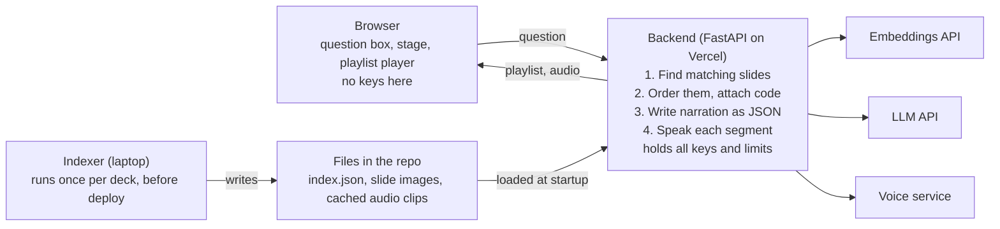

# Faculty Twin: Spec and Build Guide

Oct 5, 2026 · Ben Collier

## What we are building

Faculty Twin is a web app where a student asks a course question and gets a short narrated walkthrough: the relevant slides and code appear on screen, and an AI voice cloned from Ben talks through them one at a time.

It is 15-113 Project 2, due Wednesday October 7 at 11:59 PM, with a budget of about 8 focused hours. It lives in its own repo first and gets embedded in the portfolio site afterward.

**The demo scenario.** A visitor types "explain clustering methods." The chat slides to a side panel. Four or five slides from the clustering deck appear in order on the main stage, with the matching notebook code beside them. Ben's voice explains each slide in 30 to 45 seconds, and the stage advances when each clip ends. The visitor can pause, go back, or ask a follow-up.

**What makes it different from a chatbot.** The answer is assembled from Ben's own teaching materials, shown as the materials themselves, and every spoken sentence is grounded in a slide, its speaker notes, or a lecture transcript. If the materials do not cover a question, the twin says so.

## Scope

Build in this order and stop wherever the clock says to. Each tier is a finished, submittable project on its own.

| Tier | What it adds | Done when |
| --- | --- | --- |
| 1. Must work | One topic (clustering), one deck, one notebook. Question in, ordered slides and code out, narration shown as captions. Deployed at a public URL. | A stranger on a phone can ask "what is k-means" and step through the answer |
| 2. Voice | Narration spoken in the cloned voice, slides advance automatically, pause and back controls | The same question plays start to finish with no clicks after "ask" |
| 3. Polish | Suggested-question chips, pre-generated answers for 8 to 10 common questions, a short recorded video clip of Ben in the corner while the answer loads, a question log in a database | First audio starts in under 2 seconds for a suggested question |
| 4. Later, not for Wednesday | Live avatar video, more courses, memory between visits, voice input, embedding in collier.phd | After submission |

**The cut line for the check-in question.** If time runs short, tier 3 goes first, then the voice. Tier 1 alone still meets the assignment: frontend-backend communication, a keyed third-party API, and a retrieval component built on embeddings.

## User experience

The page has two states, and the change between them is the signature moment of the app.

**Idle.** A centered question box, a one-line description ("An AI version of Prof. Collier that teaches from his own slides"), and six to eight suggested-question chips. A small label says the voice is AI-generated.

**Presenting.** The chat docks to a narrow panel on the right, about 30% of the width. The stage takes the rest:

- Slide image at the top of the stage, large.
- Code panel under it, shown only when a segment has code, with the relevant lines marked.
- A caption strip with the sentence being spoken.
- A control bar: play or pause, previous, next, a progress row of dots (one per segment), and a mute button.

On a phone the stage stacks on top and the chat collapses to an input bar at the bottom.

**The flow after a question**

1. Visitor submits a question or taps a chip. That tap is also what unlocks audio in the browser.
2. The chat docks and the stage shows a loading state. In tier 3 the corner clip of Ben plays here.
3. The playlist arrives with all slide images, code, and caption text. The first slide appears right away.
4. Audio for segment 1 loads and plays. Audio for segment 2 loads in the background.
5. When a clip ends, the stage moves to the next segment. After the last one, the chat offers two follow-up questions.
6. A new question at any time stops playback and starts over at step 2.

**Error states to design, not discover**

- Question is off-topic or not covered: a spoken or written "I don't have course material on that" plus the suggested chips.
- Backend is waking up or unreachable: a plain message and a retry button, never a blank stage.
- Voice service fails or the daily cap is reached: the walkthrough continues with captions only and a small note saying audio is unavailable.

## Architecture

One repo, one Vercel project. The FastAPI backend deploys as a single Vercel Function, and the frontend, slide images, and pre-generated audio are static files in `public/`, served from Vercel's CDN. One URL, one deploy, no cross-origin setup this week, and no long cold start. Fallback if the Vercel deploy fights back in Block 0: the same code on a paid Render instance.



The browser only ever talks to the backend. The indexer runs on the laptop ahead of time and also calls the embeddings API, so the deployed service starts with everything it needs already in the repo.

| Part | What it does | Built with |
| --- | --- | --- |
| Indexer (`indexer/`) | Runs on Ben's laptop, once per content change. Turns a deck and a notebook into slide images plus `index.json`. | Python, python-pptx, nbformat, LibreOffice and pdftoppm for slide images, an embeddings API |
| Backend (`app/`) | Answers questions: retrieval, narration script, speech. Holds every key. Enforces limits. | Python, FastAPI as one Vercel Function, numpy, an LLM API, ElevenLabs for the voice |
| Frontend (`public/`) | The idle and presenting screens, the playlist player. | Plain HTML, CSS, JavaScript. No framework, no bundler, same as the portfolio site |
| Static content (`public/slides/`, `public/audio/`) | Slide PNGs and pre-generated audio for suggested questions. | Files committed to the repo, served from the CDN |
| Index (`content/index.json`) | Slide and code records with embeddings, read by the backend. | A JSON file bundled with the function |
| Counters and question log | Rate-limit counters, the daily voice cap, and one row per question. | Supabase |

**Why these choices**

- Vercel's Python runtime runs FastAPI directly, so the backend code is ordinary FastAPI. Vercel looks for a FastAPI instance named `app` in a file such as `app/main.py`, and serves anything in `public/` at the matching root path.
- A function keeps nothing between requests: no saved files, no counters in memory. So pre-generated audio lives in the repo, live audio is streamed back without being saved, and counters live in Supabase.
- The index is a JSON file, not a vector database. One deck and one notebook produce roughly 60 to 100 vectors, and numpy searches that in under a millisecond. Ben can open the file and read it, which helps when explaining the code.
- Speech is generated per segment, not per answer. The first clip can start while later ones are still being made, and one failed clip does not sink the whole answer.

**Repo layout**

```
faculty-twin/
  README.md            written by Ben
  prompt_log.md        separate file, same folder
  .gitignore           includes .env
  .env.example         key names only, no values
  requirements.txt
  vercel.json          sets the function's max duration
  app/main.py          FastAPI instance named app, routes
  app/retrieval.py     ranking and ordering (hand-written)
  app/narration.py     LLM call and grounding prompt
  app/speech.py        voice call, signed links, daily cap
  public/index.html
  public/app.js        player and state changes
  public/styles.css
  public/slides/       clustering-001.png ...
  public/audio/        pre-generated clips
  content/index.json
  indexer/build_index.py
  tests/test_retrieval.py
```

## Data

**Content sources, in order of value**

1. The slide deck (.pptx): slide text and speaker notes.
2. The matching notebook (.ipynb): code cells and the markdown cells above them.
3. A cleaned lecture transcript for that session, with student questions removed. This is what makes the narration sound like Ben's explanation instead of a summary of bullet points. Optional for tier 1.

**What the indexer writes.** One record per slide and one per code cell, all in `content/index.json`:

```json
{
  "id": "clustering-014",
  "kind": "slide",
  "deck": "clustering",
  "order": 14,
  "title": "Choosing k: the elbow method",
  "text": "slide text, notes, and any transcript passage matched to this slide",
  "image": "/slides/clustering-014.png",
  "related_code": ["clustering-cell-22"],
  "embedding": [0.013, -0.094]
}
```

Code cells use the same shape with `"kind": "code"`, a `source` field holding the code, and no image. `related_code` is filled in by hand for tier 1: a short mapping file that says which cells go with which slides. Ten minutes of manual work beats an hour of tuning automatic matching.

**What the backend returns for a question.** A playlist:

```json
{
  "question": "how do I choose k?",
  "covered": true,
  "segments": [
    {
      "n": 1,
      "slide_id": "clustering-014",
      "image": "/slides/clustering-014.png",
      "code": { "source": "inertias = [] ...", "mark_lines": [3, 4, 5] },
      "narration": "Sixty to ninety words in Ben's teaching voice.",
      "audio": "/audio/9f2c1a.mp3"
    }
  ],
  "follow_ups": ["What is the silhouette score?", "When does k-means fail?"]
}
```

`covered` is false when the best match scores below the threshold. In that case `segments` is empty and the frontend shows the not-covered message.

**Segment rules**

- Three to five segments per answer. More than five turns an answer into a lecture.
- Segments play in deck order, even if a later slide scored higher. Slides were written to be seen in sequence.
- Each narration is 60 to 90 words, which is about 25 to 40 seconds of speech.
- Pre-generated clips are static files named by a hash of their narration text, as in the example above. For a live answer, the audio field is a signed link to the audio route instead.

## API endpoints

Four routes. The frontend never talks to a model or voice provider directly.

| Route | Input | Returns | Notes |
| --- | --- | --- | --- |
| `GET /api/health` | none | `{"ok": true}` | The frontend calls this on page load to warm the function and to show a clear message if it is down |
| `GET /api/topics` | none | The list of suggested questions | Each one maps to a pre-generated playlist whose audio is already in `public/audio/` |
| `POST /api/ask` | `{"question": "..."}`, 300 characters max | A playlist (see Data) | Retrieval, then one LLM call that writes all segment narrations as JSON. No speech is generated here |
| `GET /api/audio` | the narration text and a signature, both taken from a segment's audio link | An mp3, streamed | Checks the signature, checks the daily cap, calls the voice service, streams the result. Nothing is saved on the server |

**Inside `/api/ask`, step by step**

1. Reject empty or over-length questions with a 400 and a readable message.
2. Check the rate limit for this visitor.
3. If the question matches a suggested question, return its stored playlist and stop.
4. Embed the question.
5. Score every slide by cosine similarity. If the top score is under the threshold, return `covered: false`.
6. Pick the segments (see Code Ben writes by hand).
7. Send the chosen slides' text and code to the LLM with the grounding prompt. Ask for JSON only.
8. Validate the JSON: every `slide_id` must be one that was sent, every narration under 110 words. If validation fails, retry once, then fall back to using each slide's speaker notes as the narration.
9. Sign each narration with a secret key held in an environment variable, build the audio links from the text and signature, and return the playlist.

**The grounding prompt, in plain terms.** The model is told it is writing narration for Prof. Collier's walkthrough. It may only explain what is in the supplied slide text, notes, transcript passages, and code. It writes in first person, in a conversational teaching voice, one segment per slide, and refers to what is on screen ("on this slide," "in line 4"). It must not add facts, examples, or opinions that are not in the supplied material, and it must not answer questions about anything outside the course content.

## Safety, cost and privacy rules

A public page that speaks in a real professor's voice needs firm limits. These are requirements, not polish.

**The voice only says what the materials support**

- Narration is grounded in indexed content. Off-topic questions get the not-covered response, never an improvised answer.
- The audio route only speaks text the backend itself wrote. Every audio link carries a signature made with a secret key, and the route refuses text whose signature does not match, so nobody can send it their own words.
- The page states that the voice is AI-generated from Ben's recordings, on the idle screen and in the README.

**Spending caps**

- Per-visitor rate limit: 5 questions per minute, 30 per day.
- Daily cap on characters sent to the voice service, set in an environment variable. Past the cap, answers continue with captions only.
- Question length capped at 300 characters. Narration capped at 110 words per segment.
- Suggested-question clips are pre-generated and served as static files, so replaying them costs nothing. Rate-limit and cap counters live in Supabase, because a function keeps no memory between requests.

**Secrets**

- All keys live in the Vercel project's environment variables. `.env` is in `.gitignore` from the first commit. `.env.example` lists the variable names with no values.
- Before the first push, search the repo for key prefixes. The assignment takes a large deduction for a committed secret.

**Content and privacy**

- No student voices or names. Transcripts are stripped of student questions before indexing.
- Use a deck Ben is comfortable publishing in full: no textbook figures, no licensed images, no unreleased exam material.
- The question log stores question text and scores only. No names, no accounts, no IP addresses in the stored rows.
- Voice recordings used for cloning are Ben's own. Check the voice provider's current terms and plan requirements before uploading.

## Build guide

Eight blocks, about 8 hours. Every block ends the same way: run its check, commit and push, and add an entry to `prompt_log.md` with the prompts used and anything the AI got wrong. The assignment grades the commit history and the log, so doing this as you go is part of the work.

| Block | When | Time | Result |
| --- | --- | --- | --- |
| 0. Skeleton and first deploy | Mon evening | 30 min | A public URL that says hello |
| 1. Indexer | Mon evening | 75 min | Slide images and `index.json` |
| 2. Ask endpoint, text only | Mon evening | 75 min | A playlist from a typed question |
| 3. Stage and player | Tue | 90 min | The full walkthrough with captions |
| 4. Voice | Tue | 60 min | Spoken narration, auto-advance |
| 5. Limits and pre-generated answers | Tue | 45 min | Caps on, suggested questions instant |
| 6. Phone pass and error states | Wed | 45 min | Works on a phone, fails gracefully |
| 7. README, log, video, submit | Wed | 60 min | Submitted by 9 PM, three hours early |

### Block 0. Skeleton and first deploy

1. Create the `faculty-twin` repo, public, with the folder layout from Architecture.
2. Add `.gitignore` (with `.env`), `.env.example`, `requirements.txt`, a README stub, and an empty `prompt_log.md`.
3. Write `app/main.py` with a FastAPI instance named `app` and one route, `/api/health`. Put a placeholder `index.html` in `public/`.
4. Run it locally with `vercel dev`, following Vercel's FastAPI guide (linked under Open decisions).
5. Connect the GitHub repo to a new Vercel project and deploy. Add the environment variables in the project settings, even if empty.
6. Time box: 30 minutes. If the deploy is still failing at that point, switch to a paid Render instance and move on.

**Check:** the Vercel URL loads the page on your phone, and `/api/health` returns ok. Deploying first answers the check-in question about deployment and removes the biggest deadline risk.

### Block 1. Indexer

1. Pick the deck and notebook. Export the deck to PDF, then to one PNG per slide at about 1600 px wide, saved in `public/slides/`.
2. Extract each slide's title, body text, and speaker notes with python-pptx.
3. Extract code cells and their preceding markdown with nbformat.
4. Write the slide-to-code mapping by hand in a small YAML or JSON file.
5. Embed each record's text and write `content/index.json`.

**Check:** open `index.json` and read three records. Slide 1's image file is slide 1. Record count equals slides plus code cells.

### Block 2. Ask endpoint, text only

1. Load `index.json` into memory at startup.
2. Write the retrieval and segment-selection functions by hand (see next section). Test them with a few questions before any LLM call.
3. Add the narration call with the grounding prompt and JSON validation.
4. Add the not-covered threshold. Find its value by trying five on-topic and five off-topic questions and looking at the top scores.

**Check:** from a terminal, "how do I choose k" returns three to five segments in deck order with sensible narration, and "who won the Stanley Cup" returns `covered: false`.

### Block 3. Stage and player

1. Build the idle screen and the docking change to the presenting layout.
2. Render a segment: slide image, code panel with marked lines, caption.
3. Build the player as a small state machine: current segment number, playing or paused, next and previous. In this block, "playing" advances on a timer based on word count.
4. Add the progress dots and the follow-up chips.

**Check:** ask a question on the deployed site and click through the whole answer on laptop and phone.

### Block 4. Voice

1. Create the voice clone from 2 to 5 minutes of clean solo lecture audio. Listen to a test sentence before wiring anything.
2. Write `/api/audio`: check the signature, call the voice service, stream the mp3 back. Add the signing step to the ask route.
3. Replace the timer in the player with the audio element's ended event. Preload the next clip while the current one plays.
4. Add the mute button and the captions-only fallback.

**Check:** one tap on "ask," then hands off: the answer plays through all segments with sound, and slides change on time.

### Block 5. Limits and pre-generated answers

1. Create the Supabase table for counters. Add the rate limit and the daily character cap, both reading and writing that table.
2. Write eight to ten suggested questions. Run each once, review the narration by ear, fix anything wrong, and commit the playlists and the mp3 files in `public/audio/`. A small script on your laptop does the generating.
3. If time allows: record the 5-second corner clip, and add the question log to the same Supabase project.

**Check:** a suggested question starts speaking in under 2 seconds. Setting the cap to zero produces a captions-only answer with a note, not an error.

### Block 6. Phone pass and error states

1. Walk through every state on a real phone: idle, loading, presenting, not covered, backend asleep, audio failed.
2. Fix layout problems: long code lines, small tap targets, the caption covering the slide.
3. Ask someone who has not seen it to try three questions. Write down what confused them.

**Check:** no state shows a blank screen or a raw error message.

### Block 7. README, log, video, submit

1. Write the README yourself: what it does, how to use it, proudest features, how to run locally, how secrets are handled, how AI was used.
2. Finish `prompt_log.md`: tools and which job each did, the process, the hand-written code, verbatim prompts, one place AI got it wrong.
3. Record the demo on the deployed URL with sound. Show a question, the walkthrough, a refusal, and the retrieval function on screen while you explain it.
4. Add the project to `data/portfolio.json` in the portfolio repo, rebuild, commit.
5. Test the video link in an incognito window. Submit the form.

**Check:** every box in the deliverables checklist below is ticked.

## Code Ben writes by hand

The graders want to see changes you made yourself and can explain without notes. These four pieces are small, central to how the app behaves, and close to what you teach, so they are the ones to write without an AI tool.

**1. Cosine similarity and ranking** (`app/retrieval.py`). Given the question's embedding and the matrix of slide embeddings, return slides sorted by score. A few lines of numpy, and the same math as the similarity material in your own courses.

**2. Segment selection** (`app/retrieval.py`). This is the design decision that makes answers feel like teaching:

- Take the top 8 slides by score.
- Drop any under the threshold.
- Prefer slides that sit next to each other in the deck: if slides 12, 13, and 15 are in the top 8, include 14 as well so the explanation does not skip a step.
- Keep at most 5, then sort by deck order.
- Attach each slide's related code cell if it has one.

**3. The not-covered threshold.** Choosing the cutoff from your ten test questions, and writing down in the prompt log how you picked it.

**4. The player's advance logic** (`public/app.js`). The function that runs when a clip ends: move to the next segment, start its audio, preload the one after, and handle the last segment and the pause state.

`tests/test_retrieval.py` gets three tests on your selection function: a clear on-topic question returns slides in deck order, a gap between adjacent slides is filled, and an off-topic question returns nothing. Rink Rivals had a regression test that made a good story in the write-up, and these do the same job here.

**For the prompt log.** Likely candidates for "one place AI got it wrong": the slide-to-image export step, autoplay being blocked by the browser, and the model ignoring the JSON-only instruction. Note the first one that happens, with what you did about it.

## Deliverables checklist

From the [Project 2 page](https://www.cs.cmu.edu/~113/project2.html). Due Wednesday October 7 at 11:59 PM, with no extensions into Fall Break.

- [ ] Deployed app at a public URL, verified on a phone
- [ ] Public GitHub repo with several commits across the project days
- [ ] `README.md` at the repo root, written in Ben's own words, covering: what it does, how to use it, proudest features, how to run locally, how secrets are handled, a short summary of AI use with citations
- [ ] Any AI-written documentation sits at the bottom of the README under a heading that labels it as AI-generated
- [ ] `prompt_log.md` as a separate file in the same folder: models and tools used, which tool for which job and why, process from start to finish, which code Ben wrote or changed, important prompts verbatim, one place AI got it wrong
- [ ] No keys or secrets anywhere in the repo or its history
- [ ] Project linked from the Projects section of the portfolio site
- [ ] Demo video with sound, recorded on the deployed URL, explaining the architecture and the hand-written code
- [ ] Video link opens in an incognito window
- [ ] Google form submitted with deployed URL, repo URL, and video link
- [ ] Ready to explain the code in person at the final presentation

**Requirement boxes this project ticks:** frontend-backend communication, third-party APIs with secure keys, an ML component (embedding retrieval), and a database if the question log ships.

## Open decisions

The spec above assumes a default for each of these. Changing one changes the build, so settle them before Block 1.

| Decision | Default assumed | What a different answer changes |
| --- | --- | --- |
| Which deck and notebook | The clustering session from Data Mining | Block 1 content, the suggested questions |
| Is there a transcript for that session | No, slides and notes only | With one, narration follows Ben's real explanations |
| Do the slides have speaker notes | Unknown | Without notes or a transcript, narration is thin and the model has to stretch |
| Voice | A clone of Ben's voice through ElevenLabs | A stock voice removes the consent and labeling work and about 20 minutes |
| Who can use it | Anyone with the link | A course passcode would cut cost and misuse risk |
| LLM and embeddings provider | Whichever key Ben already has set up | Only the two API calls |
| Hosting | Vercel, one project (decided October 5). Fallback: a paid Render instance | Cloudflare is the candidate for the portfolio integration later; a free build there would mean a JavaScript backend |
| Name | Faculty Twin | Repo name, page title |

**Not verified.** ElevenLabs plan requirements and pricing for voice cloning, how long a cold start feels on Vercel's free plan with numpy loaded, and current model names for embeddings. Check each during the block that uses it. Vercel's FastAPI guide: https://vercel.com/docs/frameworks/backend/fastapi
