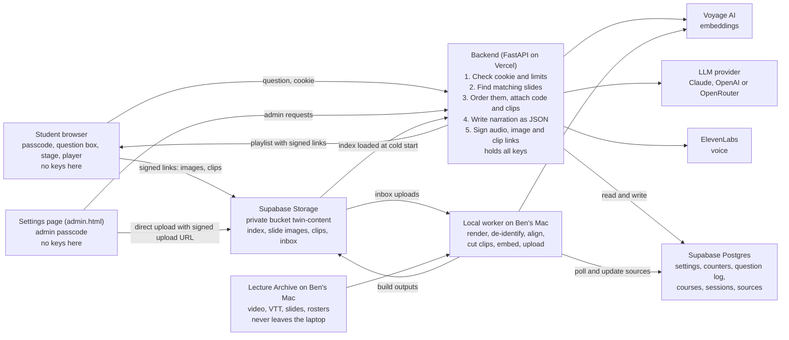

# Faculty Twin: Spec and Build Guide

Oct 5, 2026 · Ben Collier · revised Oct 5 (two full courses, private content, Settings page)

> **How to read the revisions.** I made decisions on October 5 that change scope and architecture. Where a decision changed, the original reasoning stays in place and a short **Changed Oct 5** note says what changed and why. Where the two disagree, the note wins.

## What we are building

Faculty Twin is a web app where a student asks a course question and gets a short narrated walkthrough: the relevant slides and code appear on screen, and an AI voice cloned from Ben talks through them one at a time.

It is 15-113 Project 2, due Wednesday October 7 at 11:59 PM, with a budget of about 8 focused hours. It lives in its own repo first and gets embedded in the portfolio site afterward.

**The demo scenario.** A visitor types "explain clustering methods." The chat slides to a side panel. Four or five slides from the clustering deck appear in order on the main stage, with the matching notebook code beside them. Ben's voice explains each slide in 30 to 45 seconds, and the stage advances when each clip ends. The visitor can pause, go back, or ask a follow-up.

> **Changed Oct 5.** The twin now covers my two Fall 2026 courses, every class session so far, instead of one clustering deck. The demo becomes: a student in 70-445 enters the course passcode and asks "how does a neural network learn?" Four or five slides from this semester appear in order, each with a card that says where it is in the course (course, session, date, slide number). My cloned voice explains each one, and where I explained that slide in class, a button plays the real class recording of me doing it. The point is to send students back to the current slides from the semester, not to replace them.

**What makes it different from a chatbot.** The answer is assembled from Ben's own teaching materials, shown as the materials themselves, and every spoken sentence is grounded in a slide, its speaker notes, or a lecture transcript. If the materials do not cover a question, the twin says so.

**Who it is for.** Students in 70-445 and 45-884 this semester. The site asks for a course passcode before it shows anything.

## Scope

Build in this order and stop wherever the clock says to. Each tier is a finished, submittable project on its own.

| Tier | What it adds | Done when |
| --- | --- | --- |
| 1. Must work | One topic (clustering), one deck, one notebook. Question in, ordered slides and code out, narration shown as captions. Deployed at a public URL. | A stranger on a phone can ask "what is k-means" and step through the answer |
| 2. Voice | Narration spoken in the cloned voice, slides advance automatically, pause and back controls | The same question plays start to finish with no clicks after "ask" |
| 3. Polish | Suggested-question chips, pre-generated answers for 8 to 10 common questions, a short recorded video clip of Ben in the corner while the answer loads, a question log in a database | First audio starts in under 2 seconds for a suggested question |
| 4. Later, not for Wednesday | Live avatar video, more courses, memory between visits, voice input, embedding in collier.phd | After submission |

> **Changed Oct 5: the tiers now read as follows.** "More courses" moved from Tier 4 into Tier 1, because pointing students at the right session and slide across a whole semester is the useful version of this app, and one clustering deck is not. Class video clips and an admin Settings page joined Tier 3. Everything else keeps its tier.

| Tier | What it adds | Done when |
| --- | --- | --- |
| 1. Must work | Two full courses (70-445 sessions 01 to 11, 45-884 sessions 01 to 11). Passcode gate. Private content served through signed links. Multi-course retrieval with a course filter. Every segment cites course, session, date, and slide number on a source card. Narration shown as captions. Deployed at a public URL. | A student on a phone enters the passcode, asks a question from either course, steps through the answer, and can tell from each card exactly which session and slide to open |
| 2. Voice | Narration spoken in the cloned voice, slides advance automatically, pause and back controls | The same question plays start to finish with no clicks after "ask" |
| 3. Polish | Suggested-question chips, pre-generated answers for 8 to 10 common questions, a corner clip of Ben while the answer loads, the question log, class video clips ("Watch me explain this in class"), and the Settings page: model switch first, then voice, limits, activity, and course and source uploads processed by the local worker | First audio starts in under 2 seconds for a suggested question; a clip plays in place of its slide; switching the model in Settings changes the next answer |
| 4. Later, not for Wednesday | Live avatar video, memory between visits, voice input, embedding in collier.phd, clips from the Tesla vs Waymo case sessions if I release that case, a worker that runs in the cloud instead of on my Mac | After submission |

**The cut line for the check-in question.** If time runs short, tier 3 goes first, then the voice. Tier 1 alone still meets the assignment: frontend-backend communication, a keyed third-party API, and a retrieval component built on embeddings.

> **Changed Oct 5.** Inside tier 3, cut in this order: Settings uploads and the local worker, then class clips, then the rest of Settings, then the corner clip. The model switch in Settings is the last tier 3 piece to cut, because it is small and it lets me recover if one provider has a bad day during grading.

### Course content in scope

Every session folder lives in the private archive (`~/Lecture Archive/<course>/2026 Fall/<NN> <date> <title>/`), never in the repo. `slides.pdf` there is the most current version of each deck; `SOURCES.md` in the same folder records the Drive file it came from. If I revise a deck, I replace `slides.pdf` and re-run the pipeline for that session.

**70-445 AI for Business Leaders (Fall 2026)**

| Session | Date | Title | Slide PDF | Zoom VTT | Notebooks |
| --- | --- | --- | --- | --- | --- |
| 01 | Aug 25 | Course Introduction and What Is AI | yes | yes | |
| 02 | Aug 27 | A Short History of AI | yes | yes | 1 |
| 03 | Sep 1 | Rules Search and Expert Systems | yes | yes | 2 |
| 04 | Sep 3 | Five Tribes of Machine Learning | yes | yes | |
| 05 | Sep 8 | Machine Learning Fundamentals | yes | yes | |
| 06 | Sep 10 | Neural Networks and Deep Learning | yes | yes | |
| 07 | Sep 17 | How Large Language Models Work | yes | yes | 1 |
| 08 | Sep 22 | Agentic AI and AI Workflows | yes | yes | |
| 09 | Sep 24 | Agentic AI Lab | no (lab) | yes | |
| 10 | Sep 29 | Software Development with AI Assistance | yes | yes | |
| 11 | Oct 1 | Software Development Lab | yes | missing: pull from Zoom in Chrome | |

**45-884 AI Methods for Social and Visual Data (Fall 2026, Mini 1)**

| Session | Date | Title | Slide PDF | Zoom VTT | Notebooks |
| --- | --- | --- | --- | --- | --- |
| 01 | Aug 24 | Introduction to AI Models and Unstructured Data | yes | yes | |
| 02 | Aug 26 | Training the Assistant, Scaling Laws, and Your First API Calls | no | yes | 5 |
| 03 | Aug 31 | Natural Language Processing | yes | yes | |
| 04 | Sep 2 | In-Class Lab: Working with NLP and Foundation Models | no (lab) | yes | 2 |
| 05 | Sep 9 | Text Mining for Business Insight | yes | yes | 1 |
| 06 | Sep 14 | Computer Vision Fundamentals | yes (no pptx, so no speaker notes) | yes | |
| 07 | Sep 16 | Computer Vision Demos: YOLO, ResNet, and Visual Transformers | no | yes | 2 |
| 08 | Sep 21 | Agentic AI and AI Workflows | yes | yes | |
| 09 | Sep 23 | Hands-On Exercise: Building Interactive AI Agent Workflows | no (lab) | yes | |
| 10 | Sep 28 | Mining Visual Data for Business Insight | pptx only: render to PDF with LibreOffice | yes | |
| 11 | Sep 30 | Tesla vs Waymo Case | yes (indexed, no clips) | yes | |

About 920 slide pages across the two courses, plus notebook code cells. Sessions without a deck (the labs) contribute code records in Tier 1; their transcripts are still de-identified and kept, ready for when a lab has slides to attach them to. Graded material, answer keys, student data, and third-party video were never copied into the archive and stay out.

## User experience

The page has two states, and the change between them is the signature moment of the app.

> **Changed Oct 5.** There is now a passcode screen before the idle state, a course filter on the idle screen, a source card and an optional class clip on the presenting screen, and a separate Settings page for me. The two-state design for students is unchanged.

**Passcode.** A single field and a button: "Enter the course passcode." A wrong code says "That passcode did not work. Check the course announcement and try again." After the backend accepts it, the browser holds a signed cookie for 7 days and the passcode screen does not come back until it expires or I rotate the passcode.

**Idle.** A centered question box, a one-line description ("An AI version of Prof. Collier that teaches from his own slides"), and six to eight suggested-question chips. A small label says the voice is AI-generated.

> **Changed Oct 5 (voice tiers).** The label names the voice that actually speaks, read from `GET /api/voice`: "The voice is AI-generated from recordings of me, Ben Collier." only when my clone speaks, "The voice is AI-generated (a stock voice, not mine)." for an ElevenLabs stock voice or a free Microsoft voice, and no voice label when the voice is set to captions only. While an answer plays, the small label in the chat dock shows the segment's voice label ("AI voice made from my recordings." or "AI voice (a stock voice, not mine).") and changes if the fallback voice takes over. Before the page knows the voice it says only "AI voice.", never the clone label.

Above the question box, a course filter with three choices: **All courses**, **70-445**, **45-884**. It defaults to All, remembers the last choice on that device, sends `course` with every question, and filters the suggested chips to that course.

**Presenting.** The chat docks to a narrow panel on the right, about 30% of the width. The stage takes the rest:

- Slide image at the top of the stage, large.
- Code panel under it, shown only when a segment has code, with the relevant lines marked.
- A caption strip with the sentence being spoken.
- A control bar: play or pause, previous, next, a progress row of dots (one per segment), and a mute button.
- Added Oct 5: a source card under the slide image, and on segments that have one, a button to watch the class clip (see Where this is in the course).

On a phone the stage stacks on top and the chat collapses to an input bar at the bottom.

**The flow after a question**

1. Visitor submits a question or taps a chip. That tap is also what unlocks audio in the browser.
2. The chat docks and the stage shows a loading state. In tier 3 the corner clip of Ben plays here.
3. The playlist arrives with all slide images, code, and caption text. The first slide appears right away.
4. Audio for segment 1 loads and plays. Audio for segment 2 loads in the background.
5. When a clip ends, the stage moves to the next segment. After the last one, the chat offers two follow-up questions.
6. A new question at any time stops playback and starts over at step 2.

**Error states to design, not discover**

- Question is off-topic or not covered: a spoken or written "I don't have course material on that" plus the suggested chips.
- Backend is waking up or unreachable: a plain message and a retry button, never a blank stage.
- Voice service fails or the daily cap is reached: the walkthrough continues with captions only and a small note saying audio is unavailable.
- Added Oct 5. Wrong passcode: the message above, and after too many tries, "Too many tries. Wait a few minutes and try again."
- Added Oct 5. Cookie expired or passcode rotated: any API call returns 401 and the page goes back to the passcode screen, keeping the typed question.
- Added Oct 5. A slide image or clip link has expired (the student left the tab open): the frontend asks the same question again for fresh links instead of showing a broken image.
- Added Oct 5. A clip fails to load: the button disappears for that segment and the slide stays.

### Where this is in the course

Added Oct 5. Every segment shows a source card under the slide (on a phone, directly under the slide and above the caption). It is the part of the answer that sends a student back to the real materials.

- **Card title:** "Where this is in the course."
- **Course:** code and title, for example "70-445 AI for Business Leaders".
- **Session:** number and title, for example "Session 06: Neural Networks and Deep Learning".
- **Date:** the class date, for example "Sep 10, 2026".
- **Slide:** "Slide 14", matching the page number in the slide PDF students have on Canvas.
- **Thumbnail:** a small copy of the slide image, so the student can recognize it when they flip through the deck.

For a code segment, the card says the notebook name and cell number instead of a slide number.

When the segment has a clip, the card also shows a button: **"Watch me explain this in class."** Tapping it pauses the walkthrough and plays the class recording in place of the slide image, with a small label "Recorded in class on Sep 10, 2026 (my real voice, not the AI voice)." When the clip ends, or the student taps "Back to the slide," the slide returns and the walkthrough stays paused until they press play. The clip ending never advances the walkthrough; that is separate from the advance logic, which runs when a narration audio clip ends.

After the last segment, the chat lists the answer's sources (course, session, date, slide) above the two follow-up questions, so a student can write them down.

### Settings page

Added Oct 5, for me only. `/admin.html`, behind a separate admin passcode and its own cookie, never linked from the student page. Five sections:

1. **Model.** Provider dropdown (Claude native, OpenAI native, OpenRouter) and a model picker. Claude and OpenAI show a short curated list plus a free-text model id. OpenRouter shows its live model list, searchable. "Test this model" runs one sample question through the full ask pipeline and shows the result and latency. Save writes the choice to the `settings` table.
2. **Voice.** The voices on the ElevenLabs account, each with a preview I can play, plus a stock voice and a captions-only option. Saving changes `voice_id`. Pre-generated audio is keyed by voice id, so changing the voice never plays the old one.
   *Changed Oct 5 (voice tiers).* Three groups, each voice with a Preview button, and a pill that says which cost money:
   - **My voice clone**: ElevenLabs voices with category `cloned` (or a `professional` clone this account owns), the `ELEVENLABS_VOICE_ID` voice first. Costs ElevenLabs credits.
   - **ElevenLabs voices**: every other voice on the account (`premade`, `generated`, and Voice Library voices, which ElevenLabs also calls `professional` but this account does not own). Costs ElevenLabs credits.
   - **Free Microsoft voices**: Microsoft neural voices through the `edge-tts` package, no key and no cost. A curated list of teaching voices (Andrew, Ava, Brian, Emma, Christopher, Aria, Ryan, Sonia) plus a field for any other voice's ShortName, checked against Microsoft's voice list.
   - Plus **Server default** (`ELEVENLABS_VOICE_ID`) and **Captions only**.
   ElevenLabs previews play the voice's own `preview_url` (no characters spent). Free previews come from `GET /api/admin/voice-preview`, which speaks one fixed sentence set on the server. A second control sets the fallback: when an ElevenLabs voice fails or hits today's cap, answers continue with captions only (the default) or with a chosen free voice. The page shows the label students will see for the saved voice.
3. **Courses and source material.** Courses, then sessions under each, with date, title, and what exists for that session: slides, transcript, video, clips, indexed or not. I can add a course (code, title, term), add a session, and upload source material for it: a slide PDF or pptx, a Zoom VTT, the class video, a notebook. Files go straight from the browser to the private bucket. Each upload shows its status (uploaded, processing, ready, error with a message) and a "Re-run" button. A switch hides or shows a session for students.
4. **Limits and access.** The daily voice character cap (editable), the per-visitor limits (shown, not editable), and a field to rotate the student passcode. *Added Oct 5 (voice tiers):* a second, higher daily cap for the free voices.
5. **Activity.** Today's counters, and the last 50 questions: question text, covered or not, top score, provider and model, latency.

The page shows only whether each key is configured, never the key itself.

## Architecture

One repo, one Vercel project. The FastAPI backend deploys as a single Vercel Function, and the frontend, slide images, and pre-generated audio are static files in `public/`, served from Vercel's CDN. One URL, one deploy, no cross-origin setup this week, and no long cold start. Fallback if the Vercel deploy fights back in Block 0: the same code on a paid Render instance.

> **Changed Oct 5.** Slide images, audio, the index, and clips no longer live in the repo or in `public/`. The repo is public, and the content now includes de-identified class transcripts and class video, which I want behind a passcode. All course content lives in a private Supabase Storage bucket (`twin-content`). The backend loads the index from it at cold start and hands the browser short-lived signed links for images and clips. `public/` holds only the HTML, CSS, and JavaScript, which contain no course content. Still one repo, one Vercel project, one URL.



The browser only ever talks to the backend, except to fetch a file through a link the backend signed (or, on the Settings page, to upload one). The pipeline runs on my Mac, ahead of time or whenever a new upload arrives, and it also calls the embeddings API, so the deployed service starts with everything it needs already in the bucket.

| Part | What it does | Built with |
| --- | --- | --- |
| Indexer (`indexer/`) | Runs on Ben's laptop, once per content change. Turns a deck and a notebook into slide images plus `index.json`. | Python, python-pptx, nbformat, LibreOffice and pdftoppm for slide images, an embeddings API |
| Backend (`app/`) | Answers questions: retrieval, narration script, speech. Holds every key. Enforces limits. | Python, FastAPI as one Vercel Function, numpy, an LLM API, ElevenLabs for the voice |
| Frontend (`public/`) | The idle and presenting screens, the playlist player. | Plain HTML, CSS, JavaScript. No framework, no bundler, same as the portfolio site |
| Static content (`public/slides/`, `public/audio/`) | Slide PNGs and pre-generated audio for suggested questions. | Files committed to the repo, served from the CDN |
| Index (`content/index.json`) | Slide and code records with embeddings, read by the backend. | A JSON file bundled with the function |
| Counters and question log | Rate-limit counters, the daily voice cap, and one row per question. | Supabase |

> **Changed Oct 5: the parts now read as follows.**

| Part | What it does | Built with |
| --- | --- | --- |
| Pipeline (`indexer/`) | Runs on my Mac. Renders slides, de-identifies transcripts, aligns transcript to slides, cuts clips, builds and embeds the index, uploads to the bucket. Each stage is its own script and can be re-run alone. | Python via `uv`, pdftoppm, LibreOffice, python-pptx, nbformat, ffmpeg, numpy, Voyage AI |
| Local worker (`indexer/worker.py`) | Picks up files uploaded through Settings and runs the same stages for that session. Runs on my Mac because the rosters and ffmpeg are there. | Python, Supabase REST |
| Backend (`app/`) | Passcode check, retrieval, narration, speech, signed links, Settings API. Holds every key. Enforces limits. | Python, FastAPI as one Vercel Function, numpy, httpx, Claude or OpenAI or OpenRouter, Voyage AI, ElevenLabs |
| Frontend (`public/`) | Passcode, idle and presenting screens, playlist player, Settings page. | Plain HTML, CSS, JavaScript. No framework, no bundler |
| Private content (bucket `twin-content`) | Slide images, clips, the index, pre-generated audio, and the upload inbox. | Supabase Storage, private, served only through signed URLs |
| Index (`content/index.json` and `content/embeddings.npy` in the bucket) | Slide and code records, and one embedding row per record. Loaded at cold start. | A JSON file and a numpy array |
| Database | Settings, rate-limit counters, the daily voice cap, the question log, courses, sessions, and sources. | Supabase Postgres, schema in `supabase/schema.sql` |

**Why these choices**

- Vercel's Python runtime runs FastAPI directly, so the backend code is ordinary FastAPI. Vercel looks for a FastAPI instance named `app` in a file such as `app/main.py`, and serves anything in `public/` at the matching root path.
- A function keeps nothing between requests: no saved files, no counters in memory. So pre-generated audio lives in the repo, live audio is streamed back without being saved, and counters live in Supabase. *(Changed Oct 5: pre-generated audio now lives in the bucket, not the repo. The rest still holds.)*
- The index is a JSON file, not a vector database. One deck and one notebook produce roughly 60 to 100 vectors, and numpy searches that in under a millisecond. Ben can open the file and read it, which helps when explaining the code. *(Changed Oct 5: two courses produce about 1,200 records. That is still tiny for numpy, so the reasoning holds. Embeddings moved to a separate `embeddings.npy` (about 5 MB at 1,024 dimensions) so the JSON stays readable.)*
- Speech is generated per segment, not per answer. The first clip can start while later ones are still being made, and one failed clip does not sink the whole answer.
- Added Oct 5. **Private bucket, not the repo.** The repo is public and graded. Class transcripts and video are class records, so they stay behind the passcode even after de-identification.
- Added Oct 5. **Signed links, not proxying.** Images and clips go straight from Supabase to the browser through links that expire in an hour. The function never streams large files, which matters because Vercel caps request and response bodies and bills function time. The same reason makes Settings uploads go straight from the browser to the bucket with a signed upload URL: Vercel caps request bodies at 4.5 MB, and a class video is far larger.
- Added Oct 5. **The pipeline runs on my Mac.** Video work (ffmpeg, frame matching) is too heavy and too slow for a function, and de-identification needs the rosters, which never leave the laptop. The worker is a small loop around the same stage scripts I run by hand.
- Added Oct 5. **A small provider interface, not SDKs.** `app/llm.py` has one function per provider, `complete_json(system, user, max_tokens) -> str`, each a plain `httpx` call. Switching providers changes one row in `settings`, not the code. The grounding prompt and the JSON validation are the same for every provider. Embeddings stay on Voyage whatever the narration provider is, because the index was built with Voyage and the question must be embedded the same way.
- Added Oct 5. **Index reload.** The backend caches the index in memory for the life of a warm function. At most every 60 seconds it reads `settings.index_version`; if the pipeline uploaded a new index, it reloads.

**Access and cookies.** Added Oct 5. Everything except `/api/health` and `/api/login` needs the student cookie `ft_session`: signed with `SESSION_SECRET`, httpOnly, SameSite=Lax, Secure in production, 7 days. It carries a random visitor id (used for rate limits) and a passcode version, so rotating the passcode signs everyone out. The Settings API needs a separate `ft_admin` cookie (same signing, 12 hours) issued only for `ADMIN_PASSCODE`. The static HTML, CSS, and JavaScript are public; nothing in them is course content.

**Configuration.** Added Oct 5. `.env.example` lists these names with no values; real values live in Vercel and in my git-ignored local `.env`.

| Variable | Used for |
| --- | --- |
| `ANTHROPIC_API_KEY`, `OPENAI_API_KEY`, `OPENROUTER_API_KEY` | Narration providers. Only the active one is needed. |
| `LLM_PROVIDER`, `LLM_MODEL` | Defaults when the `settings` row is empty: `anthropic` and `claude-sonnet-5-5` |
| `VOYAGE_API_KEY`, `VOYAGE_MODEL` | Embeddings for the index and for questions |
| `ELEVENLABS_API_KEY`, `ELEVENLABS_VOICE_ID` | Voice; the voice id is the default when `settings.voice_id` is empty |
| `SUPABASE_URL`, `SUPABASE_SERVICE_ROLE_KEY`, `SUPABASE_BUCKET` | Storage and Postgres, server side only. Bucket defaults to `twin-content` |
| `STUDENT_PASSCODE`, `ADMIN_PASSCODE` | Bootstrap passcodes; a rotated student passcode lives as a hash in `settings` |
| `SESSION_SECRET`, `AUDIO_SIGNING_SECRET` | Cookie signing and audio-link signing |
| `DAILY_VOICE_CHAR_CAP` | Default daily voice cap, overridable in Settings |
| `DAILY_FREE_VOICE_CHAR_CAP` | Added Oct 5. Default daily cap for the free Microsoft voices (200,000 characters), overridable in Settings |
| `EDGE_TTS_RATE`, `EDGE_TTS_PITCH` | Added Oct 5, optional. Speaking rate and pitch for the free voices; defaults `-5%` and `+0Hz` |
| `CONTENT_DIR` | Local folder used instead of Supabase for local development and tests, for example `~/Lecture Archive/_build` |

With `CONTENT_DIR` set, `app/storage.py` reads the index and files from that folder and signs links to a local-only route, so the app runs and the tests pass without Supabase.

**Repo layout**

```
faculty-twin/
  README.md            written by Ben
  prompt_log.md        separate file, same folder
  .gitignore           includes .env
  .env.example         key names only, no values
  requirements.txt
  vercel.json          sets the function's max duration
  app/main.py          FastAPI instance named app, routes
  app/retrieval.py     ranking and ordering (hand-written)
  app/narration.py     LLM call and grounding prompt
  app/speech.py        voice call, signed links, daily cap
  public/index.html
  public/app.js        player and state changes
  public/styles.css
  public/slides/       clustering-001.png ...
  public/audio/        pre-generated clips
  content/index.json
  indexer/build_index.py
  tests/test_retrieval.py
```

> **Changed Oct 5: the layout is now this.** `public/slides/`, `public/audio/`, and `content/` leave the repo (they are git-ignored and live in the bucket). New backend modules split out auth, providers, storage, and limits. The indexer becomes one script per pipeline stage plus the worker.

```
faculty-twin/
  README.md               written by Ben
  prompt_log.md           separate file, same folder
  .gitignore              .env, content/, _build/, slide images, video, VTT, .npy
  .env.example            variable names only, no values
  requirements.txt
  vercel.json             sets the function's max duration
  supabase/schema.sql     settings, counters, question_log, courses, sessions, sources
  app/main.py             FastAPI instance named app, routes
  app/auth.py             passcode checks, signed ft_session and ft_admin cookies
  app/retrieval.py        ranking and segment selection (hand-written)
  app/narration.py        grounding prompt, JSON validation, fallback
  app/llm.py              provider interface: Claude, OpenAI, OpenRouter; active choice from settings
  app/speech.py           ElevenLabs call, audio signing, daily cap
  app/voices.py           voice tiers, labels, fallback, which cap a voice uses (added Oct 5)
  app/edge_voice.py       free Microsoft voices through edge-tts, previews (added Oct 5)
  app/storage.py          bucket or CONTENT_DIR access, index load and reload, signed URLs
  app/limits.py           rate limits, counters, question log
  public/index.html       passcode, idle, presenting
  public/app.js           player and state changes
  public/styles.css
  public/admin.html       Settings page, never linked from the student page
  indexer/slides.py       render slide images, extract text and notes
  indexer/deidentify.py   parse VTT, scrub names, mark student turns, leak check
  indexer/align.py        match transcript time to slides
  indexer/clips.py        cut class clips under the clip rules
  indexer/build_index.py  records, code cells, embeddings, index.json and embeddings.npy
  indexer/upload.py       mirror build outputs to the bucket, bump index_version
  indexer/worker.py       poll sources, run the stages for uploaded files
  tests/test_retrieval.py Ben's selection tests (plus failing stubs for his functions)
  tests/                  auth, signing, providers, storage, pipeline tests with fakes
```

## Data

**Content sources, in order of value**

1. The slide deck (.pptx): slide text and speaker notes.
2. The matching notebook (.ipynb): code cells and the markdown cells above them.
3. A cleaned lecture transcript for that session, with student questions removed. This is what makes the narration sound like Ben's explanation instead of a summary of bullet points. Optional for tier 1.

> **Changed Oct 5.** The order is now:
>
> 1. The most current slide PDF per session. It gives the images and the slide numbers students see on Canvas, so citations match.
> 2. The pptx speaker notes, matched to PDF pages by position.
> 3. The Zoom VTT transcript per session, de-identified (for 45-884 Fall 2026, the ASR-corrected cue files in my FacultyTwinContent folder, `*.cleaned.timed.jsonl`, same Zoom timings; for 70-445 session 11, which has no Zoom captions in Drive, a local Whisper transcript until the Zoom file is pulled), with student turns marked and excluded. No longer optional: it is what lets the twin say what I actually said in class, and it drives alignment and clips.
> 4. Notebooks, when a session has them.
> 5. The class video. Used only to align slides and cut clips. Never indexed as text.

**IDs.** Added Oct 5. Course codes are `70445` and `45884` (shown to students as 70-445 and 45-884). A slide id is course, two-digit session, and three-digit slide number (1-based PDF page): `70445-s06-014`. A code id is course, session, notebook number (1-based, in file-name order), and cell number: `45884-s05-nb1-c022`.

**What the indexer writes.** One record per slide and one per code cell, all in `content/index.json`:

```json
{
  "id": "clustering-014",
  "kind": "slide",
  "deck": "clustering",
  "order": 14,
  "title": "Choosing k: the elbow method",
  "text": "slide text, notes, and any transcript passage matched to this slide",
  "image": "/slides/clustering-014.png",
  "related_code": ["clustering-cell-22"],
  "embedding": [0.013, -0.094]
}
```

Code cells use the same shape with `"kind": "code"`, a `source` field holding the code, and no image. `related_code` is filled in by hand for tier 1: a short mapping file that says which cells go with which slides. Ten minutes of manual work beats an hour of tuning automatic matching.

> **Changed Oct 5.** Records carry course and session fields, keep text, notes, and transcript apart, and point at private paths in the bucket. Embeddings moved to `content/embeddings.npy` (float32, row *i* belongs to record *i*), so the JSON has no vectors in it. The hand-written mapping survives as `indexer/code_map.json` (ids only, no content); sessions without a mapping attach no code.

```json
{
  "id": "70445-s06-014",
  "kind": "slide",
  "course": "70445",
  "course_title": "AI for Business Leaders",
  "session": 6,
  "session_title": "Neural Networks and Deep Learning",
  "date": "2026-09-10",
  "slide_number": 14,
  "title": "slide title",
  "text": "slide body text, de-identified",
  "notes": "speaker notes, de-identified",
  "transcript": "what I said in class while this slide was up, instructor turns only, de-identified",
  "image": "slides/70445/s06/70445-s06-014.webp",
  "clip": "clips/70445-s06-014.mp4",
  "related_code": []
}
```

Code records use the same shape with `"kind": "code"`, a `source` field holding the code, a `notebook` field with the notebook's file name, `"image": null`, `"slide_number": null`, and `"clip": null`. The text that gets embedded is title, text, notes, and transcript joined, in that order.

**Build outputs.** Added Oct 5. Everything below is private. The pipeline writes it to `~/Lecture Archive/_build/` and `indexer/upload.py` mirrors the parts the backend needs to the bucket. None of it is ever committed.

| Path | Contents | Uploaded to the bucket |
| --- | --- | --- |
| `slides/<course>/s<NN>/<slide_id>.webp` | One image per PDF page, 1600 px wide | yes |
| `slides/<course>/s<NN>/slides.json` | `[{slide_id, course, session, slide_number, title, text, notes}]`, de-identified | no (folded into the index) |
| `transcripts/<course>/s<NN>.json` | `{course, session, date, cues: [{start, end, text, speaker}]}`, times in seconds, `speaker` is `"instructor"`, `"student"`, or `"unclear"`, every student name replaced by `[student]` | no |
| `align/<course>/s<NN>.json` | `[{slide_id, windows: [[start, end], ...], transcript}]`, where `transcript` is de-identified instructor speech in those windows. May also carry `methods`, parallel to `windows`, each `"frame"` or `"text"`; readers ignore fields they do not know | no |
| `clips/<slide_id>.mp4` | H.264 720p, AAC, faststart, 15 to 90 seconds | yes |
| `clips/manifest.json` | `[{slide_id, course, session, start, end, reason_kept}]`, times in the original recording | yes |
| `content/index.json`, `content/embeddings.npy` | The index (see above) | yes |
| `topics/topics.json` | Suggested questions and their stored playlists | yes |
| `audio/<voice_id>/<hash>.mp3` | Pre-generated narration for suggested questions, named by voice id and a hash of the narration text. *Changed Oct 5 (voice tiers): new files go under `audio/<voice tag>/`, the same 10-character tag the audio links carry, because free voice ids contain a colon. Older `audio/<ElevenLabs id>/` folders are still read for that voice.* | yes |
| `review/<course>-s<NN>.txt` | De-identification review notes | no, never |

The bucket also has `inbox/<course>/s<NN>/<kind>/<filename>` for files uploaded through Settings. Transcripts and alignment stay on the laptop: the backend only needs what is already folded into the index.

**What the backend returns for a question.** A playlist:

```json
{
  "question": "how do I choose k?",
  "covered": true,
  "segments": [
    {
      "n": 1,
      "slide_id": "clustering-014",
      "image": "/slides/clustering-014.png",
      "code": { "source": "inertias = [] ...", "mark_lines": [3, 4, 5] },
      "narration": "Sixty to ninety words in Ben's teaching voice.",
      "audio": "/audio/9f2c1a.mp3"
    }
  ],
  "follow_ups": ["What is the silhouette score?", "When does k-means fail?"]
}
```

`covered` is false when the best match scores below the threshold. In that case `segments` is empty and the frontend shows the not-covered message.

> **Changed Oct 5.** Each segment now carries the fields for its source card, a signed image link, and an optional clip, and the playlist has a `sources` list. `covered` works the same way, and `sources` is empty when it is false.

```json
{
  "question": "how does a neural network learn?",
  "covered": true,
  "segments": [
    {
      "n": 1,
      "slide_id": "70445-s06-014",
      "course": "70445",
      "course_title": "AI for Business Leaders",
      "session": 6,
      "session_title": "Neural Networks and Deep Learning",
      "date": "2026-09-10",
      "slide_number": 14,
      "image": "https://<project>.supabase.co/storage/v1/object/sign/twin-content/slides/70445/s06/70445-s06-014.webp?token=...",
      "narration": "Sixty to ninety words in my teaching voice.",
      "audio": "/api/audio?t=<base64url narration>&v=<voice tag>&s=<hmac>",
      "voice": { "kind": "clone", "label": "AI voice made from my recordings." },
      "audio_fallback": "/api/audio?t=<base64url narration>&v=<free voice tag>&s=<hmac>",
      "voice_fallback": { "kind": "free", "label": "AI voice (a stock voice, not mine)." },
      "code": null,
      "clip": {
        "url": "https://<project>.supabase.co/storage/v1/object/sign/twin-content/clips/70445-s06-014.mp4?token=...",
        "start": 1394.2,
        "end": 1441.8
      }
    }
  ],
  "sources": [
    { "slide_id": "70445-s06-014", "course": "70445", "session": 6, "date": "2026-09-10", "slide_number": 14, "image": "<signed link>" }
  ],
  "follow_ups": ["What is backpropagation?", "Why do we need activation functions?"]
}
```

`audio` is `null` when the voice is set to captions only. *Added Oct 5 (voice tiers):* `voice` is the label of the voice behind `audio` (`kind` is `clone`, `stock`, `free`, or `unverified` when an ElevenLabs voice's category could not be checked, labeled just "AI voice."), and `null` with no audio. `audio_fallback` and `voice_fallback` are set only when an ElevenLabs voice speaks and the free fallback is on: if `audio` fails to play, the page switches the rest of the answer to `audio_fallback` and shows `voice_fallback.label`. When today's ElevenLabs cap is already spent and the fallback is on, `audio` is the free voice from the start and is labeled as one. For a suggested question it is a signed link to the stored mp3 instead of the audio route. `clip` is `null` when the slide has no clip. `clip.start` and `clip.end` are positions in the original class recording, used for the label; the clip file itself starts at zero. Signed links expire after an hour.

**Segment rules**

- Three to five segments per answer. More than five turns an answer into a lecture.
- Segments play in deck order, even if a later slide scored higher. Slides were written to be seen in sequence. *(Changed Oct 5: with two courses, "deck order" means course, then session, then slide number. "Next to each other" means the same course and session.)*
- Each narration is 60 to 90 words, which is about 25 to 40 seconds of speech.
- Pre-generated clips are static files named by a hash of their narration text, as in the example above. For a live answer, the audio field is a signed link to the audio route instead. *(Changed Oct 5: pre-generated audio is in the bucket under the voice id, served through a signed link.)*
- Added Oct 5. With the course filter set, only that course's records are scored. With "All courses", an answer can draw on both, and the sources list shows which.
- Added Oct 5. Records from sessions I have hidden in Settings are never scored.

**Database tables.** Added Oct 5. All in `supabase/schema.sql`, all reached only by the backend and the worker with the service role key.

| Table | Columns | Notes |
| --- | --- | --- |
| `settings` | `key`, `value` (jsonb), `updated_at` | Keys: `provider`, `model`, `voice_id`, `daily_voice_char_cap`, `student_passcode_hash`, `index_version`. Env vars are the defaults when a key is missing. *Added Oct 5 (voice tiers):* `voice_kind` (`{voice_id, kind}`, written by Settings after checking the voice's category on the ElevenLabs account), `voice_fallback` (`captions` or `free`), `voice_fallback_voice` (`edge:<ShortName>`), `daily_free_voice_char_cap` |
| `counters` | `key`, `day`, `count`, `expires_at` | Rate limits per visitor id, login attempts, daily voice characters, daily question counts. Bumped only through the `ft_increment` function, which adds atomically and refuses an add that would pass a cap |
| `question_log` | `id`, `at`, `question`, `course`, `covered`, `top_score`, `provider`, `model`, `latency_ms` | Question text and scores only: no names, accounts, cookies, or IP addresses |
| `courses` | `code`, `title`, `term` | Seeded with 70445 and 45884 |
| `sessions` | `id`, `course`, `session`, `date`, `title`, `visible` | `visible` false hides the session from students and from retrieval |
| `sources` | `id`, `course`, `session`, `kind`, `path`, `status`, `message`, `updated_at` | `kind` is `slides` (PDF or pptx), `transcript` (VTT), `video`, or `notebook`, matching the Settings form. `status` is `pending_upload` (link minted, file not confirmed), `uploaded`, `processing`, `ready`, or `error`; the worker only takes `uploaded`. `message` never contains a student name |

## Preprocessing pipeline

Added Oct 5. This is the part that did not exist when the app was one deck. Every stage runs on my Mac with `uv run python -m indexer.<stage>`, takes `--course` and `--session` (or `--all`), reads from the private archive, writes to `~/Lecture Archive/_build/`, and skips work whose inputs have not changed. A stage that needs a key (only `build_index.py` for Voyage, and `upload.py` for Supabase) caches what it has done, so it can be started before the keys exist and finished the moment they arrive.

| Stage | Script | Reads | Writes | Needs a key |
| --- | --- | --- | --- | --- |
| 1. Slides | `indexer/slides.py` | `slides.pdf` (or `slides.pptx`, converted to PDF with LibreOffice), `slides.pptx` for notes | `slides/` | no |
| 2. De-identify | `indexer/deidentify.py` | `transcript_raw.vtt`, rosters, `slides.json` | `transcripts/`, scrubbed `slides.json`, `review/` | no |
| 3. Align | `indexer/align.py` | `video.mp4`, slide images, transcript | `align/` | no |
| 4. Clips | `indexer/clips.py` | `video.mp4`, alignment, transcript | `clips/` | no |
| 5. Index | `indexer/build_index.py` | everything above, notebooks, `indexer/code_map.json` | `content/` | Voyage |
| 6. Upload | `indexer/upload.py` | `_build/` | the bucket, `settings.index_version` | Supabase |

**1. Slide rendering.** `pdftoppm` renders each PDF page, which is converted to WebP at 1600 px wide. Text comes from the PDF page; the title is the pptx title placeholder when there is one, otherwise the first line. Speaker notes come from the pptx by position (pptx slide *i* is PDF page *i*). If the page counts differ, the stage skips notes for that session and says so, rather than attaching notes to the wrong slide. 45-884 session 10 has only a pptx, so LibreOffice renders its PDF first.

**2. Transcript de-identification.** Zoom labels every cue "Ben Collier" because students speak through the room microphone, so speaker labels are useless and the scrub works on the text.

- Parse the VTT into cues with start and end times in seconds.
- **Roster scrub.** Load the rosters from `~/Lecture Archive/_private/rosters/` into memory only. Build a list of first names, last names, preferred names, and full names, and replace every match in cue text with `[student]`. Names that are also ordinary English words are replaced only in name-like positions (start of a sentence followed by a comma, after "thanks", "yes", "go ahead", before "'s team") and every such case is flagged for review. The same scrub runs on slide text and speaker notes, since a slide can list a team.
- **Student turns.** Detected from content, because the label cannot tell. A cue is `student` when it falls inside a stretch that starts right after I hand the floor to someone (I say a student's name, "go ahead", "yes?", "what do you think?") and ends when I take it back ("great question", "so", "right, so"). Known student segments (the "AI in the News" and "AI Methods in the News" presentations, team presentations) are marked from a small per-session time-range file in `_build/overrides/`, which holds times only. Anything the rules are unsure of is `unclear`. Only `instructor` cues are ever used as narration material or clip audio; `student` and `unclear` are dropped.
- **Everyone else named, too.** Added Oct 5 (later the same evening). I asked for every person named in a transcript to be de-identified except me (Ben, Benjamin, Ben Collier, Professor or Dr. Collier). That includes public figures I talk about, such as researchers and executives. Students and anyone I address in class become `[student]`; everyone else becomes `[person]`. Company, product, and model names are not people and stay. Slide text is not changed by this rule, so a name printed on a slide still shows on the slide. Detection uses capitalized-name patterns and a name list in addition to the roster, and the review file counts `[person]` replacements.
- **Leak check.** Before anything is uploaded, every text output (`slides.json`, transcripts, alignment, the index, the clip manifest) is re-scanned against the full roster. One hit fails the stage. This automated check is the gate.
- **Review.** `review/<course>-s<NN>.txt` lists the number of replacements, the flagged ambiguous cases, the student-turn stretches, and capitalized words that are not in the course vocabulary (possible names the roster cannot know, such as a nickname or a guest). I skim it per session. The review file stays in `_build/review/`, is never printed to the terminal, logged, or uploaded, and nothing in the pipeline ever prints a roster name.

**3. Slide-to-transcript alignment.** For each slide, find the time windows when it was on screen and what I said then.

- **Frame matching first.** Where the recording is a screen share, sample a frame every 2 seconds with ffmpeg, downscale it, and compare it with each slide image of that session (normalized image correlation on grayscale thumbnails; in presenter view, compare the largest slide region, not the next-slide thumbnail). A frame matches a slide when the best score clears a threshold and beats the runner-up by a margin. Runs shorter than 4 seconds are smoothed away. Frames that show something else (a black Zoom tile with only my name card, a Canvas page, a terminal, an embedded third-party video) match nothing.
- **Text similarity as the fallback.** For stretches with no frame match, split the transcript into 30-second chunks and score each against each slide's text and notes (TF-IDF cosine, no key needed). Assign chunks with an in-order constraint: a dynamic program over chunks where the slide number never moves backward, except for a short jump back of one or two slides, which is how I actually teach.
- Each window records which method produced it. The `transcript` for a slide is the de-identified instructor speech inside its windows.

> **Added Oct 5 (Block 2 build).** How `indexer/align.py` does this, after calibration on two sessions:
>
> - Frames are sampled every 2 s at 256 px wide in grayscale and cached in `_build/.cache/align/`, so a re-run does not decode the video again. Comparison is normalized correlation on 64x36 thumbnails. Each frame is tried three ways: the whole frame, the best of up to three bright slide-shaped regions (presenter view, or a slide window next to another display), and the session's usual slide box (for dark slides).
> - Thresholds: best score at least 0.45 and at least 0.04 above the best runner-up that is not a look-alike; below 0.60 the margin must be 0.15. Slides that correlate 0.93 or more with each other (repeated section dividers) count as one group, and the member nearest the previous match wins. A one-frame dropout inside a run is bridged; runs under 4 s are dropped.
> - The text fallback keeps a chunk only when its TF-IDF cosine is at least 0.12, and the dynamic program for each uncovered stretch is bounded by the frame matches on either side (two slides of slack).
> - A recording in two parts (`video.mp4`, `video_part2.mp4`) is one timeline: part 2 starts at part 1's duration, the same rule the transcript stage uses.
> - `align/<course>/s<NN>.meta.json` sits next to each alignment file: coverage, thresholds, and every frame run with its scores, a motion measure, and the times of frames that matched only through bridging. Local only, like the alignment.

**4. Clip cutting rules.** Clips auto-publish behind the passcode, so the rules are strict and a clip is skipped whenever one fails.

- Only frame-matched windows, so the video shows that slide. Text-only alignments never become clips.
- 15 to 90 seconds. Adjacent windows of the same slide merge when the gap is under 5 seconds. Cuts land on cue boundaries; a window over 90 seconds is cut at the last cue boundary before 90.
- Instructor only: every cue overlapping the window, plus 5 seconds on each side, must be `instructor`. Any `student` or `unclear` cue disqualifies it.
- No names in the audio or text: no `[student]` or `[person]` token in the padded window (audio cannot be de-identified), and the slide's own text and notes have no roster hit.
- No student names on screen: frame matching already guarantees the screen shows my slide, not a Canvas page or a participant list. A slide whose text had a roster hit gets no clip.
- No embedded third-party video playing in the window (the frame match drops while it plays, and the audio is not me).
- Excluded entirely: the student "AI in the News" and "AI Methods in the News" presentations, any student presentation, and the Tesla vs Waymo case sessions (45-884 session 11, and session 12 when it happens). I am keeping that case private for now; its slides are still indexed.
- Encode with ffmpeg: H.264 at 720p, AAC audio, `+faststart`, sized for mostly-static slides (target 3 MB or less per clip).
- `clips/manifest.json` records each kept clip and why (`reason_kept`, for example "frame-matched 42 s, instructor only, no names"). To pull a clip, I add its slide id to the session's override file and re-run the stage.

> **Added Oct 5 (Block 7 build).** Details of `indexer/clips.py`:
>
> - Stricter than the 5-second merge above: every sampled frame inside a clip must match the slide on its own. Runs are split around frames that matched only through bridging, so a 2-second flash of a browser or Canvas page can never sit inside a clip. The 5-second merge is used only when alignment has no frame-level detail.
> - When a whole window fails the speech rules, the longest stretch inside it that passes every rule (whole cues, 15 to 90 seconds, 5 seconds clear of any student, unclear, or masked cue) is used instead. One clip per slide: the longest passing candidate.
> - Slides flagged `student_names_possible`, `in_the_news`, `student_presentation_possible`, or `no_clips_private_case` by the slide stage get no clip, and neither does a slide whose stored text or notes carry a `[student]` mask.
> - PG rule (added Oct 5, later): a window is rejected (`pg_language`) when any cue in it, padding included, is marked `pg: true` by the PG filter, or its text matches the basic profanity list in `indexer/clips.py` (the fallback until every transcript carries the flag). The audio cannot be cleaned.
> - An embedded video is detected from the frames: if more than 35% of consecutive frame pairs in the window change, the window is skipped.
> - Encoding: H.264 CRF 26 with `-tune stillimage`, 720p, AAC 96 kbps mono, `+faststart`; a clip over 3 MB is re-encoded at CRF 30. Only the video and audio streams are kept: Zoom recordings carry an embedded caption text track (raw captions, not de-identified) and metadata, and both are dropped. A clip that would cross from `video.mp4` into `video_part2.mp4` is skipped.
> - The override file is `_build/overrides/<course>/s<NN>.json` with `{"no_clips": ["<slide_id>", ...]}`; a `no_clips` key in the de-identification override file for the session works too.
> - `clips/manifest.json` stays a list. Rejections go to `clips/rejected.json`: per-window reasons (slide ids, times, and reason codes only), counts per reason, and the count of slides left without a clip by reason. It is a local report: upload only the `.mp4` files and `manifest.json`.

**5. Build the index.** Combine `slides.json`, alignment, the clip manifest, notebook code cells (nbformat; code plus the markdown cell above it; outputs dropped), and `indexer/code_map.json` into records. Embed each record's text with Voyage (document input type, batches of 128). Embeddings are cached by a hash of the text in `_build/cache/`, so a re-run only embeds records that changed. Write `content/index.json` and `content/embeddings.npy`, then run the leak check on both.

**6. Upload.** Mirror slide images, clips, the manifest, the index, topics, and audio to `twin-content`, skipping files that have not changed. Then set `settings.index_version` to a hash of the new index. Warm backends pick it up within a minute.

**When a new class happens.** Two ways in.

- **On my Mac:** create the session folder in the archive (`<NN> <date> <title>`), drop in `slides.pdf`, `transcript_raw.vtt`, `video.mp4`, and any notebooks, add the session in Settings (or in the `sessions` table), then run `uv run python -m indexer.run --course 70445 --session 12`, which runs stages 1 to 6 for that session and rebuilds the index. If the Zoom VTT is not in Drive, I download it from the Zoom cloud recording in Chrome.
- **From Settings:** add the session and upload the files. Each lands in `inbox/` with a `sources` row marked `uploaded`. `indexer/worker.py`, running on my Mac, polls `sources` every 30 seconds, marks a row `processing`, copies the file into the archive folder for that session, runs the stages it affects (a new VTT re-runs de-identify, align, clips, index, upload; a new deck re-runs everything), and marks the row `ready` or `error` with a message. If the worker is not running, rows stay `uploaded` and Settings says "Waiting for the worker on Ben's Mac." "Re-run" sets a row back to `uploaded`.

A revised deck for an existing session works the same way: replace `slides.pdf` and re-run that session.

## API endpoints

Four routes. The frontend never talks to a model or voice provider directly.

| Route | Input | Returns | Notes |
| --- | --- | --- | --- |
| `GET /api/health` | none | `{"ok": true}` | The frontend calls this on page load to warm the function and to show a clear message if it is down |
| `GET /api/topics` | none | The list of suggested questions | Each one maps to a pre-generated playlist whose audio is already in `public/audio/` |
| `POST /api/ask` | `{"question": "..."}`, 300 characters max | A playlist (see Data) | Retrieval, then one LLM call that writes all segment narrations as JSON. No speech is generated here |
| `GET /api/audio` | the narration text and a signature, both taken from a segment's audio link | An mp3, streamed | Checks the signature, checks the daily cap, calls the voice service, streams the result. Nothing is saved on the server |

> **Changed Oct 5: the routes are now these.** Login, courses, and the Settings API are new; `ask` takes a course filter. Everything except `/api/health` and `/api/login` returns 401 without a valid `ft_session` cookie, and every `/api/admin/*` route except its login returns 401 without `ft_admin`. The frontend still never talks to a model or voice provider directly.

**Student routes**

| Route | Input | Returns | Notes |
| --- | --- | --- | --- |
| `GET /api/health` | none | `{"ok": true}` | No cookie needed. Warms the function on page load |
| `POST /api/login` | `{"passcode": "..."}` | 204 and the `ft_session` cookie, or 401 | Constant-time compare against the current student passcode. Rate-limited per address (salted daily hash): 10 tries per 15 minutes, then 429 |
| `GET /api/courses` | none | `[{course, title, sessions: [{session, date, title}]}]` | Visible sessions only |
| `GET /api/topics` | none | `[{question, course}]` | Read from `topics/topics.json`. Asking a topic's exact question returns its stored playlist, with links signed on the way out |
| `POST /api/ask` | `{"question": "...", "course": "70445" \| "45884" \| null}`, question 300 characters max | A playlist (see Data) | Retrieval, then one LLM call that writes all segment narrations as JSON. No speech is generated here |
| `GET /api/audio?t=&v=&s=` | the narration text (base64url), a short tag of the voice id, and their signature | An mp3, streamed | The voice tag makes every link change when the voice changes, so the browser never replays the old voice; a link from an old voice gets 403. 404 when the voice is set to captions only. 403 on a bad signature, 429 past the daily cap (the frontend falls back to captions). Calls ElevenLabs with the current voice. Nothing is saved on the server. *Changed Oct 5 (voice tiers):* the tag picks the voice: the current voice, or the free fallback voice when the fallback is on. ElevenLabs voices stream from ElevenLabs and spend the ElevenLabs cap; free voices stream from `edge-tts` (MP3 in memory, no temp files; pieces of at most 400 characters, at most 6 at once, each retried) and spend the free cap. A free voice that cannot start answers 502 before any audio |
| `GET /api/voice` | none | `{kind, label, fallback: {kind, label} \| null}` | Added Oct 5. What students are told about the voice right now: `kind` is `clone`, `stock`, `free`, `unverified`, or `none` (captions only, `label` null) |

**Settings routes** (all need `ft_admin` except login)

| Route | Input | Returns | Notes |
| --- | --- | --- | --- |
| `POST /api/admin/login` | `{"passcode": "..."}` | 204 and the `ft_admin` cookie, or 401 | Against `ADMIN_PASSCODE`. 5 tries per 15 minutes |
| `GET /api/admin/settings` | none | `{provider, model, voice_id, daily_voice_char_cap, ...}` | Never returns a key or a passcode hash. `voice_id` is null when the server default (`ELEVENLABS_VOICE_ID`) applies, `"none"` for captions only. *Added Oct 5:* also `voice_kind`, `voice_label` (what students see), `voice_costs_money`, `voice_fallback`, `voice_fallback_voice`, `daily_free_voice_char_cap` |
| `PUT /api/admin/settings` | any of `{provider, model, voice_id, daily_voice_char_cap, student_passcode}` | the saved settings | A new student passcode is stored as a hash and bumps the passcode version, signing students out. *Added Oct 5:* also `voice_fallback`, `voice_fallback_voice`, `daily_free_voice_char_cap`. `voice_id` is `eleven:<id>` (checked against the account, which records whether it is my clone), `edge:<ShortName>` (checked against Microsoft's list), `"none"`, or null; an older bare ElevenLabs id is still accepted |
| `GET /api/admin/models?provider=anthropic\|openai\|openrouter` | provider | `{provider, models: [{id, name}], source}` | Curated lists for Anthropic and OpenAI; OpenRouter's live list from `https://openrouter.ai/api/v1/models` |
| `POST /api/admin/test` | `{"question": "...", "provider"?, "model"?}` | a playlist plus latency | Runs the full ask pipeline with the given or saved model; not logged, but counted against limits |
| `GET /api/admin/status` | none | which keys are configured (booleans only), today's counters, index version and record count | |
| `GET /api/admin/voices` | none | `{voices: [{voice_id, name, category, preview_url}]}` | Proxied from ElevenLabs with the server-side key. *Changed Oct 5 (voice tiers):* returns `{groups: [{id: "clone" \| "elevenlabs" \| "free", label, cost, costs_money, student_label, voices: [...]}], voices: [all], elevenlabs_error}`. Without an ElevenLabs key it still returns the free group |
| `GET /api/admin/voice-preview?voice=edge:<ShortName>` | a free voice id | an mp3 | Added Oct 5. Speaks one fixed sentence set on the server (never text from the caller), cached in memory, counted against the free cap. 400 for ElevenLabs voices (they use `preview_url`) and unknown names |
| `GET /api/admin/courses` | none | `{courses: [...]}`, each with sessions and what exists for each (`has: {slides, transcript, video, clips, indexed}`) | Merges the `courses`, `sessions`, and `sources` tables with what the loaded index holds |
| `POST /api/admin/courses` | `{course, title, term}` (`code` also accepted) | the course | |
| `POST /api/admin/sessions` | `{course, session, date, title}` | the session | Starts visible |
| `PATCH /api/admin/sessions/{id}` | any of `{date, title, visible}` | the session | Hiding takes effect on the next question |
| `POST /api/admin/uploads` | `{course, session, kind, filename, size}` | `{upload_url, method, headers, path, source_id}` | Mints a signed upload URL for `inbox/<course>/s<NN>/<kind>/<filename>` and creates a `sources` row with status `pending_upload`. When the PUT finishes, the page calls `rerun` (or `complete`, which first checks the file is in the bucket) to mark it `uploaded`; listing sources also promotes a `pending_upload` row whose file has arrived. Rejects unknown kinds and files over the plan's limit. The browser uploads straight to Supabase |
| `GET /api/admin/sources` | optional `course`, `session` | `{sources: [...]}` | Settings polls this to show status |
| `POST /api/admin/sources/{id}/complete` | none | the row, status `uploaded` | 409 if the file is not in the bucket yet |
| `POST /api/admin/sources/{id}/rerun` | none | the row, status `uploaded` | The worker picks it up again |
| `GET /api/admin/log` | none | `{rows: [...]}`, the last 50 question-log rows | |

**Inside `/api/ask`, step by step**

1. Reject empty or over-length questions with a 400 and a readable message.
2. Check the rate limit for this visitor.
3. If the question matches a suggested question, return its stored playlist and stop.
4. Embed the question.
5. Score every slide by cosine similarity. If the top score is under the threshold, return `covered: false`.
6. Pick the segments (see Code Ben writes by hand).
7. Send the chosen slides' text and code to the LLM with the grounding prompt. Ask for JSON only.
8. Validate the JSON: every `slide_id` must be one that was sent, every narration under 110 words. If validation fails, retry once, then fall back to using each slide's speaker notes as the narration.
9. Sign each narration with a secret key held in an environment variable, build the audio links from the text and signature, and return the playlist.

> **Changed Oct 5.** The steps are now:
>
> 1. Check the `ft_session` cookie (401 if missing, bad, expired, or from an old passcode).
> 2. Reject empty or over-length questions with a 400 and a readable message.
> 3. Check the rate limit for this visitor.
> 4. If the question matches a suggested question (and its course fits the filter), return its stored playlist with fresh signed links and stop.
> 5. Embed the question with Voyage (query input type).
> 6. Keep only rows for the chosen course and visible sessions, then score them by cosine similarity. If the top score is under the threshold, return `covered: false`.
> 7. Pick the segments (see Code Ben writes by hand).
> 8. Send the chosen slides' text, notes, transcript passages, and code to the active provider through `app/llm.py`, with the grounding prompt. Ask for JSON only.
> 9. Validate the JSON: every `slide_id` must be one that was sent, every narration under 110 words. If validation fails, retry once, then fall back to each slide's speaker notes (or its transcript passage, then its text) as the narration.
> 10. Sign each narration, build the audio links, sign the image and clip links in one batch call to Supabase, build `sources`, write one question-log row, and return the playlist.

**The grounding prompt, in plain terms.** The model is told it is writing narration for Prof. Collier's walkthrough. It may only explain what is in the supplied slide text, notes, transcript passages, and code. It writes in first person, in a conversational teaching voice, one segment per slide, and refers to what is on screen ("on this slide," "in line 4"). It must not add facts, examples, or opinions that are not in the supplied material, and it must not answer questions about anything outside the course content.

Added Oct 5: the transcript passages are what I said in class, so the model may say "as I said in class" but must not mention students, student questions, or anything marked `[student]`. Each slide's course, session, and slide number are in the prompt so the narration can point to them ("this is from session 6"). The same prompt goes to every provider.

## Safety, cost and privacy rules

A public page that speaks in a real professor's voice needs firm limits. These are requirements, not polish.

**The voice only says what the materials support**

- Narration is grounded in indexed content. Off-topic questions get the not-covered response, never an improvised answer.
- The audio route only speaks text the backend itself wrote. Every audio link carries a signature made with a secret key, and the route refuses text whose signature does not match, so nobody can send it their own words.
- The page states that the voice is AI-generated from Ben's recordings, on the idle screen and in the README.
- Added Oct 5 (voice tiers). The disclosure always matches the voice that is speaking. My clone: "AI voice made from my recordings." Any ElevenLabs stock voice or free Microsoft voice: "AI voice (a stock voice, not mine)." Captions only: no voice label. A voice is labeled a clone only when the ElevenLabs account says it is one (category `cloned`, or a `professional` clone the account owns); when that cannot be checked the label is "AI voice." and never the clone label. When the fallback voice takes over mid-answer, the label changes with it.
- Added Oct 5 (voice tiers). Free voices follow every rule above: the audio route speaks only signed text, the signature covers the voice tag, and the same length caps and grounding checks apply. Voice previews speak a fixed sentence set on the server.
- Added Oct 5. Switching providers in Settings does not loosen any of this: every provider gets the same grounding prompt and the same validation, and a model that ignores JSON falls back to the speaker notes. "Test this model" exists so I check a model before students get it.
- Added Oct 5. Class clips are labeled as real class recordings, so no one confuses them with the AI voice.

**Access**

Added Oct 5.

- Nothing but `/api/health` works without the student passcode cookie. Course content is reachable only through signed links that expire in an hour.
- The bucket is private. The service role key exists only in Vercel and my local `.env`; the browser never sees it.
- The Settings page needs a separate admin passcode and cookie, and is not linked from the student page. Admin login is rate-limited more tightly than student login.
- The student passcode can be rotated from Settings; rotation signs everyone out.

**Spending caps**

- Per-visitor rate limit: 5 questions per minute, 30 per day.
- Daily cap on characters sent to the voice service, set in an environment variable. Past the cap, answers continue with captions only. *(Changed Oct 5: the env var is the default; Settings can change it.)*
- Question length capped at 300 characters. Narration capped at 110 words per segment.
- Suggested-question clips are pre-generated and served as static files, so replaying them costs nothing. Rate-limit and cap counters live in Supabase, because a function keeps no memory between requests. *(Changed Oct 5: pre-generated audio is served from the bucket by signed link; still costs nothing to replay.)*
- Added Oct 5. The visitor id for rate limits is the random id inside the student cookie. Login attempts are counted per salted hash of the address that rotates daily; that hash lives only in `counters`, never in the question log.
- Added Oct 5. "Test this model" counts against the same limits.
- Added Oct 5 (security review, docs/SECURITY.md). Logging in again mints a new visitor id, so questions are also limited per network address (salted daily hash, kept only in `counters`): 20 per minute, 300 per day. Two global daily caps fail closed when the database is unreachable: model calls (`DAILY_LLM_CALL_CAP`, default 600; past it narration falls back to speaker notes) and question embeddings (`DAILY_EMBED_CAP`, default 1,500; past it `/api/ask` returns a readable 503). One visitor or address may use at most a quarter of the daily voice cap. Rate limits fall back to an in-memory counter, not to "unlimited", when the database is down; admin login fails closed.
- Added Oct 5 (security review). Every narration is checked for grounding before it is signed for the voice: most of its content words must come from the slides sent, it must not repeat a long run of the question, it must be under 900 characters, and it must not contain a web address. A failing reply is retried once, then falls back to the speaker notes.
- Added Oct 5 (voice tiers). The free Microsoft voices cost nothing but use a free service, so they have their own daily cap (`DAILY_FREE_VOICE_CHAR_CAP`, default 200,000 characters, editable in Settings) with the same quarter-per-visitor and per-address rule, at most 6 requests at once per function instance, and short timeouts. The ElevenLabs cap applies only to ElevenLabs voices. Both caps fail closed.
- Added Oct 5 (security review). OpenRouter models priced above $15 in / $60 out per million tokens are refused in Settings (adjustable with `LLM_MAX_PROMPT_PRICE_PER_MTOK` and `LLM_MAX_COMPLETION_PRICE_PER_MTOK`).

**Secrets**

- All keys live in the Vercel project's environment variables. `.env` is in `.gitignore` from the first commit. `.env.example` lists the variable names with no values.
- Before the first push, search the repo for key prefixes. The assignment takes a large deduction for a committed secret.
- Added Oct 5. The search runs before every push, over the diff, for the prefixes listed in AGENTS.md (including Voyage, ElevenLabs, Supabase, and JWT-shaped tokens). The Settings page shows only whether each key is configured.
- Added Oct 5 (security review). `SESSION_SECRET` and `AUDIO_SIGNING_SECRET` have no silent fallback: if either is missing the backend refuses to sign, and in production each must be at least 32 random characters. Local dev may opt into fixed dev keys with `FT_LOCAL_DEV=1`, which production ignores.

**Content and privacy**

- No student voices or names. Transcripts are stripped of student questions before indexing.
- Use a deck Ben is comfortable publishing in full: no textbook figures, no licensed images, no unreleased exam material. *(Changed Oct 5: content is no longer published. It sits behind the passcode for my own students, which is how it is already shared on Canvas. Graded material and answer keys still stay out.)*
- The question log stores question text and scores only. No names, no accounts, no IP addresses in the stored rows.
- Added Oct 5 (security review). Before a question is logged, emails, phone numbers, long digit runs, @handles, and names that follow "my name is", a title (Prof., Dr., Ms.), or "classmate"/"partner" are replaced with tokens (`app/privacy.py`). It is a roster-free heuristic, so the question box also asks students not to type names.
- Voice recordings used for cloning are Ben's own. Check the voice provider's current terms and plan requirements before uploading.
- Added Oct 5. Every student name is replaced with `[student]` at import, in transcripts and in slide text. In transcripts, every other person named except me is replaced with `[person]`. Rosters stay in `~/Lecture Archive/_private/rosters/` and are never copied, printed, logged, uploaded, or committed. The leak check is the gate before any upload.
- Added Oct 5. Student turns are marked and never used as narration material or clip audio. Unsure turns are treated as student turns.
- Added Oct 5. Clips follow the clip rules above: instructor only, no names in the audio, text, or on screen, no student presentations, and nothing from the Tesla vs Waymo case sessions.
- Added Oct 5. Only de-identified text leaves my Mac: the narration provider (including models reached through OpenRouter) and Voyage see slide text, notes, and de-identified instructor speech, never a roster or a raw transcript.
- Added Oct 5. Never committed: `.env`, rosters, raw or de-identified transcripts, video, clips, slide images, the index, embeddings, review files.

## Build guide

Eight blocks, about 8 hours. Every block ends the same way: run its check, commit and push, and add an entry to `prompt_log.md` with the prompts used and anything the AI got wrong. The assignment grades the commit history and the log, so doing this as you go is part of the work.

> **Changed Oct 5.** Two courses, private content, clips, and Settings add work that does not fit in 8 hours of my time. A team of AI agents builds the new blocks in parallel, one branch and one pull request per block, following AGENTS.md; my hours go to the four hand-written pieces, reviewing, the voice, and the demo. Every block still ends with its **Check**, a squash-merged PR, and a prompt-log entry. **Deadline: Wednesday October 7, 11:59 PM.** There are now eleven blocks, 0 to 10. The original Blocks 1, 2, and 3 were replaced; their text is kept at the end of this section. The other original blocks are kept with their changes marked.

The original plan, for the record:

| Block | When | Time | Result |
| --- | --- | --- | --- |
| 0. Skeleton and first deploy | Mon evening | 30 min | A public URL that says hello |
| 1. Indexer | Mon evening | 75 min | Slide images and `index.json` |
| 2. Ask endpoint, text only | Mon evening | 75 min | A playlist from a typed question |
| 3. Stage and player | Tue | 90 min | The full walkthrough with captions |
| 4. Voice | Tue | 60 min | Spoken narration, auto-advance |
| 5. Limits and pre-generated answers | Tue | 45 min | Caps on, suggested questions instant |
| 6. Phone pass and error states | Wed | 45 min | Works on a phone, fails gracefully |
| 7. README, log, video, submit | Wed | 60 min | Submitted by 9 PM, three hours early |

The revised plan (Oct 5):

| Block | When | Result | Tier |
| --- | --- | --- | --- |
| 0. Skeleton and first deploy | Mon Oct 5 | A public URL that says hello | 1 |
| 1. Slides and de-identification | Mon Oct 5 | Slide images, scrubbed text and transcripts for 22 sessions, review files | 1 |
| 2. Alignment and index | Mon Oct 5 to Tue Oct 6 | Alignment for every session, `index.json` and `embeddings.npy` | 1 |
| 3. Storage, passcode, ask endpoint (text only) | Tue Oct 6 | A playlist with signed links from a typed question, behind the passcode | 1 |
| 4. Stage, player, source card | Tue Oct 6 | The full walkthrough with captions and citations | 1 |
| 5. Voice (was Block 4) | Tue Oct 6 | Spoken narration, auto-advance | 2 |
| 6. Limits and pre-generated answers (was Block 5) | Tue Oct 6 | Caps on, suggested questions instant, question log | 3 |
| 7. Class clips | Tue Oct 6 | Clips cut, uploaded, and playable from the source card | 3 |
| 8. Settings page and worker | Tue Oct 6 to Wed Oct 7 | Model switch, voice, limits, activity, then courses, uploads, and the worker | 3 |
| 9. Phone pass and error states (was Block 6) | Wed Oct 7 | Works on a phone, fails gracefully | all |
| 10. README, log, video, submit (was Block 7) | Wed Oct 7 | Submitted by 9 PM, three hours early | all |

### Block 0. Skeleton and first deploy

1. Create the `faculty-twin` repo, public, with the folder layout from Architecture.
2. Add `.gitignore` (with `.env`), `.env.example`, `requirements.txt`, a README stub, and an empty `prompt_log.md`.
3. Write `app/main.py` with a FastAPI instance named `app` and one route, `/api/health`. Put a placeholder `index.html` in `public/`.
4. Run it locally with `vercel dev`, following Vercel's FastAPI guide (linked under Open decisions).
5. Connect the GitHub repo to a new Vercel project and deploy. Add the environment variables in the project settings, even if empty.
6. Time box: 30 minutes. If the deploy is still failing at that point, switch to a paid Render instance and move on.

Added Oct 5: the `.gitignore` also covers `content/`, `_build/`, `*.webp`, `*.mp4`, `*.vtt`, and `*.npy`, and `.env.example` lists every variable from Configuration.

**Check:** the Vercel URL loads the page on your phone, and `/api/health` returns ok. Deploying first answers the check-in question about deployment and removes the biggest deadline risk.

### Block 1. Slides and de-identification

New Oct 5 (replaces the slide half of the original Block 1).

1. `indexer/slides.py`: render every session's slide PDF to WebP and write `slides.json` with text and notes (Preprocessing stage 1). Render 45-884 session 10 from its pptx.
2. Pull the missing 70-445 session 11 VTT from the Zoom cloud recording in Chrome into the archive folder.
3. `indexer/deidentify.py`: parse VTTs, run the roster scrub on transcripts and slide text, mark student turns, write the review files, run the leak check (stage 2).
4. Write the per-session override files for the "In the News" presentations.
5. Tests with a made-up roster and a made-up VTT, in `tests/`. No real names in any test.

**Check:** for every session, image count equals PDF page count, and slide 1's image is slide 1. The leak check reports zero roster hits across all outputs. I read three review files and one scrubbed transcript and find no student name and no student turn marked `instructor`.

### Block 2. Alignment and index

New Oct 5 (replaces the index half of the original Block 1).

1. `indexer/align.py`: frame matching where the recording is a screen share, text similarity with the in-order constraint as fallback (stage 3).
2. Write `indexer/code_map.json` by hand for the sessions with notebooks.
3. `indexer/build_index.py`: records, code cells, Voyage embeddings with the cache, `index.json` and `embeddings.npy`, leak check (stage 5). If the Voyage key is not in yet, it writes everything else and embeds when the key arrives.

**Check:** open `index.json` and read three records from different sessions. For each, open the class video at the start of its first window and see that slide on screen. Record count equals slides plus code cells, and `embeddings.npy` has the same number of rows.

### Block 3. Storage, passcode, ask endpoint (text only)

Replaces the original Block 2, with storage and the passcode added.

1. `supabase/schema.sql` and the Supabase project; create the private bucket `twin-content`.
2. `indexer/upload.py`: mirror the build outputs and set `index_version` (stage 6).
3. `app/storage.py`: load the index from the bucket (or `CONTENT_DIR`), reload on a new `index_version`, sign links in batches.
4. `app/auth.py`: `/api/login`, the `ft_session` cookie, the cookie check on every other route.
5. `app/llm.py` with the Claude provider first (OpenAI and OpenRouter can follow in Block 8), and `app/narration.py` with the grounding prompt, validation, and fallback.
6. `/api/courses` and `/api/ask` with the course filter. I write the retrieval and segment-selection bodies by hand (see Code Ben writes by hand) and test them before any LLM call.
7. Add the not-covered threshold. Find its value by trying five on-topic and five off-topic questions per course and looking at the top scores.

**Check:** from a terminal, `/api/ask` without the cookie returns 401. After logging in, a question from each course returns three to five segments in course order with sensible narration and image links that open, `course: "45884"` never returns a 70-445 slide, and "who won the Stanley Cup" returns `covered: false`.

### Block 4. Stage, player, source card

Replaces the original Block 3, with the passcode screen, course filter, and source card added.

1. Build the passcode screen, the idle screen with the course filter, and the docking change to the presenting layout.
2. Render a segment: slide image, source card, code panel with marked lines, caption.
3. Build the player as a small state machine: current segment number, playing or paused, next and previous. In this block, "playing" advances on a timer based on word count.
4. Add the progress dots, the sources list, and the follow-up chips.

**Check:** enter the passcode and ask a question on the deployed site, then click through the whole answer on laptop and phone. Each card's course, session, date, and slide number match the slide PDF on Canvas.

### Block 5. Voice (was Block 4)

1. Create the voice clone from 2 to 5 minutes of clean solo lecture audio. Listen to a test sentence before wiring anything.
2. Write `/api/audio`: check the signature, call the voice service, stream the mp3 back. Add the signing step to the ask route.
3. Replace the timer in the player with the audio element's ended event. Preload the next clip while the current one plays.
4. Add the mute button and the captions-only fallback.

Changed Oct 5: `/api/audio` also needs the student cookie, and it uses the voice id from `settings` (falling back to `ELEVENLABS_VOICE_ID`).

**Check:** one tap on "ask," then hands off: the answer plays through all segments with sound, and slides change on time.

### Block 6. Limits and pre-generated answers (was Block 5)

1. Create the Supabase table for counters. Add the rate limit and the daily character cap, both reading and writing that table.
2. Write eight to ten suggested questions. Run each once, review the narration by ear, fix anything wrong, and commit the playlists and the mp3 files in `public/audio/`. A small script on your laptop does the generating.
3. If time allows: record the 5-second corner clip, and add the question log to the same Supabase project.

Changed Oct 5: `app/limits.py` holds the counters, the login rate limit, and the question log, which is no longer optional. The suggested questions cover both courses (four or five each). Their playlists and mp3 files go to `topics/` and `audio/<voice_id>/` in the bucket, not the repo.

**Check:** a suggested question starts speaking in under 2 seconds. Setting the cap to zero produces a captions-only answer with a note, not an error. Added Oct 5: the eleventh wrong passcode within 15 minutes returns 429, and a question shows up in the log with no cookie or address in the row.

### Block 7. Class clips

New Oct 5.

1. `indexer/clips.py`: cut clips under the clip rules, write the manifest (stage 4). Re-run `build_index.py` so records get their `clip` path, then `upload.py`.
2. Add the clip to each segment in `/api/ask` and the "Watch me explain this in class" button to the source card.

**Check:** the manifest has no entry from 45-884 session 11 and none overlapping an "In the News" window. I watch ten random clips end to end: only my voice, no student name said or shown, and the slide on screen matches the card. The button plays the clip in place of the slide, and the slide comes back, paused, when it ends.

### Block 8. Settings page and worker

New Oct 5. Build in this order and stop where the clock says.

1. Admin login, the `ft_admin` cookie, `/api/admin/status`.
2. Model: OpenAI and OpenRouter providers in `app/llm.py`, `/api/admin/models`, `/api/admin/settings`, `/api/admin/test`.
3. Voice: `/api/admin/voices`, preview, captions-only option. *Added Oct 5:* the three voice tiers (my clone, ElevenLabs voices, free Microsoft voices), `/api/admin/voice-preview`, the fallback voice, the free cap, and `/api/voice` for the label.
4. Limits and access: cap, passcode rotation. Activity: `/api/admin/log`.
5. Courses and source material: the course and session routes, `/api/admin/uploads` with signed upload URLs, `/api/admin/sources` and rerun, `indexer/worker.py`.

**Check:** I switch to an OpenRouter model, "Test this model" returns a valid playlist, and the next student question's log row shows the new provider and model. Rotating the passcode sends an open student tab back to the passcode screen. A test VTT uploaded for a hidden test session goes from `uploaded` to `ready` within a minute of the worker running, and hiding a real session drops its slides from answers.

### Block 9. Phone pass and error states (was Block 6)

1. Walk through every state on a real phone: idle, loading, presenting, not covered, backend asleep, audio failed. *(Added Oct 5: also passcode, wrong passcode, expired cookie, clip playing, clip failed.)*
2. Fix layout problems: long code lines, small tap targets, the caption covering the slide. *(Added Oct 5: and the source card crowding the slide.)*
3. Ask someone who has not seen it to try three questions. Write down what confused them.

**Check:** no state shows a blank screen or a raw error message.

### Block 10. README, log, video, submit (was Block 7)

1. Write the README yourself: what it does, how to use it, proudest features, how to run locally, how secrets are handled, how AI was used.
2. Finish `prompt_log.md`: tools and which job each did, the process, the hand-written code, verbatim prompts, one place AI got it wrong.
3. Record the demo on the deployed URL with sound. Show a question, the walkthrough, a refusal, and the retrieval function on screen while you explain it. *(Added Oct 5: also show the source card, one class clip, and the Settings model switch. Do not show the passcode, the Settings activity list, or any student.)*
4. Add the project to `data/portfolio.json` in the portfolio repo, rebuild, commit.
5. Test the video link in an incognito window. Submit the form. *(Added Oct 5: put the passcode for graders in the form.)*

**Check:** every box in the deliverables checklist below is ticked.

### Original Blocks 1 to 3 (replaced Oct 5)

Kept for the record. They describe the one-deck build.

**Block 1. Indexer**

1. Pick the deck and notebook. Export the deck to PDF, then to one PNG per slide at about 1600 px wide, saved in `public/slides/`.
2. Extract each slide's title, body text, and speaker notes with python-pptx.
3. Extract code cells and their preceding markdown with nbformat.
4. Write the slide-to-code mapping by hand in a small YAML or JSON file.
5. Embed each record's text and write `content/index.json`.

**Check:** open `index.json` and read three records. Slide 1's image file is slide 1. Record count equals slides plus code cells.

**Block 2. Ask endpoint, text only**

1. Load `index.json` into memory at startup.
2. Write the retrieval and segment-selection functions by hand (see next section). Test them with a few questions before any LLM call.
3. Add the narration call with the grounding prompt and JSON validation.
4. Add the not-covered threshold. Find its value by trying five on-topic and five off-topic questions and looking at the top scores.

**Check:** from a terminal, "how do I choose k" returns three to five segments in deck order with sensible narration, and "who won the Stanley Cup" returns `covered: false`.

**Block 3. Stage and player**

1. Build the idle screen and the docking change to the presenting layout.
2. Render a segment: slide image, code panel with marked lines, caption.
3. Build the player as a small state machine: current segment number, playing or paused, next and previous. In this block, "playing" advances on a timer based on word count.
4. Add the progress dots and the follow-up chips.

**Check:** ask a question on the deployed site and click through the whole answer on laptop and phone.

## Code Ben writes by hand

The graders want to see changes you made yourself and can explain without notes. These four pieces are small, central to how the app behaves, and close to what you teach, so they are the ones to write without an AI tool.

**1. Cosine similarity and ranking** (`app/retrieval.py`). Given the question's embedding and the matrix of slide embeddings, return slides sorted by score. A few lines of numpy, and the same math as the similarity material in your own courses.

**2. Segment selection** (`app/retrieval.py`). This is the design decision that makes answers feel like teaching:

- Take the top 8 slides by score.
- Drop any under the threshold.
- Prefer slides that sit next to each other in the deck: if slides 12, 13, and 15 are in the top 8, include 14 as well so the explanation does not skip a step.
- Keep at most 5, then sort by deck order.
- Attach each slide's related code cell if it has one.

**3. The not-covered threshold.** Choosing the cutoff from your ten test questions, and writing down in the prompt log how you picked it.

**4. The player's advance logic** (`public/app.js`). The function that runs when a clip ends: move to the next segment, start its audio, preload the one after, and handle the last segment and the pause state.

`tests/test_retrieval.py` gets three tests on your selection function: a clear on-topic question returns slides in deck order, a gap between adjacent slides is filled, and an off-topic question returns nothing. Rink Rivals had a regression test that made a good story in the write-up, and these do the same job here.

Added Oct 5: the four items are unchanged. With two courses, "deck" means one course session and "deck order" means course, session, slide number; the course filter and hidden sessions are applied by the code around these functions before ranking, so the functions themselves stay small. The agents left signatures, docstrings, `raise NotImplementedError` stubs, and failing tests for all four (in `app/retrieval.py`, `public/app.js`, and `tests/test_retrieval.py`), with everything around them ready, so I only fill in the bodies. End-to-end tests use a clearly labeled test fake, injected inside `tests/` only.

**For the prompt log.** Likely candidates for "one place AI got it wrong": the slide-to-image export step, autoplay being blocked by the browser, and the model ignoring the JSON-only instruction. Note the first one that happens, with what you did about it.

## Deliverables checklist

From the [Project 2 page](https://www.cs.cmu.edu/~113/project2.html). Due Wednesday October 7 at 11:59 PM, with no extensions into Fall Break.

- [ ] Deployed app at a public URL, verified on a phone
- [ ] Public GitHub repo with several commits across the project days
- [ ] `README.md` at the repo root, written in Ben's own words, covering: what it does, how to use it, proudest features, how to run locally, how secrets are handled, a short summary of AI use with citations
- [ ] Any AI-written documentation sits at the bottom of the README under a heading that labels it as AI-generated
- [ ] `prompt_log.md` as a separate file in the same folder: models and tools used, which tool for which job and why, process from start to finish, which code Ben wrote or changed, important prompts verbatim, one place AI got it wrong
- [ ] No keys or secrets anywhere in the repo or its history
- [ ] Added Oct 5: no rosters, transcripts, video, slide images, or index files anywhere in the repo or its history
- [ ] Added Oct 5: the passcode for graders is in the submission form
- [ ] Project linked from the Projects section of the portfolio site
- [ ] Demo video with sound, recorded on the deployed URL, explaining the architecture and the hand-written code
- [ ] Video link opens in an incognito window
- [ ] Google form submitted with deployed URL, repo URL, and video link
- [ ] Ready to explain the code in person at the final presentation

**Requirement boxes this project ticks:** frontend-backend communication, third-party APIs with secure keys, an ML component (embedding retrieval), and a database if the question log ships. *(Changed Oct 5: the database now ships regardless, for settings, counters, the question log, and courses.)*

## Open decisions

The spec above assumes a default for each of these. Changing one changes the build, so settle them before Block 1.

| Decision | Default assumed | What a different answer changes | Status (Oct 5) |
| --- | --- | --- | --- |
| Which deck and notebook | The clustering session from Data Mining | Block 1 content, the suggested questions | Settled: both Fall 2026 courses, sessions 01 to 11 each, most current slide PDF per session |
| Is there a transcript for that session | No, slides and notes only | With one, narration follows Ben's real explanations | Settled: Zoom VTT for every session; the missing 70-445 session 11 VTT gets pulled from Zoom in Chrome |
| Do the slides have speaker notes | Unknown | Without notes or a transcript, narration is thin and the model has to stretch | Answered: pptx notes for most decks; 45-884 session 6 has none; transcripts cover the gap |
| Voice | A clone of Ben's voice through ElevenLabs | A stock voice removes the consent and labeling work and about 20 minutes | Settled: ElevenLabs clone, switchable to a stock voice or captions only in Settings. Oct 5: also switchable to a free Microsoft voice (edge-tts), with a free-voice fallback option |
| Who can use it | Anyone with the link | A course passcode would cut cost and misuse risk | Settled: content private in a Supabase bucket, course passcode, signed cookies and signed links |
| LLM and embeddings provider | Whichever key Ben already has set up | Only the two API calls | Settled: Claude (`claude-sonnet-5-5`) writes narration, Voyage AI embeds; the narration model is switchable in Settings (Claude, OpenAI, OpenRouter) |
| Hosting | Vercel, one project (decided October 5). Fallback: a paid Render instance | Cloudflare is the candidate for the portfolio integration later; a free build there would mean a JavaScript backend | Settled, unchanged; content and database on Supabase |
| Name | Faculty Twin | Repo name, page title | Settled, unchanged |

**Also settled October 5**

- Class video clips: built, and published automatically behind the passcode, under the clip rules.
- The Tesla vs Waymo case sessions get no clips; their slides are indexed.
- Admin model switch, which grew into the full Settings page: model, voice, courses and source uploads processed by a local worker, limits and access, activity.

**Still open**

| Decision | Default assumed | What a different answer changes |
| --- | --- | --- |
| How students and graders get the passcode | A Canvas announcement in each course, and the submission form for graders | One passcode for both courses is simplest; separate ones would need the cookie to carry a course |
| ElevenLabs plan | The lowest plan that allows an instant voice clone and enough characters for testing and grading | A bigger plan raises the daily cap I can afford; no plan means captions only |
| Supabase project | A new project for Faculty Twin, so its keys and storage are separate from everything else | Plan limits decide whether clips and video uploads fit: the free plan's storage and per-file upload limits may be smaller than a semester of clips or one class video. If so, keep clips small and upload video on the Mac instead of through Settings |
| Vercel account | My personal account, one project | A team account changes who can see environment variables and the function duration limit |

**Not verified.** ElevenLabs plan requirements and pricing for voice cloning, how long a cold start feels on Vercel's free plan with numpy loaded, and current model names for embeddings. Check each during the block that uses it. Vercel's FastAPI guide: https://vercel.com/docs/frameworks/backend/fastapi

Added Oct 5, also not verified: Supabase's storage, egress, and per-file upload limits on the plan I end up on; the cold start with the index downloaded from storage (about 10 MB); the exact OpenRouter models-list response shape; the current Voyage model name for `VOYAGE_MODEL`; and that `claude-sonnet-5-5` is the right model id. Check each in the block that uses it.
